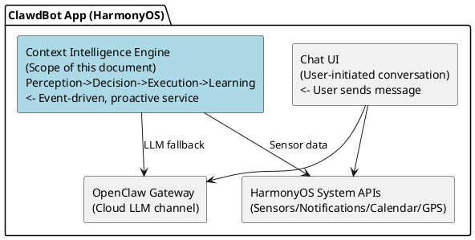
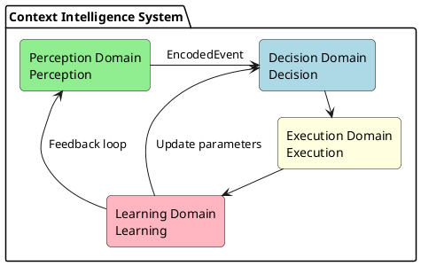
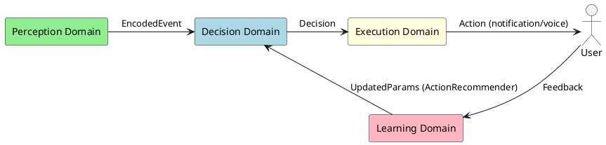
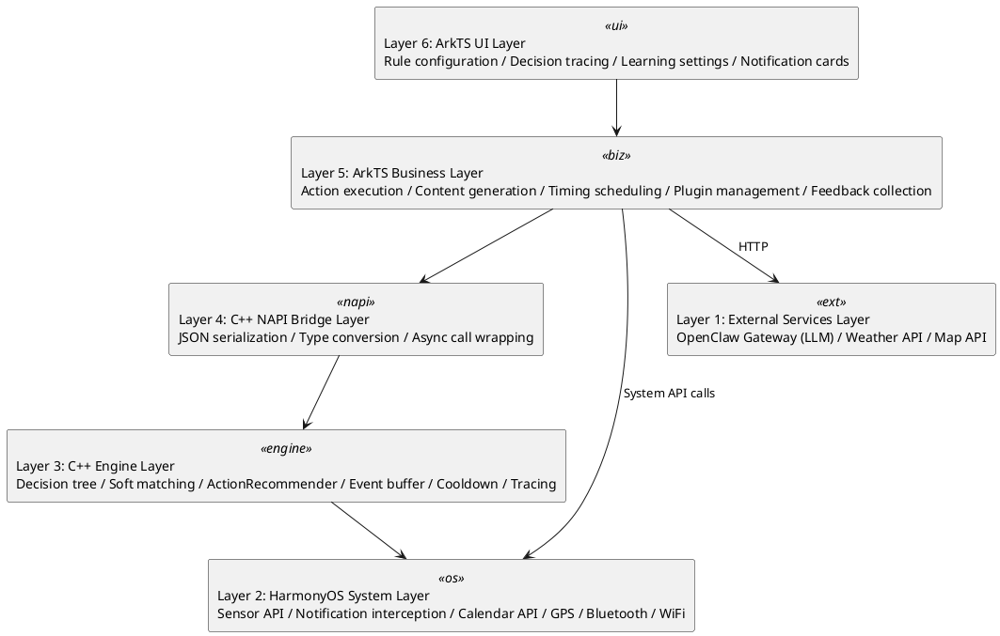
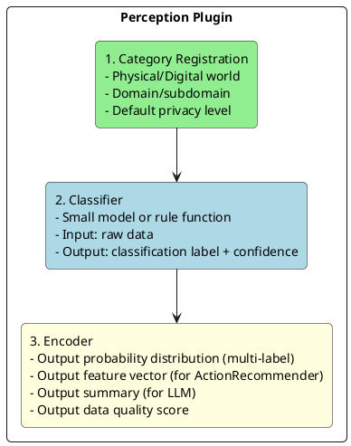
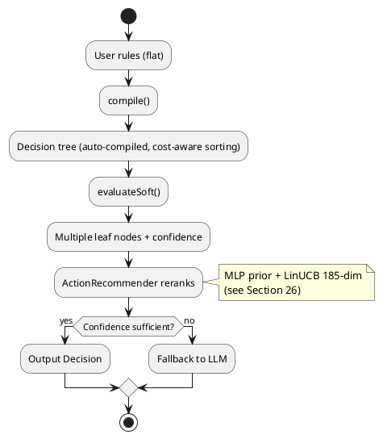
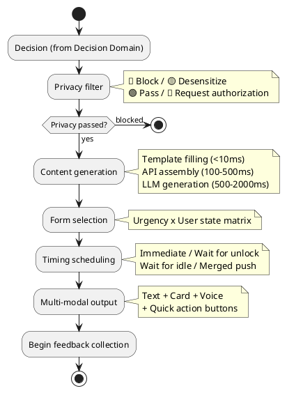
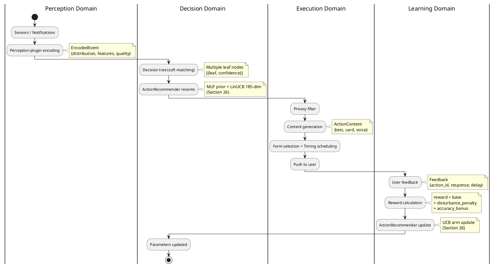
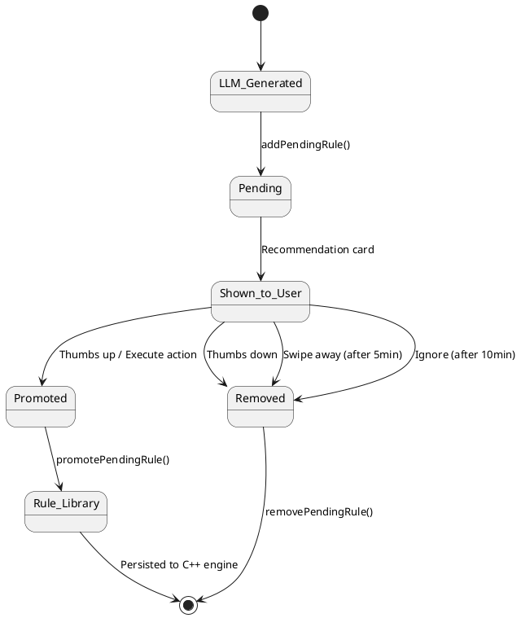
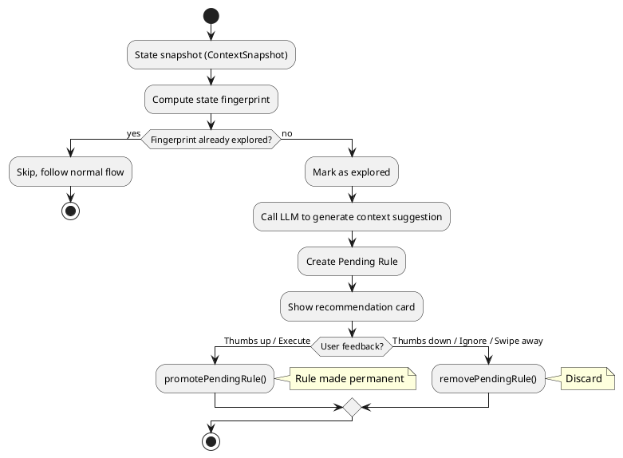

# Context Intelligence Framework Design Document
> Version: v8
> Date: 2026-03-03
> Author: 刘洪杰 (Hongjie Liu)

### Revision History

| Version | Date | Author | Change Description |
|---------|------|--------|-------------------|
| 1.0 | 2026-02-17 | 刘洪杰 (Hongjie Liu) | Initial version: overview, data classification, perception plugins, intent recognition, importance calculation, reward system, learning system |
| 2.0 | 2026-02-19 | 刘洪杰 (Hongjie Liu) | Encoders changed to probability distribution output; intent recognition rewritten: configurable rules -> auto-compiled decision tree -> soft matching -> 5-layer robustness protection; added temporal rules, OR conditions, cooldown, decision tracing, template inheritance, dynamic thresholds; composite reward function |
| 3.0 | 2026-02-19 | 刘洪杰 (Hongjie Liu) | Full document restructured following DDD 7-step method: Boundary -> Use Case -> Sub-domain -> Layer -> Architecture -> Narrow-down -> Entity; added system boundary definition, four problem domain partitioning, six-layer architecture model, execution domain design, implementation roadmap |
| 4.0 | 2026-02-20 | 刘洪杰 (Hongjie Liu) | C++ NAPI migration implementation (4 new modules); context.test remote testing capability; 21-scenario full coverage test suite; cooldown loadRules fix; actual directory structure update |
| 5.0 | 2026-02-22 | 刘洪杰 (Hongjie Liu) | LLM fallback rule feedback loop (pending -> promote/remove); rule deduplication mechanism; recommendation anti-duplication; active exploration mode design; FeedbackService card lifecycle; merged context_awareness_design.md (collection strategy, geofence learning, app learning, silent mode enhancement, wearable integration, data tray, training sync, feedback learning) |
| 7.0 | 2026-02-27 | 刘洪杰 (Hongjie Liu) | *(Stream Deep RL -- removed in v8, replaced by ActionRecommender)* |
| 8.0 | 2026-02-27 | 刘洪杰 (Hongjie Liu) | Action Execution System: ActionExecutor routes accepted recommendations to system capabilities (calendar, app launch, mode switch); CalendarPlugin extension (getUpcomingEvents, findConflicts, formatEventsMarkdown) |
| 9.0 | 2026-03-02 | 刘洪杰 (Hongjie Liu) | State Transition Modeling: 7-dimension state model, 70-scenario enumeration, StateTransitionTracker C++, recommendation card transition path bar (P0), persistence via NAPI |
| 10.0 | 2026-03-02 | 刘洪杰 (Hongjie Liu) | 7-Tuple Physical State & Scenario Intelligence: PhysicalState 7-tuple (time, location, motion, phone, light, sound, dayType) with 226,800 state space; PhysicalStateBuilder sensor->state classification; ScenarioMatcher deterministic chain matching (72 scenarios, 12 categories); ContextSettingsPage physical state card; dual pipeline architecture (rules + scenarios) |
| v8 | 2026-03-03 | 刘洪杰 (Hongjie Liu) | Removed legacy learning modules (Stream MLP, MAB, old 14-dim LinUCB, LocationDiscovery/DBSCAN) -- replaced by ActionRecommender (Section 26); cleaned up references throughout document |

---

## Table of Contents

- [1. Boundary — Problem Boundary](#1-boundary--problem-boundary)
  - [1.1 What Context Intelligence Is](#11-what-context-intelligence-is)
  - [1.2 What Context Intelligence Is Not](#12-what-context-intelligence-is-not)
  - [1.3 System Boundary Diagram](#13-system-boundary-diagram)
  - [1.4 Input Boundary](#14-input-boundary)
  - [1.5 Output Boundary](#15-output-boundary)
  - [1.6 Privacy Boundary](#16-privacy-boundary)
- [2. Use Case — Scenarios and Use Cases](#2-use-case--scenarios-and-use-cases)
  - [2.1 Physical World Data Sources](#21-physical-world-data-sources)
  - [2.2 Digital World Data Sources (by Maslow's Hierarchy of Needs)](#22-digital-world-data-sources-by-maslows-hierarchy-of-needs)
  - [2.3 Core Use Case List](#23-core-use-case-list)
  - [2.4 Use Case Priorities](#24-use-case-priorities)
- [3. Sub-domain — Problem Domain Partitioning](#3-sub-domain--problem-domain-partitioning)
  - [3.1 Four Major Problem Domains](#31-four-major-problem-domains)
  - [3.2 Perception Domain](#32-perception-domain)
  - [3.3 Decision Domain](#33-decision-domain)
  - [3.4 Execution Domain](#34-execution-domain)
  - [3.5 Learning Domain](#35-learning-domain)
  - [3.6 Inter-domain Interactions](#36-inter-domain-interactions)
- [4. Layer — Layered Architecture](#4-layer--layered-architecture)
  - [4.1 Six-Layer Model](#41-six-layer-model)
  - [4.2 Layer Responsibilities and Languages](#42-layer-responsibilities-and-languages)
  - [4.3 Inter-layer Dependency Rules](#43-inter-layer-dependency-rules)
- [5. Architecture — Architecture Design](#5-architecture--architecture-design)
  - [5.1 Perception Domain Architecture](#51-perception-domain-architecture)
  - [5.2 Decision Domain Architecture](#52-decision-domain-architecture)
  - [5.3 Execution Domain Architecture](#53-execution-domain-architecture)
  - [5.4 Learning Domain Architecture](#54-learning-domain-architecture)
  - [5.5 Full Data Flow Panorama](#55-full-data-flow-panorama)
- [6. Narrow-down — Technical Key Points](#6-narrow-down--technical-key-points)
  - [6.1 Decision Tree Auto-compilation](#61-decision-tree-auto-compilation)
  - [6.2 Soft Matching Strategy](#62-soft-matching-strategy)
  - [6.3 LinUCB Algorithm Details (Removed)](#63-linucb-algorithm-details-removed)
  - [6.4 Robustness Detailed Design](#64-robustness-detailed-design)
  - [6.5 Temporal Rules](#65-temporal-rules)
  - [6.6 Cooldown + Merged Push](#66-cooldown--merged-push)
  - [6.7 Cold Start Strategy](#67-cold-start-strategy)
  - [6.8 On-device Training Approach](#68-on-device-training-approach)
- [7. Entity — Implementation Design](#7-entity--implementation-design)
  - [7.1 Core Data Structures](#71-core-data-structures)
  - [7.2 C++ Module Design](#72-c-module-design)
  - [7.3 NAPI Interface Definitions](#73-napi-interface-definitions)
  - [7.4 ArkTS Service Design](#74-arkts-service-design)
  - [7.5 Storage Design](#75-storage-design)
  - [7.6 Directory Structure](#76-directory-structure)
  - [7.7 Implementation Roadmap](#77-implementation-roadmap)
- [8. Implementation Record — C++ NAPI Migration](#8-implementation-record--c-napi-migration)
  - [8.1 Migration Principles](#81-migration-principles)
  - [8.2 New C++ Modules](#82-new-c-modules)
  - [8.3 ArkTS Wrapper Layer](#83-arkts-wrapper-layer)
  - [8.4 Fixed Issues](#84-fixed-issues)
  - [8.5 Actual Directory Structure](#85-actual-directory-structure)
- [9. Test Suite](#9-test-suite)
  - [9.1 Test Architecture](#91-test-architecture)
  - [9.2 Test Scenario List](#92-test-scenario-list)
  - [9.3 Test Results](#93-test-results)
- [10. LLM Fallback Rule Feedback Loop](#10-llm-fallback-rule-feedback-loop)
  - [10.1 Design Goals](#101-design-goals)
  - [10.2 Rule Lifecycle](#102-rule-lifecycle)
  - [10.3 Pending Rule Storage](#103-pending-rule-storage)
  - [10.4 Feedback-driven Promotion/Demotion](#104-feedback-driven-promotiondemotion)
  - [10.5 Recommendation Anti-duplication](#105-recommendation-anti-duplication)
- [11. Rule Deduplication Mechanism](#11-rule-deduplication-mechanism)
  - [11.1 Deduplication Strategy](#111-deduplication-strategy)
  - [11.2 Deduplication Timing](#112-deduplication-timing)
- [12. Active Exploration Mode](#12-active-exploration-mode)
  - [12.1 Design Philosophy](#121-design-philosophy)
  - [12.2 Workflow](#122-workflow)
  - [12.3 State Fingerprint](#123-state-fingerprint)
  - [12.4 Differences from Normal Mode](#124-differences-from-normal-mode)
- [13. Multi-level Collection Strategy (Power Optimization)](#13-multi-level-collection-strategy-power-optimization)
  - [13.1 CellID Location Change Detection](#131-cellid-location-change-detection)
  - [13.2 Collection Interval Configuration](#132-collection-interval-configuration)
  - [13.3 Motion State Detection](#133-motion-state-detection)
  - [13.4 Phone Pickup Detection](#134-phone-pickup-detection)
- [14. Geofence Feature Learning](#14-geofence-feature-learning)
  - [14.1 Data Structure](#141-data-structure)
  - [14.2 Learning Trigger and Feature Matching](#142-learning-trigger-and-feature-matching)
- [15. App Usage Record Learning](#15-app-usage-record-learning)
- [16. Silent Mode Enhancement](#16-silent-mode-enhancement)
  - [16.1 Key Information Extraction](#161-key-information-extraction)
  - [16.2 Emotion/Mood Detection](#162-emotionmood-detection)
- [17. Wearable Device Integration](#17-wearable-device-integration)
- [18. Data Tray Specification](#18-data-tray-specification)
- [19. Training Data Sync System (C++)](#19-training-data-sync-system-c)
  - [19.1 Architecture Overview](#191-architecture-overview)
  - [19.2 C++ Data Structures](#192-c-data-structures)
  - [19.3 NAPI Interface](#193-napi-interface)
  - [19.4 Data Flow](#194-data-flow)
  - [19.5 Server-side Interface](#195-server-side-interface)
- [20. Feedback Learning System Detailed Design](#20-feedback-learning-system-detailed-design)
- [21. Stream Deep RL (Removed)](#21-stream-deep-rl-removed)
- [22. Recommendation Action Execution System](#22-recommendation-action-execution-system)
  - [22.1 Overview](#221-overview)
  - [22.2 ActionExecutor Design](#222-actionexecutor-design)
  - [22.3 CalendarPlugin Extension](#223-calendarplugin-extension)
  - [22.4 NodeRuntime Integration](#224-noderuntime-integration)
  - [22.5 Active Recommendation Cache](#225-active-recommendation-cache)
- [23. Stream Deep RL UI Display (Removed)](#23-stream-deep-rl-ui-display-removed)
- [24. State Transition Modeling and Feature Expansion](#24-state-transition-modeling-and-feature-expansion)
  - [24.1 7-Dimension State Model](#241-7-dimension-state-model)
  - [24.2 Scenario Enumeration (70 Scenarios)](#242-scenario-enumeration-70-scenarios)
  - [24.3 Input Dimension Coverage Analysis (Removed)](#243-input-dimension-coverage-analysis-removed)
  - [24.4 State Transition Features (9 Dimensions)](#244-state-transition-features-9-dimensions)
  - [24.5 StateTransitionTracker (C++)](#245-statetransitiontracker-c)
  - [24.6 Recommendation Card Transition Path Bar](#246-recommendation-card-transition-path-bar)
  - [24.7 Future Roadmap](#247-future-roadmap)
- [25. 7-Tuple Physical State & Scenario Intelligence](#25-7-tuple-physical-state--scenario-intelligence)
  - [25.1 Architecture Overview](#251-architecture-overview)
  - [25.2 7-Tuple Physical State Model](#252-7-tuple-physical-state-model)
  - [25.3 PhysicalStateBuilder](#253-physicalstatebuilder)
  - [25.4 Scenario Chain Matching](#254-scenario-chain-matching)
  - [25.5 72 Scenario Definitions](#255-72-scenario-definitions)
  - [25.6 Dual Pipeline Integration](#256-dual-pipeline-integration)
  - [25.7 UI Display](#257-ui-display)
  - [25.8 File Manifest](#258-file-manifest)
- [26. Action Recommendation System: ActionRecommender](#26-action-recommendation-system-actionrecommender-mlp--linucb--state-chain)
  - [26.1 Design Goals](#261-design-goals)
  - [26.2 Overall Architecture](#262-overall-architecture)
  - [26.3 State Pair Encoding (185-dim Feature)](#263-state-pair-encoding-185-dim-feature)
  - [26.4 StateHistory Ring Buffer (C++)](#264-statehistory-ring-buffer-c)
  - [26.5 ActionMLP Network](#265-actionmlp-network)
  - [26.6 LinUCB (Contextual Multi-Armed Bandit)](#266-linucb-contextual-multi-armed-bandit)
  - [26.7 Training Data Generation (Offline)](#267-training-data-generation-offline)
  - [26.8 ActionCatalog (40 Standard Actions)](#268-actioncatalog-40-standard-actions)
  - [26.9 UI Feedback Pipeline](#269-ui-feedback-pipeline)
  - [26.10 File Manifest](#2610-file-manifest)
- [Appendix: TODO Items](#appendix-todo-items)

---

## 1. Boundary — Problem Boundary

### 1.1 What Context Intelligence Is

An **AI secretary** embedded in the phone that can:
- **Perceive** — Collect data from the physical world and digital world
- **Understand** — Know the user's needs and intentions
- **Act** — Provide assistance at the right moment

**Core Principles:**

| Principle | Description |
|-----------|-------------|
| **Independent Personality** | AI is a companion, not a subordinate; has its own opinions and boundaries |
| **Privacy First** | Users control what AI can see; minimum permissions by default |
| **Local First** | Personal data never leaves the device; learning is done locally |
| **Progressive Intelligence** | From rules to models to LLM, upgrading complexity as needed |

### 1.2 What Context Intelligence Is Not

| Not | Description |
|-----|-------------|
| Not a general AI assistant | Does not handle user-initiated conversations/Q&A (that's the ClawdBot main body's job) |
| Not a notification manager | Not just filtering/forwarding notifications, but proactively providing services after understanding the context |
| Not a background service | Not continuously polling all data, but event-driven + on-demand queries |
| Not a cloud system | Core decisions are made locally; cloud is only used for LLM fallback and model delivery |

### 1.3 System Boundary Diagram



**Boundary Definitions:**
- **Boundary with Chat UI**: User actively sends a message -> Chat UI handles it; context intelligence proactively pushes -> via notifications/cards/voice
- **Boundary with OpenClaw Gateway**: Context intelligence only calls Gateway at Layer 3 (LLM fallback); daily decisions are purely local
- **Boundary with HarmonyOS**: Context intelligence obtains sensor data and sends notifications via system APIs; does not modify system behavior

### 1.4 Input Boundary

```
Inputs received by context intelligence:
├── Physical world events (sensor-triggered)
│   ├── Location changes (GPS/WiFi/Bluetooth)
│   ├── Motion state changes (accelerometer)
│   ├── Environmental changes (light/noise/temperature)
│   └── Phone state changes (charging/battery/connectivity)
│
├── Digital world events (system notifications)
│   ├── New message notifications (IM/email/SMS)
│   ├── App notifications (food delivery/courier/bank)
│   ├── Calendar event reminders
│   └── System events (incoming calls/alarms)
│
└── User feedback (explicit + implicit)
    ├── Click/ignore/swipe away notifications
    ├── Say "thanks" / "don't bother me"
    └── Manually configure rules
```

### 1.5 Output Boundary

```
Outputs produced by context intelligence:
├── User notifications (primary output)
│   ├── System notification bar (fullscreen/banner/badge/silent)
│   ├── Voice broadcast (driving mode)
│   ├── Cards (rich media information)
│   └── Merged summaries (batch information digest)
│
├── Silent actions (non-intrusive)
│   ├── Pre-cache data (pre-load weather/traffic)
│   ├── Adjust system settings (mute/brightness)
│   └── Background preparation (organize schedule summary)
│
└── Feedback to learning system
    ├── Decision trace records
    └── Reward signals (for ActionRecommender)
```

### 1.6 Privacy Boundary

| Level | Symbol | AI Visible Content | Description |
|-------|--------|-------------------|-------------|
| **Open** | 🟢 | Full original text | AI has full visibility |
| **Summary** | 🟡 | Summary + metadata | AI only sees overview, not original text |
| **Forbidden** | 🔴 | Only "new message" | AI has no visibility |
| **Authorized** | 🔵 | Temporary full access | Visible after user authorization, revoked after use |

**Privacy Principles:**
1. Minimum permissions by default (new data sources default to 🔴)
2. User-initiated authorization
3. Temporary authorization auto-revokes
4. Summary level only provides statistics, not original text
5. Audit logs are available for review

---

## 2. Use Case — Scenarios and Use Cases

### 2.1 Physical World Data Sources

#### Human

| Subcategory | Data | Source |
|-------------|------|--------|
| **Vital Signs** | Heart rate, HRV, blood pressure, SpO2, body temperature | Watch/band |
| **Motion State** | Stationary (sitting/standing/lying), walking, running, cycling, riding in vehicle | Accelerometer |
| **Body Attributes** | Height, weight, body fat, age, gender | User profile |
| **Mental State** | Sleep quality, fatigue, stress, emotion | Inferred/self-reported |
| **Biometrics** | Voiceprint, face, fingerprint | Sensors |

#### Phone

| Subcategory | Data |
|-------------|------|
| **Posture** | Grip style, screen orientation |
| **Location** | GPS coordinates, place type (home/office/mall) |
| **Power** | Battery level, charging status |
| **Connectivity** | WiFi, Bluetooth, signal strength |
| **Time** | Time of day, day of week, holidays |

#### Environment (Five Senses)

| Sense | Data | Source |
|-------|------|--------|
| **Sight** | Light level, scene, people, objects | Camera/light sensor |
| **Hearing** | Noise level, ambient sound type, voice | Microphone |
| **Smell** | Air quality, PM2.5 | Sensor/API |
| **Taste** | (Indirect inference) | Scene + time |
| **Touch** | Temperature, humidity, atmospheric pressure | Environmental sensors |

### 2.2 Digital World Data Sources (by Maslow's Hierarchy of Needs)

| Level | Data | Privacy | Source |
|-------|------|---------|--------|
| **1. Physiological** | Food delivery/grocery orders | 🟢 | Meituan/Ele.me |
| | Health data trends | 🟡 | Health apps |
| | Medical diagnosis records | 🔴 | Medical apps |
| **2. Safety** | Courier/ride status | 🟢 | Courier/ride apps |
| | Bill reminders | 🟡 | Banking apps |
| | Financial details/passwords | 🔴 | Finance apps |
| **3. Social** | Public group chats | 🟢 | Social apps |
| | Private chat message summaries | 🟡 | IM apps |
| | Private conversation content | 🔴 | IM apps |
| **4. Esteem** | Tasks/schedule | 🟢 | Calendar/task apps |
| | Work document titles | 🟡 | Office apps |
| | Salary/performance | 🔴 | HR systems |
| **5. Self-actualization** | Public learning content | 🟢 | Learning platforms |
| | Learning progress | 🟡 | Learning apps |
| | Private diary | 🔴 | Note apps |

### 2.3 Core Use Case List

| Use Case | Trigger Condition | Action | Priority |
|----------|-------------------|--------|----------|
| Commute reminder | Weekday + 7:00 +/- 30min + at home | Push traffic + weather | 🟡 |
| Lunch recommendation | Weekday + 12:00 +/- 1h + at office | Push nearby restaurants/delivery | 🟢 |
| Important message | Spouse/boss sends message | Urgent notification | 🔴 |
| Low battery | Battery < 20% + not charging | Remind to charge | 🟡 |
| Bedtime summary | 22:00-24:00 + at home | Tomorrow's schedule + weather | 🟢 |
| Package arrival | Courier notification + at home | Remind to pick up | 🟢 |
| Exercise reminder | Sedentary > 2 hours | Suggest activity | 🟢 |
| Message pile-up | 3+ unread messages in 10 min | Merged reminder | 🟡 |
| Homebound traffic | Leaving office + getting in car | Broadcast traffic conditions | 🟡 |
| Sleep suggestion | 3 consecutive days using phone after 23:00 | Suggest going to bed earlier | 🟢 |
| Meeting preparation | 15 min before calendar event | Reminder + materials | 🟡 |
| Auto mute | Entering meeting room/cinema | Mute phone | ⚪ |

### 2.4 Use Case Priorities

| Phase | Use Cases | Reason |
|-------|-----------|--------|
| **MVP** | Commute reminder, important message, low battery, bedtime summary | Simple trigger conditions, high value |
| **Phase 2** | Lunch recommendation, message pile-up, meeting preparation, package arrival | Requires notification interception |
| **Phase 3** | Exercise reminder, sleep suggestion, auto mute, homebound traffic | Requires continuous sensors + temporal patterns |

---

## 3. Sub-domain — Problem Domain Partitioning

### 3.1 Four Major Problem Domains



### 3.2 Perception Domain

**Responsibility:** Collect raw data and encode it into structured probability distribution events

```
Input: Raw sensor data / System notifications / API data
Output: EncodedEvent (probability distribution + feature vector + data quality)

Sub-modules:
├── Plugin registration (category / classifier / encoder triad)
├── Physical world encoders (location/motion/environment -> probability distribution)
├── Digital world encoders (notifications/calendar/messages -> probability distribution)
└── Perception bus (event routing + privacy pre-filtering)
```

**Core Interface:** Probability distribution output (multi-label, normalization not required) + data quality score

### 3.3 Decision Domain

**Responsibility:** Based on the current context, decide what to do

```
Input: EncodedEvent + user context
Output: Decision (intent + confidence + action type + decision trace)

Sub-modules:
├── Rule configuration (user writes flat rules)
├── Decision tree compiler (auto-compilation + cost-aware sorting)
├── Soft matching engine (probability distribution -> multi-leaf confidence)
├── ActionRecommender (MLP + LinUCB 185-dim, see Section 26)
├── LLM fallback (scenarios not covered by decision tree)
├── Cooldown management
├── Temporal rule engine (event sequence matching)
└── Decision trace recording
```

**Core Algorithm:** Decision tree (soft matching) + ActionRecommender (MLP + LinUCB 185-dim)

### 3.4 Execution Domain

**Responsibility:** Transform decisions into concrete user-visible actions

```
Input: Decision
Output: User notifications / Voice broadcast / Silent actions

Sub-modules:
├── Privacy filter (last line of defense before execution)
├── Content generation (template filling / API assembly / LLM generation)
├── Form selection (fullscreen/banner/badge/voice/silent)
├── Timing scheduling (immediate/wait for unlock/wait for idle/merge)
├── Multi-modal output (text/card/voice/quick action)
└── Feedback collection trigger
```

**Core Strategy:** Urgency x User state -> Push form matrix

### 3.5 Learning Domain

**Responsibility:** Continuously improve decision quality from user feedback

```
Input: User feedback (explicit + implicit)
Output: Updated ActionRecommender parameters (LinUCB arms + UCB state)

Sub-modules:
├── Feedback collection (click/ignore/swipe away/thanks/don't bother me)
├── Reward calculation (base feedback + disturbance penalty + accuracy)
├── Anomaly detection (filter bad feedback)
├── ActionRecommender online update (LinUCB 185-dim, see Section 26)
├── Checkpoint management (auto snapshots + rollback)
└── Performance monitoring (sliding window average reward)
```

**Core Mechanism:** 5-layer robustness protection + ActionRecommender online learning

### 3.6 Inter-domain Interactions



**Data Format Conventions:**
- Perception -> Decision: `EncodedEvent` (probability distribution + features + quality)
- Decision -> Execution: `Decision` (intent + confidence + action + trace)
- Execution -> Learning: `Feedback` (action_id + user response + delay)
- Learning -> Decision: Updates ActionRecommender LinUCB arm parameters (A, b matrices per action)

---

## 4. Layer — Layered Architecture

### 4.1 Six-Layer Model



### 4.2 Layer Responsibilities and Languages

| Layer | Responsibility | Language | Reason |
|-------|---------------|----------|--------|
| UI Layer | User interaction interface | ArkTS | HarmonyOS UI must use ArkTS |
| Business Layer | Execution domain logic | ArkTS | Needs to call system APIs, UI rendering |
| NAPI Bridge | ArkTS <-> C++ | C++ | N-API standard |
| Engine Layer | Decision domain + Learning domain core | C++ | Performance, memory control, cross-platform |
| System Layer | Perception domain data sources | ArkTS -> C++ | System APIs use ArkTS, encoding uses C++ |
| External Services | LLM/API | HTTP | Network calls |

### 4.3 Inter-layer Dependency Rules

```
Upper layers can call lower layers ✅
Lower layers cannot call upper layers ❌ (use callbacks/events for notification)
Same-layer communication through interfaces ✅
Cross-layer calls prohibited (must go through adjacent layers) ❌
```

---

## 5. Architecture — Architecture Design

### 5.1 Perception Domain Architecture

#### Plugin Registration Triad



#### Encoder Output Specification

```typescript
interface EncodedOutput {
  distribution: Map<string, number>;  // Probability distribution (normalization not required)
  features: number[];                 // Feature vector
  summary?: string;                   // Text summary
  quality: number;                    // Data quality 0~1
}
```

#### Plugin Distribution Output Examples

| Plugin | Distribution Output | Description |
|--------|-------------------|-------------|
| Location | `{home:0.8, market:0.7, office:0.02}` | When GPS accuracy is poor, multiple locations have probabilities |
| Motion | `{still:0.6, walking:0.3, driving:0.1}` | At a red light, both stationary and driving are possible |
| Time Period | `{morning:0.9, commute:0.7}` | Non-mutually exclusive categories |
| Noise | `{quiet:0.4, office:0.5, cafe:0.3}` | Ambient sound is uncertain |

### 5.2 Decision Domain Architecture

#### Overall Flow



#### Rule Configuration

Users write flat rules, the system auto-compiles them into a decision tree:

```typescript
interface SmartRule {
  id: string;
  name: string;
  enabled: boolean;
  conditions: Map<string, RuleCondition>;       // AND relationship
  conditionGroups?: Map<string, RuleCondition>[]; // OR groups (optional)
  temporal?: TemporalCondition;                 // Temporal condition (optional)
  extends?: string[];                           // Template inheritance (optional)
  intent: string;
  priority: '🔴' | '🟡' | '🟢' | '⚪';
  action: string;
  cooldown?: CooldownConfig;
}
```

#### Decision Tree Auto-compilation

- Automatically builds tree by key, merging identical keys
- Cost-aware sorting: cheap checks (time, day of week) placed at upper levels, expensive ones (GPS, sensors) at lower levels
- Automatically recompiles when rules change

#### Soft Matching

- Each condition returns 0~1 confidence (not boolean)
- Missing data = 0.5 (unknown ≠ non-match)
- Key features like location use multi-source fusion (GPS + WiFi + Bluetooth + history)
- Decision tree can traverse multiple paths, confidence multiplied along paths
- Final responses graded by confidence level

#### ActionRecommender (Replacement for old LinUCB)

> The old rule-engine-internal LinUCB (~40 dim, semantic fusion) was **removed in v2.66.1** and replaced by the ActionRecommender system (Section 26), which uses a 185-dim state pair feature vector with MLP prior + per-action LinUCB arms. See Section 26 for full details.

### 5.3 Execution Domain Architecture

#### Execution Pipeline



#### Push Form Matrix

```
            Idle        Busy        Meeting     Sleeping    Driving
🔴 Now     Full+sound  Banner+vib  Banner+vib  Full+sound  Voice
🟡 Soon    Banner      Badge       Silent      Silent      Voice
🟢 Later   Badge       Silent      Silent      Silent      Silent
⚪ Bg      Silent      Silent      Silent      Silent      Silent
```

Low confidence (<0.6) automatically downgrades one level (fullscreen -> banner -> badge -> silent).

#### Merged Push

Multiple 🟢/⚪ pushes within 5 minutes are merged into a single summary notification.

### 5.4 Learning Domain Architecture

#### Reward Calculation

```python
reward = base_reward              # Explicit/implicit feedback
       + disturbance_penalty      # -0.1 x (recent push count^1.5)
       + accuracy_bonus           # Correct push +0.5 / Should have pushed but didn't -1.0
```

Time-period weighting: sleeping x3, meeting x2, driving x2.5.

#### 5-Layer Robustness Protection

| Layer | Protection | Mechanism |
|-------|-----------|-----------|
| Input | Feature anomaly | Range check + missing value filling |
| Feedback | Abnormal feedback | 3σ detection + frequency limiting + reward clipping |
| Model | Parameter protection | Time decay γ + 5% change limit + condition number monitoring |
| Output | Uncertainty | Confidence check + fallback to rules when uncertain |
| System | Overall degradation | Daily checkpoints + performance monitoring + auto rollback |

#### Cold Start

Cold start is now handled by the ActionRecommender (Section 26): MLP provides prior knowledge (weight 0.6), LinUCB starts from scratch (weight 0.4). After ~50-100 meaningful interactions LinUCB starts outperforming pure MLP; ~1000 interactions leads to fully personalized recommendations.

### 5.5 Full Data Flow Panorama



---

## 6. Narrow-down — Technical Key Points

### 6.1 Decision Tree Auto-compilation

**Key Selection Strategy:** `score = coverage x discrimination / cost`

```typescript
const featureCosts: Record<string, number> = {
  'weekday': 1, 'hour': 1, 'charging': 1, 'battery': 1,  // Free
  'keyword': 2, 'sender': 2, 'app': 2,                    // Lightweight
  'location': 10, 'activity': 10,                         // Requires sensors
  'noise': 15, 'heartrate': 20,                           // Expensive
};
```

Cheap keys placed at upper levels -> early pruning -> avoids unnecessary sensor queries.

### 6.2 Soft Matching Strategy

**Time:** Gaussian decay, 1.0 within tolerance, exponential decay beyond
```
target=7:30, tolerance=30min:
7:30->1.0, 7:00->1.0, 6:50->0.85, 6:30->0.45, 6:00->0.05
```

**Location:** Multi-source fusion takes the highest
```
GPS (if available) + WiFi SSID (0.95) + Bluetooth devices (0.8) + Historical inference
-> max(scores)
```

**Missing data:** confidence=0.5 (neutral), not 0 (negative)

### 6.3 LinUCB Algorithm Details (Removed)

> **Removed in v2.66.1.** The old rule-engine-internal LinUCB (~40 dim, semantic fusion, time-decay) has been replaced by the ActionRecommender system (Section 26), which uses a 185-dim state pair feature vector with per-action LinUCB arms (40 actions, alpha=0.3). See Section 26.6 for the new LinUCB design.

### 6.4 Robustness Detailed Design

**Time Decay:** γ=0.998, half-life ≈ 346 iterations (approximately 2 weeks), old habits automatically fade

**Anomaly Detection:** Reward deviates 3σ / >5 feedback entries within 1 minute / features out of range -> filter

**Rollback:** Daily snapshots; 30% performance drop -> auto restore checkpoint

### 6.5 Temporal Rules

```typescript
interface TemporalCondition {
  event: string;                              // Event type
  window: number;                             // Time window (ms)
  count?: { min?: number, max?: number };
  sequence?: string[];                        // Ordered event sequence
}
```

Implementation: Event ring buffer (last 7 days, max 10,000 entries), O(N) scan.

### 6.6 Cooldown + Merged Push

```typescript
interface CooldownConfig {
  duration: number;       // Minimum interval (ms)
  scope: 'rule' | 'intent';  // Dedup scope
  resetOn?: string;       // Reset event
  merge?: boolean;        // Merge during cooldown
}
```

### 6.7 Cold Start Strategy

Cold start is now handled by the ActionRecommender (Section 26): MLP provides prior knowledge from a pre-trained recommendation matrix, while LinUCB arms learn from real user feedback. No separate MVP statistical learning phase is needed.

### 6.8 On-device Training Approach

On-device training is handled by the ActionRecommender (Section 26): C++ header-only implementation with MLP inference (pre-trained weights) + LinUCB online learning (185-dim, 40 arms). No external ML framework required.

---

## 7. Entity — Implementation Design

### 7.1 Core Data Structures

```typescript
// Rule
interface SmartRule {
  id: string;
  name: string;
  enabled: boolean;
  conditions: Map<string, RuleCondition>;
  conditionGroups?: Map<string, RuleCondition>[];
  temporal?: TemporalCondition;
  extends?: string[];
  intent: string;
  priority: string;
  action: string;
  cooldown?: CooldownConfig;
}

// Decision tree node
interface ExecNode {
  key: string;
  branches: Map<Object, ExecNode | LeafNode>;
  fallthrough?: ExecNode;
}

// Leaf node
interface LeafNode {
  rules: SmartRule[];
  semantic: number[];  // Semantic vector
}

// Match result
interface MatchResult {
  rule: SmartRule;
  confidence: number;
  path: { key: string, actual: Object, expected: Object, confidence: number }[];
}

// Decision output
interface Decision {
  intent: string;
  confidence: number;
  priority: string;
  action: string;
  actionParams: Record<string, string>;
  trace: DecisionTrace;
}

// Encoder output
interface EncodedOutput {
  distribution: Map<string, number>;
  features: number[];
  quality: number;
  summary?: string;
}
```

### 7.2 C++ Module Design

```cpp
// Rule compiler
class RuleCompiler {
  ExecNode* compile(vector<Rule>& rules);
  string selectBestKey(vector<Rule>& rules);
  SemanticVector generateSemantic(Rule& rule);
};

// Decision tree execution
class DecisionTree {
  vector<MatchResult> evaluateSoft(ExecNode* root, Context& ctx);
};

// Soft matcher
class SoftMatcher {
  float match(string key, Value actual, Value expected);
  float matchLocation(string target, LocationSources& sources);
  float matchHour(float actual, float target, float tolerance);
};

// ActionRecommender (MLP + LinUCB 185-dim, see Section 26)
// Old RobustLinUCB class removed in v2.66.1 — replaced by action_recommender.h

// Event buffer
class EventRingBuffer {
  void push(Event& e);
  int countInWindow(string event, int64_t windowMs);
  bool matchSequence(vector<string>& seq, int64_t windowMs);
};

// Cooldown manager
class CooldownManager {
  bool isInCooldown(string ruleId);
  void startCooldown(string ruleId, int64_t durationMs);
  void mergeEvent(string ruleId, Event& e);
};

// Decision tracer
class DecisionTracer {
  void record(vector<MatchResult>& results, Context& ctx);
  string getHistory(int limit);  // JSON
};

// Model checkpoint
class ModelCheckpoint {
  void save(/* ActionRecommender state */);
  void maybeRollback(/* ActionRecommender state */, float currentAvgReward);
};
```

### 7.3 NAPI Interface Definitions

```typescript
// Calling C++ engine from ArkTS
import ruleEngine from 'libruleengine.so';

// Rule management
ruleEngine.loadRules(rulesJson: string): boolean;
ruleEngine.compileTree(): boolean;

// Event input
ruleEngine.pushEvent(eventJson: string): void;

// Decision
ruleEngine.evaluate(contextJson: string): string;  // -> Decision JSON

// Feedback
ruleEngine.feedback(ruleId: string, reward: number): void;

// Tracing
ruleEngine.getTraceHistory(limit: number): string;  // -> JSON

// Model management
ruleEngine.saveModel(path: string): boolean;
ruleEngine.loadModel(path: string): boolean;
ruleEngine.resetModel(): boolean;
```

### 7.4 ArkTS Service Design

```typescript
// Context intelligence main service
class ContextAIService {
  // Initialize engine
  async init(): Promise<void>;

  // Event loop: receive perception events -> decide -> execute
  async onEvent(event: EncodedEvent): Promise<void>;

  // Execution pipeline
  async executeAction(decision: Decision): Promise<void>;
}

// Perception plugin manager
class PluginManager {
  registerPlugin(plugin: PerceptionPlugin): void;
  startAll(): void;
  stopAll(): void;
}

// Content generator
class ContentGenerator {
  async generate(intent: string, context: Context): Promise<ActionContent>;
}

// Feedback collector
class FeedbackCollector {
  watch(actionId: string): void;
  onUserResponse(actionId: string, response: UserResponse): void;
}
```

### 7.5 Storage Design

```
entry/src/main/resources/
└── rawfile/
    └── context_ai/
        └── default_rules.json     # Pre-set rule library

AppData/
└── context_ai/
    ├── rules/
    │   ├── user_rules.json        # User-defined rules
    │   └── templates.json         # Rule templates
    ├── model/
    │   ├── ucb_state.bin          # ActionRecommender LinUCB state (per-action arms)
    │   └── checkpoints/           # Historical checkpoints
    ├── data/
    │   ├── event_buffer.bin       # Event ring buffer
    │   ├── feedback_log.db        # Feedback log
    │   └── decision_trace.db      # Decision trace (last 1000 entries)
    └── config/
        └── learning_config.json   # Learning parameters (γ, α, etc.)
```

Total storage: < 5MB

### 7.6 Directory Structure

**Design Target Directory (Planned):**

```
entry/src/main/
├── ets/
│   └── service/
│       └── contextai/
│           ├── ContextAIService.ets    # Main service
│           ├── PluginManager.ets       # Plugin management
│           ├── ContentGenerator.ets    # Content generation
│           ├── DeliveryManager.ets     # Push form + timing
│           ├── FeedbackCollector.ets   # Feedback collection
│           └── plugins/                # Perception plugins
│               ├── LocationPlugin.ets
│               ├── TimePlugin.ets
│               ├── NotificationPlugin.ets
│               └── MotionPlugin.ets
├── cpp/
│   └── rule_engine/
│       ├── CMakeLists.txt
│       ├── napi_entry.cpp              # NAPI bindings
│       ├── rule_compiler.h/cpp         # Rule compiler
│       ├── decision_tree.h/cpp         # Decision tree
│       ├── soft_matcher.h/cpp          # Soft matching
│       ├── action_recommender.h         # ActionRecommender (MLP + LinUCB 185-dim)
│       ├── event_buffer.h/cpp          # Event buffer
│       ├── cooldown.h/cpp              # Cooldown management
│       ├── decision_tracer.h/cpp       # Decision tracing
│       ├── feedback_validator.h/cpp    # Anomaly detection
│       ├── model_checkpoint.h/cpp      # Checkpoints
│       └── json_utils.h/cpp            # JSON utilities
└── resources/rawfile/context_ai/
    └── default_rules.json
```

**Actual Implemented Directory (v2.38.0, 2026-02-20):**

```
entry/src/main/
├── ets/service/context/                      # ArkTS context intelligence services
│   ├── ContextAwarenessService.ets           # Main service (perception + scheduling)
│   ├── ContextEngine.ets                     # Decision engine ArkTS wrapper
│   ├── ContextModels.ets                     # Data model definitions
│   ├── DataTray.ets                          # Sensor data tray (NAPI wrapper)
│   ├── GeoUtils.ets                          # Geographic calculations (NAPI wrapper)
│   ├── LocationFusionNative.ets              # Location fusion (NAPI wrapper)
│   ├── LocationFusionService.ets             # Location fusion business logic
│   ├── GeofenceManager.ets                   # Geofence management
│   ├── RecommenderBridge.ets                 # ActionRecommender ArkTS bridge
│   ├── BehaviorLogger.ets                    # Behavior logging
│   ├── SensorDataTray.ets                    # Legacy data tray (kept as backup)
│   └── plugins/                              # Perception plugins
│       ├── MotionPlugin.ets                  # Motion state
│       ├── BatteryPlugin.ets                 # Battery/charging
│       ├── NetworkPlugin.ets                 # Network state
│       ├── ScreenStatePlugin.ets             # Screen state
│       └── DigitalWorldPlugin.ets            # Digital world (notification interception)
│
├── cpp/                                      # C++ NAPI modules
│   ├── CMakeLists.txt                        # Root CMake (registers all sub-modules)
│   ├── napi_exec.cpp                         # exec module
│   ├── context_engine/                       # Decision engine (core)
│   │   ├── CMakeLists.txt
│   │   ├── context_engine.h                  # Header (Rule, MatchResult, RuleEngine, etc.)
│   │   ├── context_engine_napi.cpp           # NAPI bindings
│   │   ├── rule_engine.cpp                   # Rule engine (evaluate + cooldown + rate limit)
│   │   ├── decision_tree.cpp                 # Decision tree auto-compilation
│   │   ├── soft_match.cpp                    # Soft matching (in/eq/lte/gte/range/neq + decay)
│   │   ├── action_recommender.h              # ActionRecommender (MLP + LinUCB 185-dim)
│   │   └── action_weights.h                  # Pre-trained MLP weights (auto-generated)
│   ├── data_tray/                            # Sensor data cache (TTL + quality decay)
│   │   ├── CMakeLists.txt
│   │   ├── data_tray.h                       # Header (singleton, thread-safe)
│   │   └── data_tray_napi.cpp                # NAPI bindings
│   ├── geo_utils/                            # Geographic calculations
│   │   ├── CMakeLists.txt
│   │   ├── geo_utils.h                       # Haversine + geofence ray casting
│   │   └── geo_utils_napi.cpp                # NAPI bindings
│   ├── location_fusion/                      # Multi-source location fusion
│   │   ├── CMakeLists.txt
│   │   ├── location_fusion.h                 # GPS/WiFi/BT confidence fusion
│   │   └── location_fusion_napi.cpp          # NAPI bindings
│   ├── voiceprint/                           # Voiceprint recognition
│   └── types/                                # TypeScript declarations
│       ├── libdata_tray/                     # index.d.ts + oh-package.json5
│       ├── libgeo_utils/
│       └── liblocation_fusion/
│
├── ets/service/gateway/                      # OpenClaw node capabilities
│   ├── NodeRuntime.ets                       # Contains context.test invoke handler
│   └── GatewayProtocol.ets                   # Contains Command.CONTEXT_TEST
```

### 7.7 Implementation Roadmap

| Phase | Duration | Goal | Deliverables |
|-------|----------|------|-------------|
| **MVP** | 4 weeks | Basic rule engine + 4 core use cases | Hard-match decision tree + template notifications + statistical learning |
| **Phase 2** | 4 weeks | Soft matching + ActionRecommender + notification interception | Probability distribution encoding + ActionRecommender (MLP+LinUCB) + 8 use cases |
| **Phase 3** | 4 weeks | Temporal rules + voice + robustness | Event buffer + TTS + 5-layer protection + 12 use cases |
| **Phase 4** | Ongoing | LLM fallback + federated learning + more plugins | Complete system |

**MVP Details:**
1. Week 1: C++ decision tree (hard matching) + NAPI interface
2. Week 2: 4 perception plugins (time/location/battery/notification)
3. Week 3: ArkTS execution layer (notification push + template content)
4. Week 4: Statistical learning + feedback collection + basic UI

---

## 8. Implementation Record — C++ NAPI Migration

> Date: 2026-02-20
> Principle: ArkTS only handles UI + HarmonyOS API calls + NAPI bridging; all computation, caching, and algorithms in C++

### 8.1 Migration Principles

| Principle | Description |
|-----------|-------------|
| **C++ for computation** | Distance calculation, clustering, fusion, rule matching all native |
| **ArkTS for bridging** | Thin wrapper layer, only does JSON conversion + NAPI calls |
| **ArkTS for system calls** | Sensors, GPS, WiFi, Bluetooth, notifications and other HarmonyOS Kit APIs can only be called from ArkTS |
| **Header-only implementation** | New modules use header file implementation + separate NAPI binding .cpp, simplifying compilation |
| **Singleton pattern** | data_tray uses `std::mutex` for thread-safe singleton |

### 8.2 New C++ Modules

| Module | SO Name | Functionality | Key Algorithm |
|--------|---------|---------------|---------------|
| **data_tray** | libdata_tray.so | Sensor data caching | TTL expiry + quality decay (linear interpolation) |
| **geo_utils** | libgeo_utils.so | Geographic distance calculation | Haversine formula + polygon geofence ray casting |
| **location_fusion** | liblocation_fusion.so | Multi-source location fusion | GPS/WiFi/BT confidence-weighted fusion |

**Pre-existing C++ Modules (before migration):**

| Module | SO Name | Functionality |
|--------|---------|---------------|
| **context_engine** | libcontext_engine.so | Rule engine + decision tree + soft matching + ActionRecommender + event buffer |
| **voiceprint** | libvoiceprint.so | Voiceprint recognition (stub) |
| **exec** | libexec.so | Shell command execution |

### 8.3 ArkTS Wrapper Layer

| Wrapper File | Corresponding C++ Module | Replaced Legacy ArkTS Implementation |
|-------------|-------------------------|--------------------------------------|
| DataTray.ets | data_tray | SensorDataTray.ets (kept as backup) |
| GeoUtils.ets | geo_utils | GeofenceManager inline distance calculation |
| LocationFusionNative.ets | location_fusion | LocationFusionService inline confidence calculation |
| RecommenderBridge.ets | context_engine (action_recommender) | ActionRecommender predict / reward / flush |

### 8.4 Fixed Issues

| Issue | File | Fix |
|-------|------|-----|
| context_engine not compiled | cpp/CMakeLists.txt | Added `add_subdirectory(context_engine)` |
| ImportLinUCB function not closed | context_engine_napi.cpp | Added `return nullptr;` and `}` (legacy fix; old LinUCB removed in v2.66.1) |
| loadRules doesn't clear cooldown | rule_engine.cpp | Clear all lastFired_/categoryFirings_/globalFirings_ on loadRules |

### 8.5 Remote Testing Capability — context.test

Remote scenario injection testing implemented via the OpenClaw Node invoke protocol.

**Call Chain:**
```
Server (nodes invoke) -> Gateway -> Susan (WebSocket) -> NodeRuntime.handleContextTest()
  -> ContextEngineService.init() -> nativeLoadRules() -> nativeEvaluate() -> Return MatchResult[]
```

**Invoke Parameters:**
```json
{
  "scenario": "Scenario name",
  "loadDefaultRules": true,           // Optional: reload built-in rules (including cooldown clearing)
  "geofences": [                      // Optional: bind geofences
    { "id": "work_001", "category": "work" }
  ],
  "snapshot": {                       // Required: simulated ContextSnapshot
    "timeOfDay": "morning",
    "hour": "8",
    "dayOfWeek": "1",
    "isWeekend": "false",
    "motionState": "walking",
    "batteryLevel": "10",
    "isCharging": "false",
    "networkType": "cellular",
    "geofence": "work_001"            // Optional
  },
  "maxResults": 5                     // Optional: maximum returned results
}
```

**Gateway Configuration:** `gateway.nodes.allowCommands` must include `"context.test"`

---

## 9. Test Suite

### 9.1 Test Architecture

```
Server (Linda/OpenClaw)
  │
  ├── nodes invoke context.test  -->  Susan (Phone App)
  │                                       │
  │                                       ├── ContextEngineService.init()
  │                                       ├── loadDefaultRules() + rebindGeofences()
  │                                       ├── C++ nativeEvaluate(snapshot)
  │                                       │     ├── Decision tree routing
  │                                       │     ├── Soft matching (in/eq/lte/gte/range/neq)
  │                                       │     └── Cooldown + Rate Limit check
  │                                       │
  │  <-- Return { matches, ruleCount } ---┘
  │
  └── Verify matches vs expected
```

### 9.2 Test Scenario List

#### Full Rule Coverage (11/11 rules)

| # | Scenario | Key Conditions | Expected Rule | Result |
|---|----------|---------------|---------------|--------|
| 1 | Low battery commute | morning + walking + battery=10 + !charging | rule_low_battery(100%) + rule_morning_workday(100%) | PASS |
| 2 | Weekday driving commute | morning + driving + !weekend | rule_morning_workday(100%) + rule_commuting(100%) | PASS |
| 3 | Arrive at office | morning + stationary + geofence=work | rule_arrive_work(100%) | PASS |
| 4 | Weekend morning at home | morning + weekend + stationary | rule_weekend_morning(100%) + rule_long_stationary(100%) | PASS |
| 5 | Late night stationary | night + hour=23 + stationary | rule_bedtime(100%) | PASS |
| 6 | Evening leaving work driving | evening + driving + !weekend | rule_commuting(100%) | PASS |
| 7 | Evening arrive home | evening + stationary + geofence=home | rule_evening_home(100%) | PASS |
| 8 | Negative - afternoon stationary no geofence | afternoon + stationary + battery=60 | Only rule_long_stationary(100%) | PASS |
| 9 | Arrive at gym | evening + stationary + geofence=gym | rule_arrive_gym(100%) | PASS |
| 10 | Morning leave home (full match) | morning + walking + geofence != home | rule_leave_home_morning(100%) | PASS |
| 11 | Leave work after hours | evening + walking + geofence != work | rule_leave_work(100%) | PASS |

#### Boundary Value Tests

| # | Scenario | Key Conditions | Expected | Result |
|---|----------|---------------|----------|--------|
| 12 | Battery exactly 15% | batteryLevel=15 + !charging | rule_low_battery(100%) | PASS |
| 13 | Battery 16% (soft decay) | batteryLevel=16 + !charging | rule_low_battery(33%) decay | PASS |
| 14 | Charging with low battery | batteryLevel=10 + charging | rule_low_battery not triggered | PASS |
| 17 | hour=22 boundary | hour=22 + stationary | rule_bedtime(100%) | PASS |
| 18 | hour=21 decay | hour=21 + stationary | rule_bedtime(55%) soft decay | PASS |

#### Motion State Coverage

| # | Scenario | motionState | Verification | Result |
|---|----------|------------|--------------|--------|
| 1 | Walking commute | walking | rule_morning_workday triggered | PASS |
| 2 | Driving commute | driving | rule_commuting triggered | PASS |
| 15 | Running | running | Does not falsely trigger commute rules | PASS |
| 16 | Transit | transit | rule_commuting triggered | PASS |
| 20 | Cycling | cycling | Does not falsely trigger commute rules | PASS |
| 4 | Stationary | stationary | rule_long_stationary triggered | PASS |

#### Network State Coverage

| # | Scenario | networkType | Result |
|---|----------|-----------|--------|
| Multiple | WiFi | wifi | PASS |
| Multiple | Cellular | cellular | PASS |
| 19 | No network | none | PASS, no false triggers |

#### Negative Tests

| # | Scenario | Verification | Result |
|---|----------|-------------|--------|
| 8 | Afternoon stationary no geofence | Does not trigger commute/leave rules | PASS |
| 14 | Charging with low battery | Does not trigger low battery reminder | PASS |
| 15 | Running on weekend | Does not falsely trigger commute | PASS |
| 20 | Cycling on weekend | Does not falsely trigger commute | PASS |
| 21 | Inside home geofence + morning | Does not trigger leave_home | PASS |

### 9.3 Test Results

- **Total scenarios:** 21
- **Passed:** 21/21 (100%)
- **Rule coverage:** 11/11 (100%)
- **Motion state coverage:** 6/6 (stationary/walking/running/cycling/driving/transit)
- **Network type coverage:** 3/3 (wifi/cellular/none)
- **Geofence category coverage:** 3/6 (home/work/gym); transit/shopping/restaurant have no built-in rules (handled by ContextAwarenessService default recommendation logic, not through C++ engine)

### 9.4 Discovered and Fixed Issues

| Issue | Cause | Fix |
|-------|-------|-----|
| Same rule won't trigger in consecutive tests | loadRules doesn't clear lastFired_ cooldown map | Clear all cooldown timers on loadRules |
| context_engine.so fails to load | CMakeLists.txt missing add_subdirectory | Added context_engine to root CMakeLists |
| ImportLinUCB compilation error | Function missing return + closing brace | Added `return nullptr;` and `}` (legacy fix; old LinUCB removed in v2.66.1) |

---

## 10. LLM Fallback Rule Feedback Loop

> Date: 2026-02-22
> Core Problem: Rules generated by LLM fallback should not be immediately added to the rule library; they need user feedback confirmation before being promoted to persistent rules

### 10.1 Design Goals

| Goal | Description |
|------|-------------|
| **Non-intrusive** | LLM-suggested rules are only "tentative"; discarded if user doesn't approve |
| **Progressive learning** | Only user-approved rules are written to the engine, preventing rule library bloat |
| **Feedback loop** | Every user interaction (thumbs up/thumbs down/execute/ignore/swipe away) produces a clear promotion/demotion signal |

### 10.2 Rule Lifecycle



**Three States:**

| State | Storage Location | Persistence | Description |
|-------|-----------------|-------------|-------------|
| **Pending** | `ContextEngineService.pendingLlmRules` (Map) | In-memory | Just generated by LLM, awaiting user feedback |
| **Promoted** | C++ RuleEngine (nativeAddRule) | Disk | User approved, becomes a persistent rule |
| **Removed** | None | None | User rejected or timed out, discarded |

### 10.3 Pending Rule Storage

```typescript
// In ContextEngineService
private pendingLlmRules: Map<string, ContextRule> = new Map();

// Add pending rule (not written to engine)
addPendingRule(rule: ContextRule): void {
  this.pendingLlmRules.set(rule.id, rule);
}

// Promote to official rule (deduplicated before writing to engine)
async promotePendingRule(ruleId: string): Promise<boolean> {
  let rule = this.pendingLlmRules.get(ruleId);
  if (!rule) return false;
  if (this.isDuplicateRule(rule)) {
    this.pendingLlmRules.delete(ruleId);
    return false;  // Duplicate rule already exists
  }
  await this.addRule(rule);
  this.pendingLlmRules.delete(ruleId);
  return true;
}

// Delete pending rule
removePendingRule(ruleId: string): void {
  this.pendingLlmRules.delete(ruleId);
}
```

### 10.4 Feedback-driven Promotion/Demotion

**FeedbackService Decision Matrix:**

| User Action | reward | LLM Rule Handling | Normal Rule Handling |
|-------------|--------|-------------------|---------------------|
| Thumbs up | +1.0 | `promotePendingRule()` -> write to engine | ActionRecommender positive reward |
| Execute action | +0.8 | `promotePendingRule()` -> write to engine | ActionRecommender positive reward |
| Thumbs down | -0.5 | `removePendingRule()` -> discard | ActionRecommender negative reward |
| Swipe away (5min) | -0.1 | `removePendingRule()` -> discard | ActionRecommender mild penalty |
| Ignore (10min) | -0.2 | `removePendingRule()` -> discard | ActionRecommender mild penalty |

**Card Lifecycle Management:**

```
onCardShown(rec)
  ├── Start 10min ignore timer
  └── Record ActiveCard { rec, shownAt, timers, resolved }

onCardDismissed(ruleId)
  ├── Clear ignore timer
  └── Start 5min dismiss timer

onThumbsUp / onActionTaken (ruleId)
  ├── resolveCard() -> clear all timers
  ├── recordFeedback(ruleId, type, reward)
  ├── logToBehavior()
  └── handleLlmRuleFeedback(ruleId, positive=true) -> promote

onThumbsDown(ruleId)
  ├── resolveCard() -> clear all timers
  ├── recordFeedback(ruleId, type, reward)
  └── handleLlmRuleFeedback(ruleId, positive=false) -> remove
```

### 10.5 Recommendation Anti-duplication

**Problem:** The same type of LLM suggestion (e.g., "commute home from work") should not be repeatedly pushed if the user hasn't responded.

**Solution:** ContextAwarenessService tracks the last LLM recommendation payload:

```typescript
private lastLlmPayload: string = '';          // Last LLM recommendation content
private lastLlmRuleId: string = '';           // Last LLM rule ID
private lastLlmFeedbackReceived: boolean = false;  // Whether feedback has been received

// When LLM generates a new recommendation
if (llmPayload === this.lastLlmPayload && !this.lastLlmFeedbackReceived) {
  // Skip duplicate recommendation, only update timestamp (don't create new card)
  return;
}

// FeedbackService notifies via callback that feedback has been received
feedbackSvc.setLlmFeedbackCallback((ruleId: string) => {
  this.markLlmFeedbackReceived(ruleId);
});
```

**Rule ID Format:** `user_llm_yyyy-MM-dd HH:mm:ss` (human-readable timestamp)

---

## 11. Rule Deduplication Mechanism

> Date: 2026-02-22
> Core Problem: The rule library may contain functionally duplicate rules that need automatic deduplication

### 11.1 Deduplication Strategy

**Two-level Deduplication:**

| Level | Matching Method | Description |
|-------|----------------|-------------|
| **Exact dedup** | Action payload is identical | Two rules produce the exact same action -> keep only one |
| **Semantic dedup** | Core conditions highly overlapping (>= 3 keys identical) | Two rules are equivalent on key dimensions -> keep only one |

**Core Condition Keys:**
- `timeOfDay` — Time period
- `isWeekend` — Weekday/weekend
- `motionState` — Motion state
- `geofence` — Geofence location

```typescript
// Exact dedup: compare action payload
isDuplicateRule(newRule: ContextRule): boolean {
  let newPayload = JSON.stringify(newRule.action);
  let existingRules = this.exportRules();
  // ... iterate through existing rules
  if (existingPayload === newPayload) return true;  // Exact match

  // Semantic dedup: compare core conditions
  if (this.conditionsOverlap(existingConditions, newConditions)) return true;

  return false;
}

// Core condition overlap detection
conditionsOverlap(a: Map<string, Object>, b: Map<string, Object>): boolean {
  let coreKeys = ['timeOfDay', 'isWeekend', 'motionState', 'geofence'];
  let matchCount = 0;
  for (let key of coreKeys) {
    if (a.get(key) === b.get(key)) matchCount++;
  }
  return matchCount >= 3;  // 3/4 core conditions identical -> judged as duplicate
}
```

### 11.2 Deduplication Timing

| Timing | Method | Description |
|--------|--------|-------------|
| **Engine initialization** | `deduplicateRules()` | Clean up existing duplicate rules at startup |
| **Rule promotion** | `promotePendingRule()` calls `isDuplicateRule()` internally | Check before LLM rule promotion |
| **Manual addition** | Optional check in `addRule()` | When user manually adds rules |

---

## 12. Active Exploration Mode

> Date: 2026-02-22 (Design phase)
> Core Philosophy: Let AI proactively explore user's preference needs in each new context

### 12.1 Design Philosophy

In normal mode, context intelligence only calls LLM fallback when rule matching fails. **Active exploration mode** inverts this logic:

- **Every time an unexplored state combination is encountered**, proactively call LLM to generate suggestions
- **User feedback determines whether to convert into a persistent rule**
- Goal: Rapidly learn the user's real needs across various scenarios

```
Normal mode:    Rule matching -> Hit? -> Recommend / Miss -> LLM fallback (probabilistic trigger)
Exploration:    State change -> New state? -> Always trigger LLM -> User feedback -> Rule conversion
```

### 12.2 Workflow



### 12.3 State Fingerprint

To avoid repeatedly triggering LLM for the "same state", a **state fingerprint** needs to be defined:

```typescript
// Compress ContextSnapshot into a comparable string
function computeFingerprint(snapshot: ContextSnapshot): string {
  // Only take core dimensions, ignore high-frequency changing dimensions (e.g., exact time, battery percentage)
  return `${snapshot.timeOfDay}|${snapshot.isWeekend}|${snapshot.motionState}|${snapshot.geofence || 'none'}`;
}
```

**Fingerprint Granularity Design:**

| Dimension | Included in Fingerprint | Description |
|-----------|------------------------|-------------|
| timeOfDay | Yes | morning/afternoon/evening/night |
| isWeekend | Yes | Weekday and weekend behaviors differ |
| motionState | Yes | Stationary/walking/driving, etc. |
| geofence | Yes | Home/office/gym, etc. |
| hour | No | Too fine-grained; 7:00 and 7:30 should not be different states |
| batteryLevel | No | Continuously changing, not suitable as fingerprint |
| wifiSsid | No | Already indirectly covered by geofence |

**Fingerprint Space Estimation:**
- timeOfDay: 4 types
- isWeekend: 2 types
- motionState: 6 types
- geofence: ~10 types (including none)
- Total: 4 x 2 x 6 x 10 = **480 combinations**

At 10 new states explored per day, approximately 48 days to cover all combinations. In practice, users encounter about 30-50 state combinations in daily use.

### 12.4 Differences from Normal Mode

| Dimension | Normal Mode | Active Exploration Mode |
|-----------|------------|------------------------|
| LLM trigger condition | All rules miss + probabilistic trigger | Every new state fingerprint always triggers |
| Recommendation frequency | Low (limited by cooldown and dedup) | High (triggered on new states) |
| Rule growth rate | Slow (occasional LLM fallback approved) | Fast (continuous exploration + feedback) |
| Use case | Daily use | New user cold start / User manually enables |
| Toggle | Enabled by default | User manually enables |
| API cost | Low | Higher (more LLM calls) |

**Recommended Use Cases:**
1. **New user cold start**: Enable for the first 1-2 weeks to quickly build a personal rule library
2. **Context change**: After moving/changing jobs, enable briefly to re-learn
3. **Curious users**: Want to see what AI can suggest in various scenarios

---

## 13. Multi-level Collection Strategy (Power Optimization)

> Source: context_awareness_design.md Section 1
> Design Principle: Dynamically adjust sensor collection frequency based on motion state; reduce frequency when stationary to save power, increase frequency when moving for accuracy

### 13.1 CellID Location Change Detection

**Principle:** Cell tower CellID changes -> user may have moved; CellID unchanged -> location hasn't changed

```
1. Get current CellID
2. If CellID is the same as last time:
   - Don't request GPS, continue using cached location
3. If CellID has changed:
   - May have moved, request GPS once
   - Update cached location
```

**Advantage:** CellID has extremely low power consumption (part of network state), greatly reduces GPS requests, especially effective in indoor/stationary scenarios

**API:** `@ohos.telephony.radio` — `getSignalInformation()` or listen for network state changes

> Note: HarmonyOS `radio.getSignalInformation()` only returns signalType/signalLevel, doesn't directly provide CellID. Alternative: `telephony.radio.getNetworkState()` or rely on WiFi + accelerometer

### 13.2 Collection Interval Configuration

| Motion State | GPS Interval | WiFi Interval | Accelerometer Interval | Description |
|-------------|-------------|---------------|----------------------|-------------|
| stationary | 5 min | 5 min | 5 sec | At home/office sedentary |
| walking | 30 sec | 2 min | 1 sec | Low-speed movement |
| running | 15 sec | 5 min | 500ms | High-frequency exercise, WiFi not needed |
| driving | 5 sec | Disabled | 2 sec | High-speed movement, frequent GPS updates |
| unknown | 1 min | 2 min | 1 sec | Default configuration |

### 13.3 Motion State Detection

- **Accelerometer**: Detects body movement
- **GPS Speed**: Solves the constant-speed driving/train problem
  - GPS speed > 20m/s (72km/h) -> Driving
  - GPS speed > 5m/s (18km/h) -> Driving/cycling
  - GPS speed > 1.5m/s (5.4km/h) -> Running/fast walking

### 13.4 Phone Pickup Detection

**Problem:** "Picking up the phone" triggers motion state changes, causing unnecessary GPS resampling

**Feature Differentiation:**

| Feature | Phone Pickup | Actual Movement |
|---------|-------------|-----------------|
| Accelerometer | Brief pulse + gravity direction change | Sustained changes |
| Gyroscope | Rapid rotation | No significant rotation |
| Step count | Does not increase | Increases |
| GPS displacement | None | Present |
| Duration | < 3 seconds | > 10 seconds |

**Implementation Key Points:** Distinguish "pick up and glance" vs "start moving"; phone pickup should not trigger GPS frequency adjustment

---

## 14. Geofence Feature Learning

> Source: context_awareness_design.md Section 2

### 14.1 Data Structure

```typescript
interface LearnedPlaceSignals {
  wifiSSIDs?: string[];            // Associated WiFi SSID list
  bluetoothDevices?: string[];     // Associated Bluetooth device MAC/names
  typicalTimes?: TimeRange[];      // Typical presence time periods
  lastSeen?: number;               // Last learning timestamp
  visitCount?: number;             // Visit count
}
```

### 14.2 Learning Trigger and Feature Matching

- **Learning:** Automatically learns current WiFi/Bluetooth when entering a geofence; notifies in chat window when learning new features for the first time; data persisted to `user_places.json`
- **Matching:** When WiFi connects, checks if it matches a known geofence; even with imprecise GPS, position can be determined via WiFi; supports multiple WiFi bindings to the same geofence

---

## 15. App Usage Record Learning

> Source: context_awareness_design.md Section 3
> Status: Limited — `ohos.permission.LOOK_AT_SCREEN_DATA` does not exist in the current SDK

**App Categories:**

| Category | Example Apps |
|----------|-------------|
| Social | WeChat, QQ, WhatsApp, Telegram, Discord |
| Work | Email, WPS, Teams, Zoom, Feishu, DingTalk |
| Entertainment | Douyin (TikTok), Kuaishou, Bilibili, YouTube, Netflix |
| Navigation | Amap, Baidu Maps, Google Maps |
| Shopping | Taobao, JD.com, Pinduoduo, Amazon |
| News | Toutiao, Zhihu, Twitter, Reddit |
| Health | Huawei Health, Keep |
| Music | NetEase Cloud Music, QQ Music, Spotify |
| Reading | WeRead, Kindle |
| Gaming | Various games |

**Learning Content:** Current foreground app, usage duration, usage time patterns, category usage frequency

**Alternative Approach:** Use `ForegroundAppPlugin` for foreground app detection (limited), record usage time, learn user's app usage habits at different locations/times

---

## 16. Silent Mode Enhancement

> Source: context_awareness_design.md Section 4

### 16.1 Key Information Extraction

```typescript
interface ConversationKeyInfo {
  times: string[];           // "tomorrow at 3pm", "next Monday"
  dates: string[];           // "March 15", "this weekend"
  locations: string[];       // "Starbucks", "downstairs from office"
  people: string[];          // "Old Wang", "Director Zhang"
  events: string[];          // "meeting", "dinner", "watch movie"
  plans: string[];           // "planning to buy a computer", "preparing for business trip"
  topics: string[];          // "discussing project progress", "talking about children's education"
}
```

> Partially implemented: SilentModeExtractor.ets supports regex extraction; v2.52.0 added LLM action item extraction -> automatic calendar event creation

### 16.2 Emotion/Mood Detection

```typescript
interface EmotionAnalysis {
  mood: 'happy' | 'sad' | 'angry' | 'neutral' | 'excited' | 'tired';
  activity: 'talking' | 'singing' | 'arguing' | 'laughing' | 'whispering';
  energy: 'high' | 'medium' | 'low';
  stress: number;  // 0-100
}
```

**Detection Methods:** Tone analysis (pitch, speech rate, volume), vocabulary sentiment analysis, sound features (laughter, sighing)

**Singing Detection:** Pitch stability, rhythm features, melody patterns, background music detection

> Partially implemented: EmotionAnalyzer.ets provides basic emotion analysis

---

## 17. Wearable Device Integration

> Source: context_awareness_design.md Section 5

**Problem:** HarmonyOS `sensor.SensorId.HEART_RATE` can only read the phone's own sensors, cannot directly read Huawei watch data

**Solutions:**

| Approach | Description | Status |
|----------|-------------|--------|
| **A: Health Kit API** | Read health data via `@ohos.health` | Partially implemented (WearablePlugin.ets) |
| **B: Sensor sync** | After Huawei Health app sync, `sensor.on(HEART_RATE)` may read data | Pending verification |

**Permission:** `ohos.permission.READ_HEALTH_DATA`

> Partially implemented: WearablePlugin.ets reads heart rate and step count data via Health Kit

---

## 18. Data Tray Specification

> Source: context_awareness_design.md Section 7

**Naming Convention:** Unified lowerCamelCase (`wifiSsid`, `gpsSpeed`, `heartRate`)

**Current Fields:**

| Key | TTL | Source | Description |
|-----|-----|--------|-------------|
| latitude | 2min | GPS | Latitude |
| longitude | 2min | GPS | Longitude |
| wifiSsid | 2min | WiFi | Currently connected WiFi |
| motionState | 30s | Accelerometer | Motion state |
| gpsSpeed | 2min | GPS | GPS speed |
| heartRate | 30s | Wearable device | Heart rate |
| stepCount | 5min | Pedometer | Step count |

**Implementation:** C++ `data_tray` module (`libdata_tray.so`), singleton pattern + mutex thread safety, TTL expiry + quality decay (linear interpolation)

---

## 19. Training Data Sync System (C++)

> Source: context_awareness_design.md Section 9

### 19.1 Architecture Overview

```
┌────────────────────────────────────────────┐
│           ArkTS Layer (thin wrapper)        │
│  TrainingDataSync.ets                      │
│  - Initialize configuration (endpoint,     │
│    deviceId)                               │
│  - Call NAPI interfaces                    │
│  - HTTP upload (HarmonyOS network API)     │
└──────────────────┬─────────────────────────┘
                   │ NAPI
┌──────────────────┴─────────────────────────┐
│           C++ Core Layer                    │
│  training_sync.cpp                         │
│  - Training data collection and buffering  │
│  - Data serialization (JSON)               │
│  - Batch management, TTL cleanup           │
│  - Statistics                              │
└────────────────────────────────────────────┘
```

### 19.2 C++ Data Structures

```cpp
enum class TrainingDataType {
    RULE_MATCH,          // Rule match record
    USER_FEEDBACK,       // User feedback
    STATE_TRANSITION,    // State transition
    GEOFENCE_FEATURE     // Geofence feature
};

struct TrainingRecord {
    std::string id;
    TrainingDataType type;
    int64_t timestamp;
    std::map<std::string, std::string> stringData;
    std::map<std::string, double> numericData;
    std::map<std::string, bool> boolData;
    bool synced;
};

struct SyncStats {
    int pendingCount;
    int syncedCount;
    int64_t lastSyncTime;
    int64_t totalBytes;
};
```

**Class Design:** `TrainingDataSync` singleton, `MAX_RECORDS=200`, `SYNC_INTERVAL=1h`

### 19.3 NAPI Interface

```typescript
interface TrainingSyncNapi {
    init(deviceId: string): void;
    recordRuleMatch(data: RuleMatchRecord): void;
    recordFeedback(data: UserFeedbackRecord): void;
    recordStateTransition(data: StateTransitionRecord): void;
    exportPending(): string;
    markSynced(ids: string[]): void;
    serialize(): string;
    deserialize(json: string): void;
    getStats(): { pending: number; synced: number; lastSync: number };
}
```

> The ArkTS wrapper layer (TrainingDataSync.ets) uses typed wrapper functions to call the native module, meeting ArkTS strict mode requirements

### 19.4 Data Flow

```
1. Data Generation:
   ContextAwarenessService -> C++ recordRuleMatch() / recordFeedback() / recordStateTransition()

2. Persistence (after each record):
   C++ serialize() -> ArkTS preferences.put()

3. Sync Trigger (scheduled 1h / manual):
   ArkTS -> C++ exportPending() -> JSON -> HTTP POST -> C++ markSynced() -> persist

4. Startup Recovery:
   ArkTS preferences.get() -> C++ deserialize()
```

### 19.5 Server-side Interface

**Server:** `server/training-server.js` (port 18790, same machine as OpenClaw Gateway 18789)

```
POST /training/upload    — Upload training data (JSONL)
GET  /training/stats     — View statistics
GET  /health             — Health check
```

**Data Storage:** `server/training-data/{deviceId}_{date}.jsonl`

**Privacy:** Sensitive fields are configurable for upload; stored locally by default; sync enabled only after user authorization; HTTPS encrypted

---

## 20. Feedback Learning System Detailed Design

> Source: context_awareness_design.md Section 10

**C++ Data Structures:**

```cpp
struct FeedbackRecord {
    std::string id;
    FeedbackType type;           // USEFUL / INACCURATE / DISMISS / ADJUST
    FeedbackContext context;     // Context at the time of feedback
    AdjustmentValue adjustment;  // User adjustment value
    int64_t timestamp;
};

struct RulePreference {
    std::string ruleId;
    double preferredHour;        // User preferred hour
    double preferredMinute;      // User preferred minute
    double hourAdjustment;       // Hour adjustment amount
    double confidence;           // Confidence
    int usefulCount;             // Useful count
    int inaccurateCount;         // Inaccurate count
    int adjustCount;             // Adjustment count
};
```

**Use Cases:**
1. **Bedtime reminder adjustment**: User feedback that 21:00 is too early, adjusted to 22:00
2. **Sedentary reminder frequency**: User feedback that it's too frequent, reduce reminder frequency
3. **Commute time**: User feedback that commute time is inaccurate, adjust trigger time

**UI Interaction:**

```
┌─────────────────────────────────┐
│ Context Intelligence Recommendation │
│ It's late, go to bed early         │
│ Rule: Bedtime reminder | Confidence: 65% │
├─────────────────────────────────┤
│ [👍 Useful] [👎 Inaccurate] [Adjust Time] │
└─────────────────────────────────┘

After clicking "Adjust Time":
┌─────────────────────────────────┐
│ Adjust Reminder Time              │
│ Current: 21:00                   │
│ Adjust to: [ 22 ] : [ 00 ]      │
│         [Confirm] [Cancel]       │
└─────────────────────────────────┘
```

> Partially implemented: FeedbackService.ets provides thumbs_up/thumbs_down/action_taken/dismissed/ignored feedback types, adjusting decision weights through ActionRecommender reward mechanism (Section 26)

---

## 21. Stream Deep RL (Removed)

> **Removed in v2.66.1.** The Stream Deep RL online reinforcement learning engine (Per-Arm StreamMLP, ObGD, LayerNorm, Welford normalization, LinUCB cold-start fallback) has been replaced by the ActionRecommender system (Section 26), which provides a unified MLP + LinUCB 185-dim architecture with pre-trained prior knowledge and online personalization. The associated C++ files (`stream_mlp.h`, `stream_mlp.cpp`) and NAPI functions (`trainStreamRL`, `exportStreamRL`, `importStreamRL`) have been removed.

*(All subsections 21.1 through 21.10 removed. See Section 26 for the replacement ActionRecommender design.)*

---

## 22. Recommendation Action Execution System

### 22.1 Overview

Previously, when a user tapped "useful" (thumbs up) on a recommendation card, the system only recorded feedback and showed a generic toast message. The Action Execution System bridges the gap between **recommendation acceptance** and **actual system capability execution**.

**Design Goal:** When a user accepts a recommendation, the system should automatically execute the recommended action (e.g., read calendar events, open an app, switch a mode) and display the result in the chat window.

**Data Flow:**

```
User taps "有用" on recommendation card
    → NodeRuntime.handleA2UIAction(feedback='accept')
        → FeedbackService.onActionTaken(ruleId)       // existing reward path
        → ActionExecutor.execute(cachedRecommendation.action)  // NEW
            → CalendarPlugin.getUpcomingEvents()       // for calendar actions
            → CalendarPlugin.findConflicts()
            → CalendarPlugin.formatEventsMarkdown()
        → dispatchChatEvent('assistant', result.message)  // show in chat
```

### 22.2 ActionExecutor Design

**File:** `entry/src/main/ets/service/context/ActionExecutor.ets`

The `ActionExecutor` class acts as a router that dispatches actions by `type` to the appropriate system capability handler.

**ActionResult Interface:**

```typescript
export interface ActionResult {
  success: boolean;
  message: string;      // Markdown text for chat window display
  actionType: string;   // For telemetry and UI routing
}
```

**Routing Table:**

| action.type | Handler | Output |
|-------------|---------|--------|
| `show_info` | → `executeShowInfo()` → routes by `target`/`params.category` | Calendar info, generic info |
| `open_app` | Direct response | "🚀 正在打开 {target}..." |
| `set_mode` | Direct response | "⚙️ 已切换到 {target}" |
| `show_notification` | Direct response | "🔔 {params.info}" |
| (default) | Generic acknowledgment | "✅ 动作 \"{type}\" 已记录" |

**show_info Sub-routing:**

| Condition | Handler |
|-----------|---------|
| `target` contains "calendar" OR `params.category === 'calendar'` | `executeCalendarInfo()` |
| Otherwise | Generic info display |

**Error Handling:** All execution is wrapped in try-catch. On failure, returns `{ success: false, message: "执行失败: {error}" }`.

### 22.3 CalendarPlugin Extension

**File:** `entry/src/main/ets/service/context/plugins/CalendarPlugin.ets`

Three new public methods were added to the existing `CalendarPlugin`:

**1. getUpcomingEvents(hoursAhead?: number): Promise\<EventInfo[]\>**

Returns calendar events within the specified look-ahead window (default 8 hours). Uses the existing `calendarManager.getEvents()` API with a query filter for `startTime` in range `[now, now + hoursAhead * 3600000]`.

**2. findConflicts(events: EventInfo[]): EventConflict[]**

Detects overlapping event pairs using pairwise comparison:

```
For each pair (i, j) where i < j:
  overlapStart = max(events[i].startTime, events[j].startTime)
  overlapEnd   = min(events[i].endTime,   events[j].endTime)
  if overlapStart < overlapEnd → conflict found
    overlapMinutes = round((overlapEnd - overlapStart) / 60000)
```

**EventConflict interface:**

```typescript
export interface EventConflict {
  event1: EventInfo;
  event2: EventInfo;
  overlapMinutes: number;
}
```

**3. formatEventsMarkdown(events: EventInfo[], conflicts?: EventConflict[]): string**

Formats events into a human-readable Markdown string for chat display:

- Empty list → `"📅 接下来没有日程安排"`
- Non-empty → Header with count + numbered event list with time/location + optional conflict warnings

Example output:
```
📅 **接下来有 2 个日程**

1. **早会**
   🕐 09:00 - 10:00 📍 A101
2. **项目评审**
   🕐 11:00 - 12:00 📍 B201

⚠️ **发现 1 个时间冲突：**
   - "会议A" 与 "会议B" 重叠 30 分钟
```

### 22.4 NodeRuntime Integration

**File:** `entry/src/main/ets/service/gateway/NodeRuntime.ets`

**Modified: `handleA2UIAction()` accept branch**

After the existing `fbService.onActionTaken(ruleId)` call, the system now:
1. Looks up the cached recommendation by `ruleId`
2. If found and has an `action`, calls `ActionExecutor.execute(action)`
3. Dispatches the result message as an assistant chat event via `dispatchChatEvent()`

```typescript
// In handleA2UIAction(), feedback === 'accept' branch:
let cachedRec = this._activeRecommendations.get(ruleId);
if (cachedRec?.action) {
  await this.executeRecommendedAction(cachedRec.action);
}
```

**New method: `executeRecommendedAction(action)`**

Lazy-initializes the `ActionExecutor` (fetching `CalendarPlugin` from `ContextAwarenessService`) and executes the action. On success, dispatches the result message to the chat window.

### 22.5 Active Recommendation Cache

**File:** `entry/src/main/ets/service/gateway/NodeRuntime.ets`

A `Map<string, ContextRecommendation>` stores active recommendations keyed by `rule.id`.

**Lifecycle:**
- **Set:** When the recommendation listener fires and an A2UI card is pushed to the WebView
- **Expire:** Each entry has a 5-minute timeout (`setTimeout(() => delete, 5 * 60 * 1000)`) aligned with the FeedbackService card lifecycle
- **Consumed:** When the user accepts the recommendation and the action is executed

This cache ensures that when the user taps "useful" on a card, the original recommendation's `action` object is available for execution, even though the A2UI only carries serialized display data.

---

## 23. Stream Deep RL UI Display (Removed)

> **Removed in v2.66.1.** The Stream Deep RL UI Display (RL learning phase badges, ContextSettingsPage stats panel, Explore mode RL info) has been removed along with the Stream RL engine. The ActionRecommender (Section 26) provides its own feedback pipeline via A2UI cards with accept/dismiss/timeout interactions.

---

## 24. State Transition Modeling and Feature Expansion

The same current state can warrant very different recommendations depending on what state the user came from. For example, "at home after returning from the office" vs "at home after returning from the hospital" should trigger different suggestions. This section describes the state transition modeling system that captures this temporal context.

### 24.1 7-Dimension State Model

Every user situation can be described along 7 orthogonal dimensions:

| Dimension | Code | Values | Sensor Source |
|-----------|------|--------|---------------|
| WHERE | Location/Place | home, office, gym, cafe, mall, hospital, airport, school, park, transit, unknown | Geofence, WiFi fingerprint, GPS |
| DOING | Activity | stationary, walking, running, driving, transit, cycling, sleeping | Motion detector, step counter |
| WHEN | Time context | dawn, morning, afternoon, evening, night × weekday/weekend | System clock |
| BODY | Physical state | resting, normal, exercise, stressed | Heart rate, wearable |
| SCHEDULE | Calendar context | free, has_upcoming, in_meeting, post_meeting | Calendar plugin |
| DEVICE | Device state | charging, low_battery, connected_wifi, cellular_only | Battery, network |
| ENVIRONMENT | Ambient | quiet, noisy, outdoor, indoor | Ambient sound plugin |

These 7 dimensions define the state space. A "state" is a specific combination of values across these dimensions.

### 24.2 Scenario Enumeration (70 Scenarios)

Using the 7-dimension model, we enumerate 70 representative scenarios grouped by life domain:

**Work (17 scenarios)**
1. Morning commute (home→office, walking/driving)
2. Arrive at office (geofence enter)
3. Pre-meeting preparation (calendar: upcoming meeting)
4. In meeting (calendar: in_meeting, stationary)
5. Post-meeting summary (calendar: post_meeting)
6. Lunch break start (office, noon, walking)
7. Return from lunch (walking→stationary at office)
8. Afternoon focus time (office, afternoon, stationary)
9. Leave office (office geofence exit, evening)
10. Evening commute home (office→home, driving/transit)
11. Work from home (home, weekday, stationary, wifi)
12. Client visit (unknown location, weekday, walking)
13. Business trip departure (airport, has_upcoming)
14. Conference/event (unknown, weekday, stationary)
15. Late night work (office, night, stationary)
16. Weekend overtime (office, weekend)
17. Deadline crunch (office, evening+, stationary)

**Life (23 scenarios)**
18. Wake up at home (home, dawn/morning, stationary→walking)
19. Morning exercise (gym/park, morning, running/walking)
20. Breakfast preparation (home, morning, stationary)
21. Grocery shopping (mall, walking)
22. Cooking at home (home, evening, stationary)
23. Dinner out (restaurant/cafe, evening, stationary)
24. Evening relaxation (home, evening, stationary)
25. Bedtime routine (home, night, stationary)
26. Weekend morning (home, weekend, morning)
27. Weekend outing (park/mall, weekend, walking)
28. Hospital visit (hospital, stationary)
29. Post-hospital return home (hospital→home)
30. Family gathering (home, weekend, evening)
31. Home maintenance (home, weekend, stationary)
32. Pet walking (park, walking, short duration)
33. Childcare (home/school, walking/stationary)
34. Hair salon/spa (unknown, stationary, long duration)
35. Bank/government office (unknown, weekday, stationary)
36. Moving/relocating (transit, long duration)
37. Home delivery arrival (home, stationary)
38. Late night return home (home, night, walking→stationary)
39. Nap time (home, afternoon, stationary→sleeping)
40. Morning coffee ritual (cafe, morning, stationary)

**Study (9 scenarios)**
41. Library study (school/library, stationary, long duration)
42. Online course (home, stationary, wifi)
43. Group study (cafe/school, stationary)
44. Exam preparation (home/library, evening+night, stationary)
45. Class attendance (school, weekday, stationary)
46. Research fieldwork (outdoor, walking, variable)
47. Language practice commute (transit, walking)
48. Workshop/seminar (unknown, stationary)
49. Reading time (home, stationary, quiet)

**Entertainment (14 scenarios)**
50. Gym workout (gym, running/walking)
51. Swimming (gym, stationary→walking)
52. Outdoor jogging (park, running)
53. Movie theater (unknown, stationary, quiet)
54. Concert/event (unknown, stationary, noisy)
55. Gaming at home (home, stationary, night/evening)
56. Social media browsing (home, stationary)
57. Music listening (any, any)
58. Photography walk (outdoor, walking, weekend)
59. Hiking (outdoor, walking, long duration)
60. Cycling (outdoor, cycling)
61. Yoga/meditation (home/gym, stationary, quiet)
62. Bar/nightclub (unknown, night, noisy)
63. Sports game spectating (unknown, stationary)

**Transition (7 scenarios)**
64. Home→Office transition (commute)
65. Office→Home transition (return commute)
66. Home→Gym transition
67. Location→Hospital transition
68. Any→Airport transition (travel)
69. Home→School transition
70. Unknown→Home return (late arrival)

### 24.3 Input Dimension Coverage Analysis (Removed)

> **Removed in v2.66.1.** The old 25-dimension Stream MLP feature vector mapping has been superseded by the ActionRecommender's 185-dim state pair encoding (Section 26.3). The state transition features defined by StateTransitionTracker (Section 24.4-24.5) are still used conceptually but are now encoded as part of the 185-dim feature via `ActFeature::fromPair()`.

### 24.4 State Transition Features (9 Dimensions)

The 9 transition features (indices 16–24) are organized into three groups:

**Group A: Previous State (4 dimensions)**

| Feature | Description | Value |
|---------|-------------|-------|
| `prev_geofence` | Whether the user was in a geofence before the transition | 0 (no) or 1 (yes) |
| `geofence_changed` | Whether the geofence changed during the transition | 0 or 1 |
| `prev_motionState` (×2) | 2-hot encoding of previous motion: was_stationary / was_moving | {0,1} each |

**Group B: Temporal Interval (3 dimensions)**

| Feature | Description | Encoding |
|---------|-------------|----------|
| `transition_duration_min` | How long the transition took | min(minutes/120, 1.0) |
| `time_in_current_state_min` | How long the user has been in the current state | min(minutes/240, 1.0) |
| `transitions_last_hour` | Number of state changes in the past hour | min(count/10, 1.0) |

**Group C: Sequence Pattern (2 dimensions)**

| Feature | Description | Encoding |
|---------|-------------|----------|
| `is_routine_transition` | Whether this exact transition path has been seen 3+ times at this time | 0 or 1 |
| `transition_direction` | Semantic direction: work→rest (-1), same-type (0), rest→work (+1) | (dir+1)/2 |

**Value Examples:**

| Scenario | Key Transition Features | Recommendation Impact |
|----------|------------------------|----------------------|
| Home → Office (morning commute) | prev_geofence=1, geofence_changed=1, direction=1.0, is_routine=1 | Show commute ETA, meeting prep |
| Office → Home (evening) | prev_geofence=1, geofence_changed=1, direction=0.0, is_routine=1 | Show traffic, dinner suggestions |
| Hospital → Home | prev_geofence=1, geofence_changed=1, direction=0.0, is_routine=0 | Show health tips, rest reminders |
| Stationary → Walking (at office) | geofence_changed=0, prev_motion_stationary=1, time_in_current=low | Maybe lunch break — suggest restaurants |
| Long stationary at home (night) | time_in_current=high, transitions_last_hour=low | Suggest bedtime routine |

### 24.5 StateTransitionTracker (C++)

```cpp
// File: entry/src/main/cpp/context_engine/state_transition.h

namespace context_engine {

struct StateSnapshot {
    std::string geofence;         // geofence ID or empty
    std::string geofenceLabel;    // human-readable name
    std::string geofenceIcon;     // emoji icon
    std::string motionState;      // stationary/walking/running/driving
    int64_t timestamp;            // ms since epoch
};

struct TransitionInfo {
    StateSnapshot prev;
    StateSnapshot current;
    double durationMin;           // transition duration in minutes
    double timeInCurrentMin;      // time spent in current state
    int transitionsLastHour;      // state changes in last 60 min
    bool isRoutine;               // seen this route 3+ times
    int direction;                // -1=work→rest, 0=same, +1=rest→work
    std::string patternLabel;     // e.g. "常规通勤 · 周一早晨"
};

class StateTransitionTracker {
public:
    bool update(const ContextMap& ctx);           // returns true if state changed
    void injectFeatures(ContextMap& ctx) const;   // inject 9 transition keys
    TransitionInfo getTransitionInfo() const;
    std::string getTransitionJson() const;        // JSON for NAPI → UI
    std::string exportJson() const;               // persistence
    void importJson(const std::string& json);
private:
    StateSnapshot current_, previous_;
    std::vector<int64_t> transitionTimestamps_;
    bool hasTransition_ = false;
    std::unordered_map<std::string, int> routeCounts_;
    static constexpr int ROUTINE_THRESHOLD = 3;
    bool detectStateChange(const ContextMap& ctx) const;
    int classifyDirection(const std::string& from, const std::string& to) const;
};

}  // namespace context_engine
```

**Key algorithms:**

1. **State Change Detection**: Compares current geofence and motionState against stored `current_` snapshot. A change in either triggers a transition.

2. **Routine Detection**: Maintains a counter map with key `"fromGeo|toGeo|hourBucket"` where hourBucket = hour/4 (0–5). When count >= `ROUTINE_THRESHOLD` (3), the transition is classified as routine.

3. **Direction Classification**:
   - "Rest" locations: home, cafe, gym, park
   - "Work" locations: office, school, hospital
   - Direction = +1 (rest→work), -1 (work→rest), 0 (same category or unknown)

4. **Geofence Icons**: home→🏠, office→🏢, gym→💪, cafe→☕, mall→🛍️, hospital→🏥, airport→✈️, school→🏫, park→🌳, transit→🚌

### 24.6 Recommendation Card Transition Path Bar

When a state transition is detected, recommendation cards display a transition path bar at the top:

**Visual Design:**
```
┌─────────────────────────────────────────┐
│ 🏠 家 ── 45min ──▶ 🏢 办公室           │  ← Path bar (green, bold)
│ 常规通勤 · 周一早晨                      │  ← Pattern label (gray, small)
├─────────────────────────────────────────┤
│ 🔍 检测到状态变化                        │  ← Existing state info
│ 位置: 办公室 | 运动: 静止                │
├─────────────────────────────────────────┤
│ ── 💡 推荐操作 ──                        │
│ [🥇 查看日程安排 (92%)]                  │
│ [🥈 打开通勤路线 (85%)]                  │
│ [🙈 忽略]                               │
└─────────────────────────────────────────┘
```

**A2UI JSON Structure:**
```json
{
  "type": "text",
  "text": "🏠 家 ── 45min ──▶ 🏢 办公室",
  "style": {"fontSize": 16, "fontWeight": "bold", "color": "#4CAF50"}
}
```

The path bar is conditionally shown only when `getTransitionInfo()` returns valid transition data with both `from` and `to` locations.

### 24.7 Future Roadmap

| Priority | Feature | Description |
|----------|---------|-------------|
| **P1** | Chat Status Bar | Lightweight status bar at top/bottom of chat interface showing current location + time in state |
| **P2** | Settings Page Timeline | Vertical timeline on ContextSettingsPage showing today's state transitions |
| **P1** | Sliding Window (N-step) | Track patterns like "3 meetings in last 2 hours" using a sliding window over recent transitions |
| **P2** | RNN/Transformer | Cloud-side full-sequence understanding for complex multi-step pattern recognition |

---

## 25. 7-Tuple Physical State & Scenario Intelligence

This section describes the 7-tuple physical state model and scenario-based intelligence system that builds on top of the state transition features (Section 24). While Section 24 introduced the concept of 7 state dimensions and transition tracking, this section implements a concrete **physical state classification layer** and a **deterministic scenario chain matcher** that together form a parallel recommendation pipeline alongside the existing rule engine.

**Core architecture flow**: Physical sensors → State (7-tuple) → State chains → Scenario → Scenario + Digital data → Recommendations → Action execution

### 25.1 Architecture Overview

The system introduces two new components:

1. **PhysicalStateBuilder** (ArkTS): Reads raw sensor data from DataTray and classifies it into a discrete 7-tuple `PhysicalState`
2. **ScenarioMatcher** (ArkTS): Matches the current `PhysicalState` against 72 predefined scenario chains to identify the user's current life situation

These components run in parallel with the existing C++ rule engine:

```
┌─────────────────────────────────────────────────────────┐
│                  periodicEvaluate()                      │
│                                                          │
│  DataTray (raw sensors)                                  │
│       │                                                  │
│       ├──▶ PhysicalStateBuilder.build()                  │
│       │         │                                        │
│       │         ▼                                        │
│       │    PhysicalState (7-tuple)                       │
│       │         │                                        │
│       │         ├──▶ ScenarioMatcher.match()             │
│       │         │         │                              │
│       │         │         ▼                              │
│       │         │    ScenarioMatchResult[]               │
│       │         │                                        │
│       │         └──▶ Inject ps_* into DataTray           │
│       │                     │                            │
│       └──▶ tray.getSnapshot() ──▶ C++ evaluate()        │
│                                       │                  │
│                                       ▼                  │
│                              MatchResult[] (rules)       │
│                                       │                  │
│                              mergeResults → deliver      │
└─────────────────────────────────────────────────────────┘
```

### 25.2 7-Tuple Physical State Model

Every user situation is described by 7 orthogonal physical dimensions:

| # | Dimension | Type | Values | Count |
|---|-----------|------|--------|-------|
| 1 | **Time** | `TimeSlot` | sleeping, dawn, morning, forenoon, lunch, afternoon, evening, night, late_night | 9 |
| 2 | **Location** | `LocationCategory` | home, work, commute, restaurant, gym, transit_hub, shopping, outdoor, cafe, unknown | 10 |
| 3 | **Motion** | `MotionCategory` | stationary, walking, running, cycling, driving, transit, unknown | 7 |
| 4 | **Phone** | `PhoneCategory` | in_use, on_desk, in_pocket, face_down, charging, unknown | 6 |
| 5 | **Light** | `LightCategory` | dark, dim, normal, bright | 4 |
| 6 | **Sound** | `SoundCategory` | silent, quiet, normal, noisy, unknown | 5 |
| 7 | **DayType** | `DayType` | workday, weekend, holiday | 3 |

**State space**: 9 × 10 × 7 × 6 × 4 × 5 × 3 = **226,800** theoretical combinations. Due to physical impossibilities (e.g., gym + driving, bright + sleeping), effective combinations are approximately **300–600**.

**Comparison with Section 24's 7 dimensions**:
- Section 24's dimensions (WHERE, DOING, WHEN, BODY, SCHEDULE, DEVICE, ENVIRONMENT) are conceptual categories mixing physical and digital signals
- This section's 7-tuple is purely physical-world state that can be directly measured from sensors
- Digital-world signals (calendar, battery, app usage) are handled as `digitalConditions` on scenario steps

### 25.3 PhysicalStateBuilder

**File**: `entry/src/main/ets/service/context/PhysicalStateBuilder.ets`

Reads DataTray sensor data and classifies each dimension:

| Dimension | DataTray Keys | Classification Logic |
|-----------|--------------|---------------------|
| Time | `hour` (system) | 0:00–5:00→sleeping, 5:00–7:00→dawn, 7:00–9:00→morning, 9:00–11:30→forenoon, 11:30–13:30→lunch, 13:30–17:00→afternoon, 17:00–19:30→evening, 19:30–22:00→night, 22:00–24:00→late_night |
| Location | `wifiGeofence`, `motionState`, `gpsSpeed` | WiFi geofence mapping (home/work/gym/restaurant/transit/shopping/cafe) → location; no geofence + motion=driving/transit → commute; no WiFi + GPS → outdoor; else → unknown |
| Motion | `motionState`, `transportMode` | Direct mapping; `transportMode=transit` → transit; `transportMode=cycling` → cycling |
| Phone | `isCharging`, `ambient_brightness`, `proximity`, `screen_on`, `phone_posture` | Priority: charging > pocket (dark+proximity) > face_down > in_use (screen_on) > on_desk (flat) > unknown |
| Light | `ambient_brightness` (lux) | <5→dark, 5–50→dim, 50–500→normal, >500→bright |
| Sound | `noise_level` (dB) | <25→silent, 25–40→quiet, 40–55→normal, >55→noisy |
| DayType | `dayOfWeek`, calendar holiday events | Holiday calendar event → holiday; Saturday/Sunday → weekend; else → workday |

**Static helpers**:
- `fingerprint(ps)` → `"time|location|motion|phone|light|sound|dayType"` (for deduplication)
- `equals(a, b)` → boolean comparison of all 7 dimensions

### 25.4 Scenario Chain Matching

**File**: `entry/src/main/ets/service/context/ScenarioMatcher.ets`

A scenario is a multi-step **state chain** — a sequence of expected PhysicalState patterns that describe a life situation progression. The ScenarioMatcher performs deterministic pattern matching (not RL) to identify which scenarios are currently active.

**Scenario definition** (JSON):
```json
{
  "id": "S07",
  "name": "早晨驾车通勤",
  "nameEn": "Morning Driving Commute",
  "category": "commute",
  "steps": [
    {
      "time": "morning",
      "location": "home",
      "motion": "walking",
      "phone": "in_pocket",
      "light": "normal",
      "sound": "quiet",
      "dayType": "*",
      "actions": [{ "id": "check_traffic", "type": "suggestion", "payload": "..." }]
    },
    {
      "time": "morning",
      "location": "commute",
      "motion": "driving",
      "phone": "*",
      "light": "normal",
      "sound": "*",
      "dayType": "*",
      "actions": [{ "id": "nav_to_work", "type": "suggestion", "payload": "..." }]
    }
  ],
  "timeoutMs": 7200000,
  "priority": 5,
  "enabled": true
}
```

**Matching algorithm**:
1. **`advanceActiveChains()`**: For each active chain, check if the next step matches the current PhysicalState. If yes, advance the chain position.
2. **`detectNewScenarios()`**: For all enabled scenarios not already active, check if Step 0 matches. If yes, start a new chain.
3. **`cleanupTimeouts()`**: Remove chains that haven't progressed within `timeoutMs` (default 2 hours).
4. **Step matching**: AND-match all 7 dimensions. `*` = wildcard (always matches). `A|B` = OR (matches either value). Confidence = number of specified (non-wildcard) dimensions / 7.
5. **Digital conditions**: Each step can optionally have `digitalConditions` (e.g., `{"batteryLevel": "lte 30"}`) checked against DataTray values.

### 25.5 72 Scenario Definitions

**File**: `entry/src/main/resources/rawfile/config/scenarios.json`

72 scenarios across 12 life categories:

| Category | Scenarios | IDs | Key Examples |
|----------|-----------|-----|-------------|
| Morning Routine | 6 | S01–S06 | Workday wake-up, weekend sleep-in, morning jog |
| Commute | 6 | S07–S12 | Driving/transit/cycling commute, late return |
| Work | 8 | S13–S20 | Focus work, meetings, lunch break, overtime |
| Home Life | 12 | S21–S32 | Cooking, TV, reading, housework, weekend rest |
| Sleep | 5 | S33–S37 | Bedtime, nap, insomnia, night waking |
| Exercise | 6 | S38–S43 | Gym, outdoor running, walking, cycling |
| Dining | 5 | S44–S48 | Restaurant lunch/dinner, cafe, takeout |
| Shopping | 3 | S49–S51 | Supermarket, mall, convenience store |
| Travel | 8 | S52–S59 | Airport, boarding, flight, train, taxi |
| Social | 3 | S60–S62 | Home visitors, outing, attending events |
| Health | 5 | S63–S67 | Sedentary alert, hydration, eye care, sleep reminder |
| Device | 5 | S68–S72 | Low battery, charging complete, BT vehicle, meeting start |

**Coverage analysis**: 55/72 (76%) fully covered by 7-tuple alone; 12/72 (17%) need digital conditions; 5/72 (7%) are pure digital triggers.

### 25.6 Dual Pipeline Integration

The evaluation pipeline in `ContextAwarenessService.periodicEvaluate()` now runs two parallel pipelines:

```
Pipeline 1 (Rules):    tray → snapshot → C++ evaluate() → MatchResult[]
Pipeline 2 (Scenarios): tray → PhysicalStateBuilder → ScenarioMatcher → ScenarioMatchResult[]
```

**PhysicalState fields injected into DataTray** (consumed by both pipelines):
- `ps_time`, `ps_location`, `ps_motion`, `ps_phone`, `ps_light`, `ps_sound`, `ps_dayType`
- `ps_scenario` (top scenario name), `ps_scenarioCategory`, `ps_chainPosition`, `ps_scenarioConfidence`

These `ps_*` keys are available to the C++ rule engine and the ActionRecommender (Section 26) for scoring, enabling the recommendation system to leverage the 7-tuple state information.

### 25.7 UI Display

**File**: `entry/src/main/ets/pages/ContextSettingsPage.ets`

A new card appears below the status overview, showing:
- 7 dimension labels with current values in a 2-column grid
- Active scenario name, step progress (e.g., "2/3"), and count

**File**: `entry/src/main/ets/common/I18n.ets`

Added I18n labels for all dimension values in both Chinese and English:
- `ps.title` → "Physical State" / "物理状态"
- `ps.time.sleeping` → "Sleeping" / "深夜睡眠"
- `ps.location.home` → "Home" / "家"
- etc. (all 7 dimensions × all values)

### 25.8 File Manifest

| File | Action | Description |
|------|--------|-------------|
| `ContextModels.ets` | Edit | Added `TimeSlot`, `LocationCategory`, `MotionCategory`, `PhoneCategory`, `LightCategory`, `SoundCategory`, `DayType`, `PhysicalState`, `Scenario`, `ScenarioStep`, `ScenarioAction`, `ScenarioState`, `ScenarioMatchResult`, `ScenarioCategory` |
| `PhysicalStateBuilder.ets` | New | Sensor → 7-tuple classification (7 classify methods + fingerprint/equals) |
| `ScenarioMatcher.ets` | New | Deterministic scenario chain matcher (72 scenarios, init/match/advance/cleanup) |
| `scenarios.json` | New | 72 scenario definitions in JSON (rawfile/config/) |
| `ContextAwarenessService.ets` | Edit | Pipeline integration: build PhysicalState, run ScenarioMatcher, inject ps_* fields |
| `ContextEngine.ets` | Edit | Added ps_* fields to ContextSnapshot interface |
| `action_recommender.h` | Existing | ActionRecommender (MLP + LinUCB 185-dim, see Section 26) |
| `ContextSettingsPage.ets` | Edit | 7-tuple PhysicalState display card |
| `I18n.ets` | Edit | Chinese + English labels for all dimension values |

---

## Appendix: TODO Items

### High Priority

| # | Item | Status |
|---|------|--------|
| 1 | C++ module NAPI bindings (motion_detector, sampling_strategy, place_learner, sleep_pattern, feedback_learner, training_sync) | Completed |
| 2 | Wearable device data retrieval (Health Kit) | Partially completed |
| 3 | Rule matching issue | Fixed |
| 4 | Feedback learning system integration (card buttons, context recording, parameter adjustment) | Partially completed |

### Medium Priority

| # | Item | Status |
|---|------|--------|
| 5 | CellID retrieval (low-power location detection) | Limited (API does not provide CellID) |
| 6 | App usage record learning | Limited (permission does not exist) |
| 7 | Silent mode enhancement (key information extraction + emotion detection) | Partially completed (LLM action item extraction implemented) |
| 8 | Phone pickup detection (avoid false GPS triggers) | Pending implementation |

### Low Priority

| # | Item | Status |
|---|------|--------|
| 9 | Architecture diagrams / data flow diagrams / API documentation | Covered in this document |
| 10 | C++ module unit tests | 21-scenario remote testing completed |

---

## 26. Action Recommendation System: ActionRecommender (MLP + LinUCB + State Chain)

### 26.1 Design Goals

Upgrade from rule engine "rule matched → fixed action" to:
- **Prior knowledge**: Learn 218 physical state → 40 standard action mappings from the recommendation matrix
- **Personalized online learning**: Continuously adjust recommendation distribution based on real user feedback (accept / ignore / dismiss)
- **State sequence awareness**: Include "where you came from" in features to recognize transition phases (just arrived / settling / settled)

### 26.2 Overall Architecture

```
┌─────────────────────────────────────────────────────────────┐
│                    ActionRecommender                        │
│                                                             │
│  PhysicalState (curr) ──┐                                   │
│  PhysicalState (prev) ──┤ ActFeature::fromPair()           │
│  time_in_state_norm   ──┘         │                         │
│                                   ▼                         │
│                       185-dim feature vector                │
│                  [curr 92] | [prev 92] | [t 1]              │
│                           │                                 │
│              ┌────────────┴────────────┐                    │
│              ▼                         ▼                    │
│  ActionMLP (185→128→64)        LinUCB (40 arms, 185-dim)   │
│  prior prob  (weight 0.6)      UCB score (weight 0.4)       │
│              └────────────┬────────────┘                    │
│                           ▼                                 │
│         combined = 0.6×mlp + 0.4×tanh(ucb)                 │
│                           │                                 │
│                      Top-3 recommendations                  │
│                           │                                 │
│           accept(1.0) / timeout(0.15) / dismiss(0.0)       │
│                           ▼                                 │
│           UCBArm[i].update(feat, reward)                    │
│           → debounced save: ucb_state.bin                   │
└─────────────────────────────────────────────────────────────┘
```

### 26.3 State Pair Encoding (185-dim Feature)

**Core insight:** "Where you came from" is the strongest recommendation signal.

| Same state | Previous state | Duration | Top-1 Recommendation |
|------------|----------------|----------|----------------------|
| Workday morning, office | Commute | Just arrived (0.0) | B1 View today's schedule (54%) |
| Workday morning, office | Office | Long sit (0.67) | G1 Sedentary reminder (46%) |
| Workday evening, driving | Office | Just left (0.0) | E1 Navigate home (appears) |
| Workday evening, driving | Unknown | — | D1 Play music (dominates) |

**185-dim feature layout:**
```
x[0..91]   = current state 92-dim one-hot
x[92..183] = previous state 92-dim one-hot   ← state chain core
x[184]     = time_norm (time in current state normalized)
  0.0 = just arrived  (<5min)
  0.33 = settling      (5-30min)
  0.67 = settled       (30min-2h)
  1.0  = long stay     (>2h)
```

**Single-state 92-dim layout (used for both curr and prev):**

| Dim | Offset | Slots | Used | Reserved |
|-----|--------|-------|------|----------|
| time | 0 | 12 | 9 | 3 |
| location | 12 | 36 | 15 | 21 |
| motion | 48 | 8 | 4 | 4 |
| phone | 56 | 12 | 8 | 4 |
| light | 68 | 8 | 5 | 3 |
| sound | 76 | 8 | 5 | 3 |
| dayType | 84 | 8 | 4 | 4 |
| **Total** | | **92** | 50 | 42 |

**Extension rules (never break existing offsets):**
- Add new locations (G-Z): use reserved location slots (idx 24-34), zero code changes
- Add new motion/phone types: use reserved slots in that dimension, zero changes
- Add new actions: add to ACTIONS array + matrix row → retrain (30 seconds)

### 26.4 StateHistory Ring Buffer (C++)

```cpp
struct StateHistory {
    static const int MAX = 8;

    void push(const PhysicalState& s);  // call on every state change
    const PhysicalState* prev() const;  // previous state (nullptr if none)
    float timeNorm() const;             // time in current state, normalized 0.0~1.0
};

// ActionRecommender maintains this automatically:
// recommend(s) → history_.push(s) → fromPair(s, *prev, timeNorm)
// reward(s, idx, r) → also uses state pair feature to update UCBArm
```

### 26.5 ActionMLP Network

| Version | Input | Hidden | Output | Params |
|---------|-------|--------|--------|--------|
| v1 (single state) | 71 | 64 | 40 | ~7K |
| v2 (reserved slots) | 92 | 80 | 64 | ~13K |
| **v3 (state pair)** | **185** | **128** | **64** | **~32K** |

Top-3 hit rate: 99.0% (4752 oversampled training samples)

### 26.6 LinUCB (Contextual Multi-Armed Bandit)

One UCB arm per action (40 defined):

```
UCBArm[i]:
  A[185×185]  — feature covariance matrix (initialized to identity)
  b[185]      — reward accumulator

score(x) = θᵀx + α·√(xᵀA⁻¹x)
  θ = A⁻¹b (diagonal approx: θ[i] ≈ b[i]/A[i][i])
  α = 0.3 (exploration parameter)

update(x, r): A += xxᵀ, b += r·x
```

**Cold start:** MLP provides prior (weight 0.6), LinUCB starts from scratch (weight 0.4).  
After ~**50-100** meaningful interactions LinUCB starts outperforming pure MLP; ~**1000** interactions → fully personalized.

### 26.7 Training Data Generation (Offline)

**Source:** 218 recommendation matrix rows × synthesized transitions = ~1806 state pair samples

**Transition synthesis rules (TRANSITION_PROBS):**

| Current location | Probable previous locations |
|------------------|-----------------------------|
| home | commute(50%) / outdoor(20%) / restaurant(15%) / work(15%) |
| work | commute(60%) / home(20%) / restaurant(10%) / outdoor(10%) |
| commute | home(55%) / work(45%) |
| airport | commute(50%) / home(30%) / work(20%) |
| restaurant | work(40%) / outdoor(25%) / home(20%) / shopping(15%) |
| subway/bus_stop | home(50%) / work(50%) |
| cafe | work(50%) / outdoor(30%) / home(20%) |

**Time bucket synthesis:**
- Location change → generate `time=0.0/0.33/0.67` (just arrived / settling / settled)
- Same location → generate `time=0.33/0.67/1.0` (no "just arrived")

**High-confidence oversampling:** Samples with confidence ≥ 0.8 are extra-duplicated to prevent rare actions (e.g., airport itinerary check) from being drowned out.

**Training commands:**
```bash
node scripts/generate_training_data.js    # → training_data.json (1806 samples)
python3 scripts/train_action_mlp.py       # → action_weights.h  (W1: 128×185)
node tests/context_ai/unit/test_action_recommender.js  # 8/8 pass
```

### 26.8 ActionCatalog (40 Standard Actions)

64 slots (24 reserved), format `[CategoryLetter][N]`:

| Category | Codes | Actions |
|----------|-------|---------|
| A - 🎫 QR Pass | A1~A4 | Metro / Bus / Payment / Ticket |
| B - 📅 Schedule | B1~B9 | Today/tomorrow/afternoon schedule, alarm, departure reminder, check-in |
| C - 🌤 Weather | C1 | Weather query |
| D - 🎵 Media | D1~D4 | Music / White noise / Podcast / News |
| E - 🗺 Navigation | E1~E8 | Home / Work / Restaurant / Shop / Hub / Attraction / Generic / Parking |
| F - 🚌 Transit | F1~F4 | ETA / Stop reminder / Ferry schedule / Showtime |
| G - 💪 Health | G1~G5 | Sedentary / Hydration / Stretch / Steps / Rest |
| H - 🍽 Food | H1 | Food suggestion |
| I - 👤 Social | I1 | Contact reminder |
| J - 📱 System | J1~J3 | Mute notifications / Confirm silent / Safety alert |
| K-Z | Reserved | Future expansion |

### 26.9 UI Feedback Pipeline

```
A2UI card displayed
  ↓
RecommenderBridge.recordShown(stateCode, [{code:"B7",...}])
  ↓ start 30s timeout

User taps action button
  → context_feedback { feedback:"accept", actionCode:"B7" }
  → reward(state, "B7", 1.0)   ← strong positive

User taps × to dismiss card
  → context_feedback { feedback:"reject" }
  → reward(state, all_shown, 0.0)   ← negative for all shown actions

Card auto-dismissed after 30s inactivity
  → checkPreviousTimeout()
  → reward(state, *, 0.15)   ← weak negative (may not have seen it)

App goes to background
  → RecommenderBridge.flush()
  → save: ucb_state.bin   ← persist UCB parameters
```

### 26.10 File Manifest

| File | Description |
|------|-------------|
| `entry/src/main/cpp/context_engine/action_recommender.h` | C++ MLP inference + LinUCB + StateHistory |
| `entry/src/main/cpp/context_engine/action_weights.h` | Pre-trained weights (auto-generated, do not edit) |
| `entry/src/main/ets/service/context/RecommenderBridge.ets` | ArkTS bridge (predict / reward / flush) |
| `scripts/generate_training_data.js` | State pair training data generator |
| `scripts/train_action_mlp.py` | MLP training script (numpy, ~30 seconds) |
| `scripts/training_data.json` | Training data (1806 samples) |
| `docs/ps-recommendation-matrix.md` | Recommendation matrix (218 rows, StateCode primary key) |
| `docs/action-catalog.json` | Standard action catalog (JSON) |
| `tests/context_ai/unit/test_action_recommender.js` | 8-scenario inference tests |

---

*End of document*
