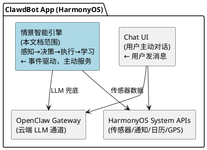
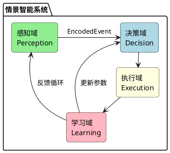
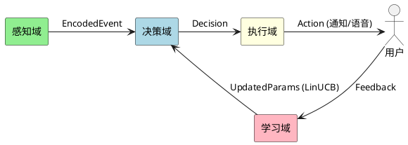
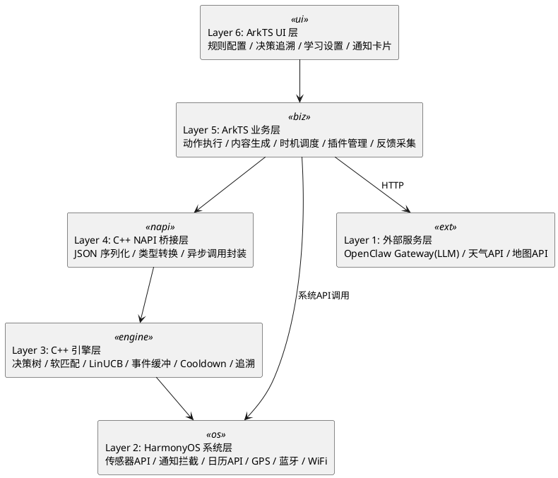
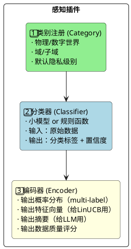
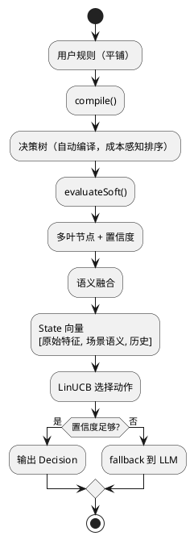
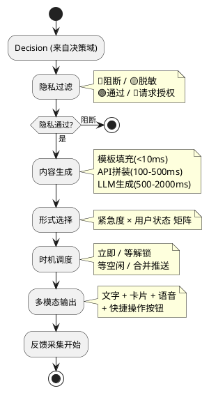
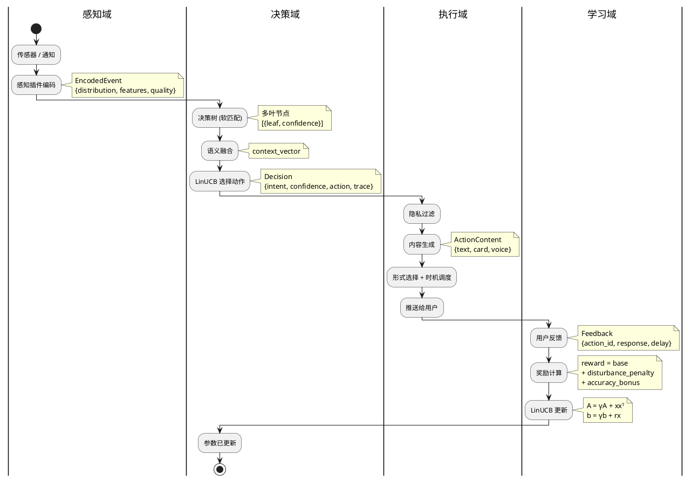
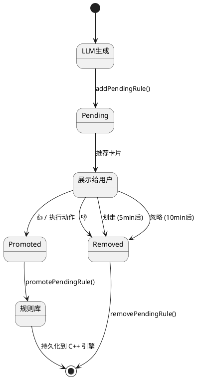
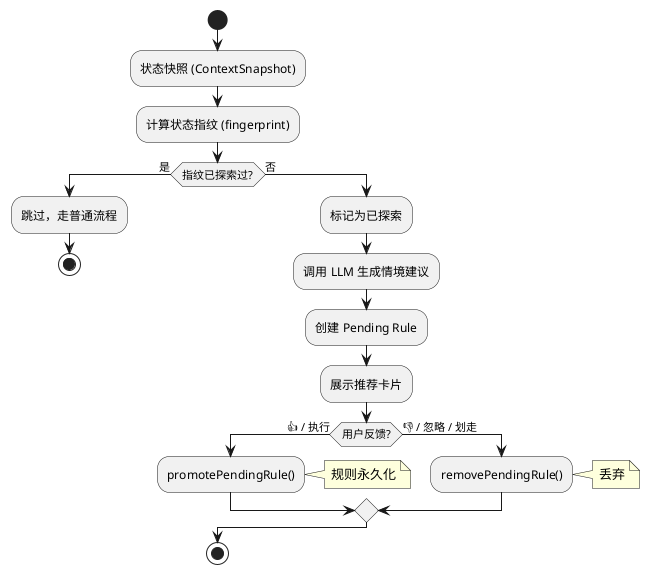

# 情景智能框架设计文档
> 版本: 9.0
> 日期: 2026-03-02
> 作者: 刘洪杰

### 修订记录

| 版本 | 日期 | 作者 | 变更说明 |
|------|------|------|---------|
| 1.0 | 2026-02-17 | 刘洪杰 | 初版：概述、数据分类、感知插件、意图识别、重要性计算、奖励系统、学习系统 |
| 2.0 | 2026-02-19 | 刘洪杰 | 编码器改为概率分布输出；意图识别重写：可配置规则→自动编译决策树→软匹配→LinUCB(语义融合)→鲁棒性5层防护；新增时序规则、OR条件、Cooldown、决策追溯、模板继承、动态阈值；复合奖励函数 |
| 3.0 | 2026-02-19 | 刘洪杰 | 按 DDD 七步法重构全文：Boundary→Use Case→Sub-domain→Layer→Architecture→Narrow-down→Entity；新增系统边界定义、四大问题域划分、六层架构模型、执行域设计、实施路线图 |
| 4.0 | 2026-02-20 | 刘洪杰 | C++ NAPI 迁移实施（4 新模块）；context.test 远程测试能力；21 场景全覆盖测试套件；cooldown loadRules 修复；实际目录结构更新 |
| 5.0 | 2026-02-22 | 刘洪杰 | LLM 兜底规则反馈闭环（pending→promote/remove）；规则去重机制；推荐防重复；积极探索模式设计；FeedbackService 卡片生命周期；合并 context_awareness_design.md（采集策略、围栏学习、App学习、静默增强、穿戴集成、数据托盘、训练同步、反馈学习） |
| 6.0 | 2026-02-24 | 刘洪杰 | 联邦学习同步系统（C++ 核心实现）：三层联邦架构（规则/LinUCB/行为模式）、SHA256 匿名化、社区规则合并；整合 v2 设计文档（数据分类框架、感知插件系统、编码器概率分布、复合奖励函数） |
| 7.0 | 2026-02-27 | 刘洪杰 | Stream Deep RL 在线强化学习引擎：Per-Arm StreamMLP（16→64→32→1）在线训练；Sparse Init + LayerNorm + ObGD 稳定训练；Welford 观测/奖励归一化；LinUCB 冷启动 fallback + 线性过渡；NAPI 桥接 + ArkTS 持久化；hybrid scoring 混合评分 |
| 8.0 | 2026-02-27 | 刘洪杰 | 动作执行系统：ActionExecutor 路由已接受推荐至系统能力（日历、App启动、模式切换）；CalendarPlugin 扩展（getUpcomingEvents, findConflicts, formatEventsMarkdown）；Stream RL UI 展示：推荐卡片显示学习标签（探索中/学习中/已学习）；ContextSettingsPage RL 统计面板；NAPI getStreamRLStats/getStreamRLArmSamples；探索模式 RL 阶段信息 |
| 9.0 | 2026-03-02 | 刘洪杰 | 状态转移建模：7维状态模型、70场景枚举、输入维度扩展 16→25（9维转移特征 StateTransitionTracker C++）、网络架构 25→128→64→1、推荐卡片转移路径条（P0）、NAPI 持久化 |

---

## 目录

- [1. Boundary — 问题边界](#1-boundary--问题边界)
  - [1.1 情景智能是什么](#11-情景智能是什么)
  - [1.2 情景智能不是什么](#12-情景智能不是什么)
  - [1.3 系统边界图](#13-系统边界图)
  - [1.4 输入边界](#14-输入边界)
  - [1.5 输出边界](#15-输出边界)
  - [1.6 隐私边界](#16-隐私边界)
- [2. Use Case — 场景与用例](#2-use-case--场景与用例)
  - [2.1 物理世界数据源](#21-物理世界数据源)
  - [2.2 数字世界数据源](#22-数字世界数据源按马斯洛需求层次)
  - [2.3 核心用例清单](#23-核心用例清单)
  - [2.4 用例优先级](#24-用例优先级)
- [3. Sub-domain — 问题域划分](#3-sub-domain--问题域划分)
  - [3.1 四大问题域](#31-四大问题域)
  - [3.2 感知域（Perception）](#32-感知域perception)
  - [3.3 决策域（Decision）](#33-决策域decision)
  - [3.4 执行域（Execution）](#34-执行域execution)
  - [3.5 学习域（Learning）](#35-学习域learning)
  - [3.6 域间交互](#36-域间交互)
- [4. Layer — 分层架构](#4-layer--分层架构)
  - [4.1 六层模型](#41-六层模型)
  - [4.2 各层职责与语言](#42-各层职责与语言)
  - [4.3 层间依赖规则](#43-层间依赖规则)
- [5. Architecture — 架构设计](#5-architecture--架构设计)
  - [5.1 感知域架构](#51-感知域架构)
  - [5.2 决策域架构](#52-决策域架构)
  - [5.3 执行域架构](#53-执行域架构)
  - [5.4 学习域架构](#54-学习域架构)
  - [5.5 数据流全景](#55-数据流全景)
- [6. Narrow-down — 技术要点](#6-narrow-down--技术要点)
  - [6.1 决策树自动编译](#61-决策树自动编译)
  - [6.2 软匹配策略](#62-软匹配策略)
  - [6.3 LinUCB 算法细节](#63-linucb-算法细节)
  - [6.4 鲁棒性详细设计](#64-鲁棒性详细设计)
  - [6.5 时序规则](#65-时序规则)
  - [6.6 Cooldown + 合并推送](#66-cooldown--合并推送)
  - [6.7 冷启动策略](#67-冷启动策略)
  - [6.8 端侧训练方案](#68-端侧训练方案)
- [7. Entity — 实现设计](#7-entity--实现设计)
  - [7.1 核心数据结构](#71-核心数据结构)
  - [7.2 C++ 模块设计](#72-c-模块设计)
  - [7.3 NAPI 接口定义](#73-napi-接口定义)
  - [7.4 ArkTS 服务设计](#74-arkts-服务设计)
  - [7.5 存储设计](#75-存储设计)
  - [7.6 目录结构](#76-目录结构)
  - [7.7 实施路线图](#77-实施路线图)
- [8. 实施记录 — C++ NAPI 迁移](#8-实施记录--c-napi-迁移)
  - [8.1 迁移原则](#81-迁移原则)
  - [8.2 新增 C++ 模块](#82-新增-c-模块)
  - [8.3 ArkTS 包装层](#83-arkts-包装层)
  - [8.4 已修复问题](#84-已修复问题)
  - [8.5 实际目录结构](#85-实际目录结构)
- [9. 测试套件](#9-测试套件)
  - [9.1 测试架构](#91-测试架构)
  - [9.2 测试场景清单](#92-测试场景清单)
  - [9.3 测试结果](#93-测试结果)
- [10. LLM 兜底规则反馈闭环](#10-llm-兜底规则反馈闭环)
  - [10.1 设计目标](#101-设计目标)
  - [10.2 规则生命周期](#102-规则生命周期)
  - [10.3 Pending Rule 存储](#103-pending-rule-存储)
  - [10.4 反馈驱动的升降级](#104-反馈驱动的升降级)
  - [10.5 推荐防重复](#105-推荐防重复)
- [11. 规则去重机制](#11-规则去重机制)
  - [11.1 去重策略](#111-去重策略)
  - [11.2 去重时机](#112-去重时机)
- [12. 积极探索模式](#12-积极探索模式)
  - [12.1 设计理念](#121-设计理念)
  - [12.2 工作流程](#122-工作流程)
  - [12.3 状态指纹](#123-状态指纹)
  - [12.4 与普通模式的区别](#124-与普通模式的区别)
- [13. 多级采集策略（功耗优化）](#13-多级采集策略功耗优化)
  - [13.1 CellID 位置变化检测](#131-cellid-位置变化检测)
  - [13.2 采集间隔配置](#132-采集间隔配置)
  - [13.3 运动状态检测](#133-运动状态检测)
  - [13.4 拿起手机检测](#134-拿起手机检测)
- [14. 围栏特征学习](#14-围栏特征学习)
  - [14.1 数据结构](#141-数据结构)
  - [14.2 学习触发与特征匹配](#142-学习触发与特征匹配)
- [15. App 使用记录学习](#15-app-使用记录学习)
- [16. 静默模式增强](#16-静默模式增强)
  - [16.1 关键信息提取](#161-关键信息提取)
  - [16.2 情绪/心情检测](#162-情绪心情检测)
- [17. 穿戴设备集成](#17-穿戴设备集成)
- [18. 数据托盘规范](#18-数据托盘规范)
- [19. 训练数据同步系统（C++）](#19-训练数据同步系统c)
  - [19.1 架构概览](#191-架构概览)
  - [19.2 C++ 数据结构](#192-c-数据结构)
  - [19.3 NAPI 接口](#193-napi-接口)
  - [19.4 数据流程](#194-数据流程)
  - [19.5 服务端接口](#195-服务端接口)
- [20. 反馈学习系统详细设计](#20-反馈学习系统详细设计)
- [21. 联邦学习同步系统（C++）](#21-联邦学习同步系统c)
  - [21.1 设计动机](#211-设计动机)
  - [21.2 三层联邦架构](#212-三层联邦架构)
  - [21.3 匿名化策略](#213-匿名化策略)
  - [21.4 C++ 核心实现](#214-c-核心实现)
  - [21.5 NAPI 接口](#215-napi-接口)
  - [21.6 ArkTS 服务层](#216-arkts-服务层)
  - [21.7 服务器 API 约定](#217-服务器-api-约定)
  - [21.8 数据流全景](#218-数据流全景)
  - [21.9 隐私保证](#219-隐私保证)
  - [21.10 Gateway 命令](#2110-gateway-命令)
- [22. v2 设计核心概念（参考）](#22-v2-设计核心概念参考)
  - [22.1 数据分类框架](#221-数据分类框架)
  - [22.2 感知插件系统](#222-感知插件系统)
  - [22.3 编码器概率分布输出](#223-编码器概率分布输出)
  - [22.4 复合奖励函数](#224-复合奖励函数)
  - [22.5 鲁棒性五层防护](#225-鲁棒性五层防护)
- [23. Stream Deep RL — 在线强化学习引擎](#23-stream-deep-rl--在线强化学习引擎)
  - [23.1 概述](#231-概述)
  - [23.2 数据流架构](#232-数据流架构)
  - [23.3 关键技术](#233-关键技术)
  - [23.4 MLP 模型架构（Per-Arm）](#234-mlp-模型架构per-arm)
  - [23.5 混合评分与冷启动策略](#235-混合评分与冷启动策略)
  - [23.6 C++ 实现设计](#236-c-实现设计)
  - [23.7 NAPI 桥接接口](#237-napi-桥接接口)
  - [23.8 ArkTS 层集成](#238-arkts-层集成)
  - [23.9 文件清单与实施顺序](#239-文件清单与实施顺序)
- [24. 状态转移建模与特征扩展](#24-状态转移建模与特征扩展)
  - [24.1 七维状态模型](#241-七维状态模型)
  - [24.2 场景枚举（70个场景）](#242-场景枚举70个场景)
  - [24.3 输入维度覆盖率分析](#243-输入维度覆盖率分析)
  - [24.4 状态转移特征（9维）](#244-状态转移特征9维)
  - [24.5 StateTransitionTracker（C++）](#245-statetransitiontrackerc)
  - [24.6 网络架构更新（25→128→64→1）](#246-网络架构更新2512864→1)
  - [24.7 推荐卡片转移路径条](#247-推荐卡片转移路径条)
  - [24.8 后续路线图](#248-后续路线图)
  - [23.10 测试计划](#2310-测试计划)
- [附录: 待办事项](#附录-待办事项)

---

## 1. Boundary — 问题边界

### 1.1 情景智能是什么

在手机里放一个 **AI 秘书**，它能够：
- **感知** — 收集物理世界和数字世界的数据
- **理解** — 知道用户的需求和意图
- **行动** — 在合适的时机提供帮助

**核心原则：**

| 原则 | 说明 |
|------|------|
| **独立人格** | AI 是伙伴，不是附属品；有自己的观点和边界 |
| **隐私优先** | 用户控制 AI 能看到什么，默认最小权限 |
| **本地优先** | 个人数据不离开设备，学习在本地完成 |
| **渐进智能** | 从规则到模型到 LLM，按需升级复杂度 |

### 1.2 情景智能不是什么

| 不是 | 说明 |
|------|------|
| 不是通用 AI 助手 | 不处理用户主动发起的对话/问答（那是 ClawdBot 主体的事） |
| 不是通知管理器 | 不只是过滤/转发通知，而是理解场景后主动提供服务 |
| 不是后台服务 | 不是持续轮询所有数据，而是事件驱动 + 按需查询 |
| 不是云端系统 | 核心决策在本地完成，云端只用于 LLM 兜底和模型下发 |

### 1.3 系统边界图



**边界定义：**
- **与 Chat UI 的边界**：用户主动发消息 → Chat UI 处理；情景智能主动推送 → 通过通知/卡片/语音
- **与 OpenClaw Gateway 的边界**：情景智能只在 Layer 3（LLM 兜底）时调用 Gateway；日常决策纯本地
- **与 HarmonyOS 的边界**：情景智能通过系统 API 获取传感器数据、发送通知；不修改系统行为

### 1.4 输入边界

```
情景智能接收的输入：
├── 物理世界事件（传感器触发）
│   ├── 位置变化（GPS/WiFi/蓝牙）
│   ├── 运动状态变化（加速度计）
│   ├── 环境变化（光照/噪音/温度）
│   └── 手机状态变化（充电/电量/连接）
│
├── 数字世界事件（系统通知）
│   ├── 新消息通知（IM/邮件/短信）
│   ├── App 通知（外卖/快递/银行）
│   ├── 日历事件提醒
│   └── 系统事件（来电/闹钟）
│
└── 用户反馈（显式+隐式）
    ├── 点击/忽略/划走通知
    ├── 说"谢谢"/"别烦我"
    └── 主动配置规则
```

### 1.5 输出边界

```
情景智能产生的输出：
├── 用户通知（主要输出）
│   ├── 系统通知栏（全屏/横幅/小红点/静默）
│   ├── 语音播报（开车模式）
│   ├── 卡片（富媒体信息）
│   └── 合并摘要（批量信息汇总）
│
├── 静默动作（不打扰用户）
│   ├── 预缓存数据（提前加载天气/路况）
│   ├── 调整系统设置（静音/亮度）
│   └── 后台准备（整理日程摘要）
│
└── 反馈给学习系统
    ├── 决策追溯记录
    └── 奖励信号（给 LinUCB）
```

### 1.6 隐私边界

| 级别 | 符号 | AI 可见内容 | 说明 |
|------|------|-----------|------|
| **开放** | 🟢 | 完整原文 | AI 完全可见 |
| **摘要** | 🟡 | 摘要+元数据 | AI 只看概要，不看原文 |
| **禁止** | 🔴 | 仅"有新消息" | AI 完全不可见 |
| **授权** | 🔵 | 临时完整访问 | 用户授权后可见，用完撤销 |

**隐私原则：**
1. 默认最小权限（新数据源默认 🔴）
2. 用户主动授权
3. 临时授权自动撤销
4. 摘要级别只给统计，不给原文
5. 审计日志可查

---

## 2. Use Case — 场景与用例

### 2.1 物理世界数据源

#### 👤 人 (Human)

| 子类 | 数据 | 来源 |
|------|------|------|
| **生命体征** | 心率、HRV、血压、血氧、体温 | 手表/手环 |
| **运动状态** | 静止(坐/站/躺)、走路、跑步、骑车、坐车 | 加速度计 |
| **身体属性** | 身高、体重、体脂、年龄、性别 | 用户档案 |
| **精神状态** | 睡眠质量、疲劳度、压力、情绪 | 推断/自报 |
| **生物特征** | 声纹、面部、指纹 | 传感器 |

#### 📱 手机 (Phone)

| 子类 | 数据 |
|------|------|
| **姿态** | 握持方式、屏幕朝向 |
| **位置** | GPS坐标、地点类型(家/公司/商场) |
| **电源** | 电量、充电状态 |
| **连接** | WiFi、蓝牙、信号强度 |
| **时间** | 时刻、星期、节假日 |

#### 🌳 环境 (五感)

| 感官 | 数据 | 来源 |
|------|------|------|
| 👁️ **眼** | 光照、场景、人物、物体 | 摄像头/光线传感器 |
| 👂 **耳** | 噪音级别、环境音类型、语音 | 麦克风 |
| 👃 **鼻** | 空气质量、PM2.5 | 传感器/API |
| 👅 **舌** | (间接推断) | 场景+时间 |
| 🖐️ **身** | 温度、湿度、气压 | 环境传感器 |

### 2.2 数字世界数据源（按马斯洛需求层次）

| 层级 | 数据 | 隐私 | 来源 |
|------|------|------|------|
| **1️⃣ 生理** | 外卖/食品订单 | 🟢 | 美团/饿了么 |
| | 健康数据趋势 | 🟡 | 健康app |
| | 医疗诊断记录 | 🔴 | 医疗app |
| **2️⃣ 安全** | 快递/出行状态 | 🟢 | 快递/出行app |
| | 账单提醒 | 🟡 | 银行app |
| | 财务明细/密码 | 🔴 | 金融app |
| **3️⃣ 社交** | 公开群聊 | 🟢 | 社交app |
| | 私聊消息摘要 | 🟡 | IM app |
| | 私密对话内容 | 🔴 | IM app |
| **4️⃣ 尊重** | 任务/日程 | 🟢 | 日历/任务app |
| | 工作文档标题 | 🟡 | 办公app |
| | 薪资/绩效 | 🔴 | HR系统 |
| **5️⃣ 自我实现** | 公开学习内容 | 🟢 | 学习平台 |
| | 学习进度 | 🟡 | 学习app |
| | 私人日记 | 🔴 | 笔记app |

### 2.3 核心用例清单

| 用例 | 触发条件 | 动作 | 优先级 |
|------|---------|------|--------|
| 🚗 通勤提醒 | 工作日 + 7:00±30min + 在家 | 推路况+天气 | 🟡 |
| 🍜 午餐推荐 | 工作日 + 12:00±1h + 在公司 | 推附近餐厅/外卖 | 🟢 |
| 📱 重要消息 | 老婆/老板发消息 | 紧急通知 | 🔴 |
| 🔋 低电量 | 电量<20% + 未充电 | 提醒充电 | 🟡 |
| 🌙 睡前摘要 | 22:00-24:00 + 在家 | 明日日程+天气 | 🟢 |
| 📦 快递到达 | 快递通知 + 在家 | 提醒取件 | 🟢 |
| 🏃 运动提醒 | 久坐>2小时 | 建议活动 | 🟢 |
| 📧 消息堆积 | 10min内3+条未读 | 合并提醒 | 🟡 |
| 🚗 回家路况 | 离开公司+上车 | 播报路况 | 🟡 |
| 😴 睡眠建议 | 连续3天23点后还在用手机 | 建议早睡 | 🟢 |
| 📅 会议准备 | 日历事件前15min | 提醒+材料 | 🟡 |
| 🔇 自动静音 | 进入会议室/电影院 | 静音手机 | ⚪ |

### 2.4 用例优先级

| 阶段 | 用例 | 原因 |
|------|------|------|
| **MVP** | 通勤提醒、重要消息、低电量、睡前摘要 | 触发条件简单，价值高 |
| **Phase 2** | 午餐推荐、消息堆积、会议准备、快递到达 | 需要通知拦截 |
| **Phase 3** | 运动提醒、睡眠建议、自动静音、回家路况 | 需要持续传感器+时序 |

---

## 3. Sub-domain — 问题域划分

### 3.1 四大问题域



### 3.2 感知域（Perception）

**职责：** 收集原始数据，编码为结构化的概率分布事件

```
输入：传感器原始数据 / 系统通知 / API 数据
输出：EncodedEvent（概率分布 + 特征向量 + 数据质量）

子模块：
├── 插件注册（类别/分类器/编码器三要素）
├── 物理世界编码器（位置/运动/环境 → 概率分布）
├── 数字世界编码器（通知/日历/消息 → 概率分布）
└── 感知总线（事件路由 + 隐私预过滤）
```

**核心接口：** 概率分布输出（multi-label，不要求归一化）+ 数据质量评分

### 3.3 决策域（Decision）

**职责：** 根据当前场景，决定做什么

```
输入：EncodedEvent + 用户上下文
输出：Decision（意图 + 置信度 + 动作类型 + 决策追溯）

子模块：
├── 规则配置（用户平铺编写规则）
├── 决策树编译器（自动编译 + 成本感知排序）
├── 软匹配引擎（概率分布 → 多叶节点置信度）
├── LinUCB 策略（语义融合 + 动作选择）
├── LLM 兜底（决策树未覆盖的场景）
├── Cooldown 管理
├── 时序规则引擎（事件序列匹配）
└── 决策追溯记录
```

**核心算法：** 决策树（软匹配）+ LinUCB（语义融合 + 时间衰减）

### 3.4 执行域（Execution）

**职责：** 将决策转化为具体的用户可见动作

```
输入：Decision
输出：用户通知 / 语音播报 / 静默动作

子模块：
├── 隐私过滤（执行前最后一道关）
├── 内容生成（模板填充 / API拼装 / LLM生成）
├── 形式选择（全屏/横幅/小红点/语音/静默）
├── 时机调度（立即/等解锁/等空闲/合并）
├── 多模态输出（文字/卡片/语音/快捷操作）
└── 反馈采集触发
```

**核心策略：** 紧急度 × 用户状态 → 推送形式矩阵

### 3.5 学习域（Learning）

**职责：** 从用户反馈中持续改进决策质量

```
输入：用户反馈（显式+隐式）
输出：更新后的 LinUCB 参数

子模块：
├── 反馈采集（点击/忽略/划走/谢谢/别烦我）
├── 奖励计算（基础反馈 + 打扰惩罚 + 正确性）
├── 异常检测（过滤坏反馈）
├── LinUCB 在线更新（时间衰减）
├── 检查点管理（自动快照 + 回滚）
└── 性能监控（滑动窗口平均奖励）
```

**核心机制：** 5层鲁棒性防护 + 时间衰减遗忘

### 3.6 域间交互



**数据格式约定：**
- 感知→决策：`EncodedEvent`（概率分布 + 特征 + quality）
- 决策→执行：`Decision`（意图 + 置信度 + 动作 + 追溯）
- 执行→学习：`Feedback`（动作ID + 用户响应 + 延迟）
- 学习→决策：直接更新 LinUCB 内部参数（A, b 矩阵）

---

## 4. Layer — 分层架构

### 4.1 六层模型



### 4.2 各层职责与语言

| 层 | 职责 | 语言 | 原因 |
|----|------|------|------|
| UI 层 | 用户交互界面 | ArkTS | HarmonyOS UI 必须用 ArkTS |
| 业务层 | 执行域逻辑 | ArkTS | 需调系统 API、UI 渲染 |
| NAPI 桥接 | ArkTS ↔ C++ | C++ | N-API 标准 |
| 引擎层 | 决策域+学习域核心 | C++ | 性能、内存控制、跨平台 |
| 系统层 | 感知域数据源 | ArkTS→C++ | 系统 API 用 ArkTS，编码用 C++ |
| 外部服务 | LLM/API | HTTP | 网络调用 |

### 4.3 层间依赖规则

```
上层可以调用下层 ✅
下层不能调用上层 ❌（通过回调/事件通知）
同层之间通过接口通信 ✅
跨层调用禁止（必须经过相邻层）❌
```

---

## 5. Architecture — 架构设计

### 5.1 感知域架构

#### 插件注册三要素



#### 编码器输出规范

```typescript
interface EncodedOutput {
  distribution: Map<string, number>;  // 概率分布（不要求归一化）
  features: number[];                 // 特征向量
  summary?: string;                   // 文本摘要
  quality: number;                    // 数据质量 0~1
}
```

#### 各插件分布输出示例

| 插件 | 分布输出 | 说明 |
|------|---------|------|
| 位置 | `{home:0.8, market:0.7, office:0.02}` | GPS 精度差时多地点有概率 |
| 运动 | `{still:0.6, walking:0.3, driving:0.1}` | 等红灯时静止和开车都可能 |
| 时间段 | `{morning:0.9, commute:0.7}` | 非互斥分类 |
| 噪音 | `{quiet:0.4, office:0.5, cafe:0.3}` | 环境音不确定 |

### 5.2 决策域架构

#### 整体流程



#### 规则配置

用户平铺写规则，系统自动编译为决策树：

```typescript
interface SmartRule {
  id: string;
  name: string;
  enabled: boolean;
  conditions: Map<string, RuleCondition>;       // AND 关系
  conditionGroups?: Map<string, RuleCondition>[]; // OR 组（可选）
  temporal?: TemporalCondition;                 // 时序条件（可选）
  extends?: string[];                           // 模板继承（可选）
  intent: string;
  priority: '🔴' | '🟡' | '🟢' | '⚪';
  action: string;
  cooldown?: CooldownConfig;
}
```

#### 决策树自动编译

- 按 key 自动建树，相同 key 合并
- 成本感知排序：便宜的判断（时间、星期）放上层，贵的（GPS、传感器）放下层
- 规则变更时自动重新编译

#### 软匹配

- 每个条件返回 0~1 置信度（不是 boolean）
- 缺失数据 = 0.5（不知道 ≠ 不匹配）
- 位置等关键特征多源融合（GPS + WiFi + 蓝牙 + 历史）
- 决策树可走多条路径，置信度沿路径相乘
- 最终按置信度分级响应

#### LinUCB（语义融合）

一个全局 LinUCB，输入语义融合后的状态向量：

```
State = concat(
  raw_features,     // 原始感知特征 ~20维
  context_vector,   // 叶节点语义加权融合 ~10维
  history_features, // 推送次数/最近反馈 ~10维
) → 总计 ~40维

score(action) = θᵀx + α√(xᵀA⁻¹x)
更新：A = γA + xxᵀ, b = γb + rx （γ=0.998 时间衰减）
```

### 5.3 执行域架构

#### 执行流水线



#### 推送形式矩阵

```
            空闲        忙碌        开会        睡觉        开车
🔴 立即    全屏+声音   横幅+震动   横幅+震动   全屏+声音   语音播报
🟡 尽快    横幅        小红点      静默        静默        语音
🟢 稍后    小红点      静默        静默        静默        静默
⚪ 背景    静默        静默        静默        静默        静默
```

低置信度（<0.6）自动降一级（全屏→横幅→小红点→静默）。

#### 合并推送

5分钟内多条 🟢/⚪ 推送合并为一条摘要通知。

### 5.4 学习域架构

#### 奖励计算

```python
reward = base_reward              # 显式/隐式反馈
       + disturbance_penalty      # -0.1 × (最近推送次数^1.5)
       + accuracy_bonus           # 推对了+0.5 / 该推没推-1.0
```

时段加权：睡觉×3、开会×2、开车×2.5。

#### 5层鲁棒性防护

| 层 | 防护 | 机制 |
|----|------|------|
| 输入 | 特征异常 | 范围检查 + 缺失值填充 |
| 反馈 | 异常反馈 | 3σ检测 + 频率限制 + 奖励裁剪 |
| 模型 | 参数保护 | 时间衰减γ + 变化限制5% + 条件数监控 |
| 输出 | 不确定性 | 置信度检查 + 不确定时回退规则 |
| 系统 | 整体退化 | 每日检查点 + 性能监控 + 自动回滚 |

#### 冷启动

| 阶段 | 规则 | RL | 说明 |
|------|------|-----|------|
| 前2周 | 100% | 0% | 只收集数据 |
| 第2周 | 70% | 30% | 开始参与 |
| 第4周+ | 30% | 70% | 逐步放权 |
| 稳定后 | 兜底 | 主导 | RL 不确定时用规则 |

### 5.5 数据流全景



---

## 6. Narrow-down — 技术要点

### 6.1 决策树自动编译

**Key 选择策略：** `score = coverage × discrimination / cost`

```typescript
const featureCosts: Record<string, number> = {
  'weekday': 1, 'hour': 1, 'charging': 1, 'battery': 1,  // 免费
  'keyword': 2, 'sender': 2, 'app': 2,                    // 轻量
  'location': 10, 'activity': 10,                         // 需要传感器
  'noise': 15, 'heartrate': 20,                           // 昂贵
};
```

便宜的 key 放上层 → 提前剪枝 → 避免不必要的传感器查询。

### 6.2 软匹配策略

**时间：** 高斯衰减，容差内1.0，超出指数衰减
```
target=7:30, tolerance=30min:
7:30→1.0, 7:00→1.0, 6:50→0.85, 6:30→0.45, 6:00→0.05
```

**位置：** 多源融合取最高
```
GPS(如果有) + WiFi SSID(0.95) + 蓝牙设备(0.8) + 历史推断
→ max(scores)
```

**缺失数据：** confidence=0.5（中性），不是0（否定）

### 6.3 LinUCB 算法细节

```
选动作：score = θᵀx + α√(xᵀA⁻¹x)
更新：  A = γA + xxᵀ, b = γb + rx
参数：  d≈40, α=1.0, γ=0.998
内存：  A(40×40) × 10动作 × 4字节 ≈ 70KB
更新耗时：<0.01ms
```

**语义融合：** 叶节点→语义向量（从规则条件自动生成）→ 按置信度加权融合 → 一个全局 LinUCB

**探索策略：** 🔴紧急不探索；低风险+用户闲着 ε=0.2；其他 ε=0.05

### 6.4 鲁棒性详细设计

**时间衰减：** γ=0.998，半衰期≈346次（约2周），旧习惯自动淡出

**异常检测：** 奖励偏离3σ / 1分钟内>5条反馈 / 特征超出范围 → 过滤

**回滚：** 每日快照，性能下降30% → 自动恢复检查点

### 6.5 时序规则

```typescript
interface TemporalCondition {
  event: string;                              // 事件类型
  window: number;                             // 时间窗口(ms)
  count?: { min?: number, max?: number };
  sequence?: string[];                        // 有序事件序列
}
```

实现：事件环形缓冲区（最近7天，最多10000条），O(N) 扫描。

### 6.6 Cooldown + 合并推送

```typescript
interface CooldownConfig {
  duration: number;       // 最小间隔(ms)
  scope: 'rule' | 'intent';  // 去重范围
  resetOn?: string;       // 重置事件
  merge?: boolean;        // 冷却期间合并
}
```

### 6.7 冷启动策略

MVP 先用统计学习（每个叶节点的动作平均奖励表），再升级到 LinUCB。

### 6.8 端侧训练方案

| 阶段 | 方案 | 说明 |
|------|------|------|
| MVP | 统计学习（无需梯度） | 平均奖励表，argmax |
| Phase 2 | C++ 手写 LinUCB | 矩阵运算，<100行代码 |
| Phase 3 | MindSpore Lite（如果支持训练） | 华为原生 |

---

## 7. Entity — 实现设计

### 7.1 核心数据结构

```typescript
// 规则
interface SmartRule {
  id: string;
  name: string;
  enabled: boolean;
  conditions: Map<string, RuleCondition>;
  conditionGroups?: Map<string, RuleCondition>[];
  temporal?: TemporalCondition;
  extends?: string[];
  intent: string;
  priority: string;
  action: string;
  cooldown?: CooldownConfig;
}

// 决策树节点
interface ExecNode {
  key: string;
  branches: Map<Object, ExecNode | LeafNode>;
  fallthrough?: ExecNode;
}

// 叶节点
interface LeafNode {
  rules: SmartRule[];
  semantic: number[];  // 语义向量
}

// 匹配结果
interface MatchResult {
  rule: SmartRule;
  confidence: number;
  path: { key: string, actual: Object, expected: Object, confidence: number }[];
}

// 决策输出
interface Decision {
  intent: string;
  confidence: number;
  priority: string;
  action: string;
  actionParams: Record<string, string>;
  trace: DecisionTrace;
}

// 编码器输出
interface EncodedOutput {
  distribution: Map<string, number>;
  features: number[];
  quality: number;
  summary?: string;
}
```

### 7.2 C++ 模块设计

```cpp
// 规则编译器
class RuleCompiler {
  ExecNode* compile(vector<Rule>& rules);
  string selectBestKey(vector<Rule>& rules);
  SemanticVector generateSemantic(Rule& rule);
};

// 决策树执行
class DecisionTree {
  vector<MatchResult> evaluateSoft(ExecNode* root, Context& ctx);
};

// 软匹配器
class SoftMatcher {
  float match(string key, Value actual, Value expected);
  float matchLocation(string target, LocationSources& sources);
  float matchHour(float actual, float target, float tolerance);
};

// LinUCB 策略
class RobustLinUCB {
  int selectAction(VectorXf& x);
  void update(int arm, VectorXf& x, float reward);
  // 内置：时间衰减、异常过滤、奖励裁剪
};

// 事件缓冲区
class EventRingBuffer {
  void push(Event& e);
  int countInWindow(string event, int64_t windowMs);
  bool matchSequence(vector<string>& seq, int64_t windowMs);
};

// Cooldown 管理
class CooldownManager {
  bool isInCooldown(string ruleId);
  void startCooldown(string ruleId, int64_t durationMs);
  void mergeEvent(string ruleId, Event& e);
};

// 决策追溯
class DecisionTracer {
  void record(vector<MatchResult>& results, Context& ctx);
  string getHistory(int limit);  // JSON
};

// 模型检查点
class ModelCheckpoint {
  void save(RobustLinUCB& model);
  void maybeRollback(RobustLinUCB& model, float currentAvgReward);
};
```

### 7.3 NAPI 接口定义

```typescript
// ArkTS 侧调用 C++ 引擎
import ruleEngine from 'libruleengine.so';

// 规则管理
ruleEngine.loadRules(rulesJson: string): boolean;
ruleEngine.compileTree(): boolean;

// 事件输入
ruleEngine.pushEvent(eventJson: string): void;

// 决策
ruleEngine.evaluate(contextJson: string): string;  // → Decision JSON

// 反馈
ruleEngine.feedback(ruleId: string, reward: number): void;

// 追溯
ruleEngine.getTraceHistory(limit: number): string;  // → JSON

// 模型管理
ruleEngine.saveModel(path: string): boolean;
ruleEngine.loadModel(path: string): boolean;
ruleEngine.resetModel(): boolean;
```

### 7.4 ArkTS 服务设计

```typescript
// 情景智能主服务
class ContextAIService {
  // 初始化引擎
  async init(): Promise<void>;
  
  // 事件循环：接收感知事件 → 决策 → 执行
  async onEvent(event: EncodedEvent): Promise<void>;
  
  // 执行流水线
  async executeAction(decision: Decision): Promise<void>;
}

// 感知插件管理
class PluginManager {
  registerPlugin(plugin: PerceptionPlugin): void;
  startAll(): void;
  stopAll(): void;
}

// 内容生成器
class ContentGenerator {
  async generate(intent: string, context: Context): Promise<ActionContent>;
}

// 反馈采集器
class FeedbackCollector {
  watch(actionId: string): void;
  onUserResponse(actionId: string, response: UserResponse): void;
}
```

### 7.5 存储设计

```
entry/src/main/resources/
└── rawfile/
    └── context_ai/
        └── default_rules.json     # 预设规则库

AppData/
└── context_ai/
    ├── rules/
    │   ├── user_rules.json        # 用户自定义规则
    │   └── templates.json         # 规则模板
    ├── model/
    │   ├── linucb_params.bin      # LinUCB 参数 (~70KB)
    │   ├── action_stats.json      # 统计学习数据（MVP）
    │   └── checkpoints/           # 历史检查点
    ├── data/
    │   ├── event_buffer.bin       # 事件环形缓冲区
    │   ├── feedback_log.db        # 反馈日志
    │   └── decision_trace.db      # 决策追溯（最近1000条）
    └── config/
        └── learning_config.json   # 学习参数（γ, α等）
```

总存储：< 5MB

### 7.6 目录结构

**设计目标目录（规划）：**

```
entry/src/main/
├── ets/
│   └── service/
│       └── contextai/
│           ├── ContextAIService.ets    # 主服务
│           ├── PluginManager.ets       # 插件管理
│           ├── ContentGenerator.ets    # 内容生成
│           ├── DeliveryManager.ets     # 推送形式+时机
│           ├── FeedbackCollector.ets   # 反馈采集
│           └── plugins/                # 感知插件
│               ├── LocationPlugin.ets
│               ├── TimePlugin.ets
│               ├── NotificationPlugin.ets
│               └── MotionPlugin.ets
├── cpp/
│   └── rule_engine/
│       ├── CMakeLists.txt
│       ├── napi_entry.cpp              # NAPI 绑定
│       ├── rule_compiler.h/cpp         # 规则编译器
│       ├── decision_tree.h/cpp         # 决策树
│       ├── soft_matcher.h/cpp          # 软匹配
│       ├── linucb.h/cpp                # LinUCB
│       ├── event_buffer.h/cpp          # 事件缓冲
│       ├── cooldown.h/cpp              # 冷却管理
│       ├── decision_tracer.h/cpp       # 决策追溯
│       ├── feedback_validator.h/cpp    # 异常检测
│       ├── model_checkpoint.h/cpp      # 检查点
│       └── json_utils.h/cpp            # JSON 工具
└── resources/rawfile/context_ai/
    └── default_rules.json
```

**实际已实现目录（v2.38.0，2026-02-20）：**

```
entry/src/main/
├── ets/service/context/                      # ArkTS 情景智能服务
│   ├── ContextAwarenessService.ets           # 主服务（感知 + 调度）
│   ├── ContextEngine.ets                     # 决策引擎 ArkTS 包装
│   ├── ContextModels.ets                     # 数据模型定义
│   ├── DataTray.ets                          # 传感器数据托盘（NAPI 包装）
│   ├── GeoUtils.ets                          # 地理计算（NAPI 包装）
│   ├── Dbscan.ets                            # DBSCAN 聚类（NAPI 包装）
│   ├── LocationFusionNative.ets              # 位置融合（NAPI 包装）
│   ├── LocationFusionService.ets             # 位置融合业务逻辑
│   ├── LocationDiscoveryService.ets          # 位置发现 + 学习
│   ├── GeofenceManager.ets                   # 围栏管理
│   ├── BehaviorLogger.ets                    # 行为日志
│   ├── SensorDataTray.ets                    # 旧版数据托盘（保留备用）
│   └── plugins/                              # 感知插件
│       ├── MotionPlugin.ets                  # 运动状态
│       ├── BatteryPlugin.ets                 # 电量/充电
│       ├── NetworkPlugin.ets                 # 网络状态
│       ├── ScreenStatePlugin.ets             # 屏幕状态
│       └── DigitalWorldPlugin.ets            # 数字世界（通知拦截）
│
├── cpp/                                      # C++ NAPI 模块
│   ├── CMakeLists.txt                        # 根 CMake（注册所有子模块）
│   ├── napi_exec.cpp                         # exec 模块
│   ├── context_engine/                       # 决策引擎（核心）
│   │   ├── CMakeLists.txt
│   │   ├── context_engine.h                  # 头文件（Rule, MatchResult, RuleEngine 等）
│   │   ├── context_engine_napi.cpp           # NAPI 绑定
│   │   ├── rule_engine.cpp                   # 规则引擎（evaluate + cooldown + rate limit）
│   │   ├── decision_tree.cpp                 # 决策树自动编译
│   │   ├── soft_match.cpp                    # 软匹配（in/eq/lte/gte/range/neq + 衰减）
│   │   ├── mab.cpp                           # Multi-Armed Bandit
│   │   └── linucb.cpp                        # LinUCB 算法
│   ├── data_tray/                            # 传感器数据缓存（TTL + 质量衰减）
│   │   ├── CMakeLists.txt
│   │   ├── data_tray.h                       # 头文件（单例，线程安全）
│   │   └── data_tray_napi.cpp                # NAPI 绑定
│   ├── geo_utils/                            # 地理计算
│   │   ├── CMakeLists.txt
│   │   ├── geo_utils.h                       # Haversine + 围栏检测
│   │   └── geo_utils_napi.cpp                # NAPI 绑定
│   ├── dbscan_cluster/                       # DBSCAN 聚类
│   │   ├── CMakeLists.txt
│   │   ├── dbscan_cluster.h                  # DBSCAN + 时间模式 + 类别推断
│   │   └── dbscan_cluster_napi.cpp           # NAPI 绑定
│   ├── location_fusion/                      # 多源位置融合
│   │   ├── CMakeLists.txt
│   │   ├── location_fusion.h                 # GPS/WiFi/BT 置信度融合
│   │   └── location_fusion_napi.cpp          # NAPI 绑定
│   ├── voiceprint/                           # 声纹识别
│   └── types/                                # TypeScript 声明
│       ├── libdata_tray/                     # index.d.ts + oh-package.json5
│       ├── libgeo_utils/
│       ├── libdbscan/
│       └── liblocation_fusion/
│
├── ets/service/gateway/                      # OpenClaw 节点能力
│   ├── NodeRuntime.ets                       # 含 context.test invoke handler
│   └── GatewayProtocol.ets                   # 含 Command.CONTEXT_TEST
```

### 7.7 实施路线图

| 阶段 | 周期 | 目标 | 交付物 |
|------|------|------|--------|
| **MVP** | 4周 | 基础规则引擎 + 4个核心用例 | 硬匹配决策树 + 模板通知 + 统计学习 |
| **Phase 2** | 4周 | 软匹配 + LinUCB + 通知拦截 | 概率分布编码 + LinUCB + 8个用例 |
| **Phase 3** | 4周 | 时序规则 + 语音 + 鲁棒性 | 事件缓冲 + TTS + 5层防护 + 12个用例 |
| **Phase 4** | 持续 | LLM 兜底 + 联邦学习 + 更多插件 | 完整系统 |

**MVP 详细：**
1. Week 1: C++ 决策树（硬匹配）+ NAPI 接口
2. Week 2: 4个感知插件（时间/位置/电量/通知）
3. Week 3: ArkTS 执行层（通知推送 + 模板内容）
4. Week 4: 统计学习 + 反馈采集 + 基础UI

---

## 8. 实施记录 — C++ NAPI 迁移

> 日期：2026-02-20
> 原则：ArkTS 只负责 UI + HarmonyOS API 调用 + NAPI 桥接；所有计算、缓存、算法在 C++

### 8.1 迁移原则

| 原则 | 说明 |
|------|------|
| **C++ 做计算** | 距离计算、聚类、融合、规则匹配全部 native |
| **ArkTS 做桥接** | 薄包装层，仅做 JSON 转换 + 调用 NAPI |
| **ArkTS 做系统调用** | 传感器、GPS、WiFi、蓝牙、通知等 HarmonyOS Kit API 只能 ArkTS 调用 |
| **Header-only 实现** | 新模块采用头文件实现 + 独立 NAPI 绑定 .cpp，简化编译 |
| **Singleton 模式** | data_tray 用 `std::mutex` 保证线程安全的单例 |

### 8.2 新增 C++ 模块

| 模块 | SO 名 | 功能 | 关键算法 |
|------|-------|------|---------|
| **data_tray** | libdata_tray.so | 传感器数据缓存 | TTL 过期 + 质量衰减（线性插值）|
| **geo_utils** | libgeo_utils.so | 地理距离计算 | Haversine 公式 + 多边形围栏射线法 |
| **dbscan_cluster** | libdbscan.so | 位置聚类 + 学习 | DBSCAN + 时间模式分析 + 类别推断 |
| **location_fusion** | liblocation_fusion.so | 多源位置融合 | GPS/WiFi/BT 置信度加权融合 |

**已有 C++ 模块（迁移前）：**

| 模块 | SO 名 | 功能 |
|------|-------|------|
| **context_engine** | libcontext_engine.so | 规则引擎 + 决策树 + 软匹配 + LinUCB + MAB + 事件缓冲 |
| **voiceprint** | libvoiceprint.so | 声纹识别（stub） |
| **exec** | libexec.so | Shell 命令执行 |

### 8.3 ArkTS 包装层

| 包装文件 | 对应 C++ 模块 | 替代的旧 ArkTS 实现 |
|---------|--------------|-------------------|
| DataTray.ets | data_tray | SensorDataTray.ets（保留备用）|
| GeoUtils.ets | geo_utils | GeofenceManager 内联距离计算 |
| Dbscan.ets | dbscan_cluster | LocationDiscoveryService 内联 DBSCAN |
| LocationFusionNative.ets | location_fusion | LocationFusionService 内联置信度计算 |

### 8.4 已修复问题

| 问题 | 文件 | 修复 |
|------|------|------|
| context_engine 未编译 | cpp/CMakeLists.txt | 添加 `add_subdirectory(context_engine)` |
| ImportLinUCB 函数未闭合 | context_engine_napi.cpp | 添加 `return nullptr;` 和 `}` |
| loadRules 不清 cooldown | rule_engine.cpp | loadRules 时清空 lastFired_/categoryFirings_/globalFirings_ |

### 8.5 远程测试能力 — context.test

通过 OpenClaw Node invoke 协议实现远程场景注入测试。

**调用链路：**
```
Server (nodes invoke) → Gateway → Susan (WebSocket) → NodeRuntime.handleContextTest()
  → ContextEngineService.init() → nativeLoadRules() → nativeEvaluate() → 返回 MatchResult[]
```

**invoke 参数：**
```json
{
  "scenario": "场景名称",
  "loadDefaultRules": true,           // 可选：重新加载内置规则（含清空 cooldown）
  "geofences": [                      // 可选：绑定围栏
    { "id": "work_001", "category": "work" }
  ],
  "snapshot": {                       // 必填：模拟的 ContextSnapshot
    "timeOfDay": "morning",
    "hour": "8",
    "dayOfWeek": "1",
    "isWeekend": "false",
    "motionState": "walking",
    "batteryLevel": "10",
    "isCharging": "false",
    "networkType": "cellular",
    "geofence": "work_001"            // 可选
  },
  "maxResults": 5                     // 可选：最大返回数
}
```

**Gateway 配置：** `gateway.nodes.allowCommands` 需包含 `"context.test"`

---

## 9. 测试套件

### 9.1 测试架构

```
Server (Linda/OpenClaw)
  │
  ├── nodes invoke context.test  ──→  Susan (手机 App)
  │                                       │
  │                                       ├── ContextEngineService.init()
  │                                       ├── loadDefaultRules() + rebindGeofences()
  │                                       ├── C++ nativeEvaluate(snapshot)
  │                                       │     ├── 决策树路由
  │                                       │     ├── 软匹配（in/eq/lte/gte/range/neq）
  │                                       │     └── Cooldown + Rate Limit 检查
  │                                       │
  │  ←── 返回 { matches, ruleCount } ────┘
  │
  └── 验证 matches vs 预期
```

### 9.2 测试场景清单

#### 规则完整覆盖（11/11 规则）

| # | 场景 | 关键条件 | 预期规则 | 结果 |
|---|------|---------|---------|------|
| 1 | 低电量通勤 | morning + walking + battery=10 + !charging | rule_low_battery(100%) + rule_morning_workday(100%) | ✅ |
| 2 | 工作日 driving 通勤 | morning + driving + !weekend | rule_morning_workday(100%) + rule_commuting(100%) | ✅ |
| 3 | 到达公司 | morning + stationary + geofence=work | rule_arrive_work(100%) | ✅ |
| 4 | 周末早上在家 | morning + weekend + stationary | rule_weekend_morning(100%) + rule_long_stationary(100%) | ✅ |
| 5 | 深夜静止 | night + hour=23 + stationary | rule_bedtime(100%) | ✅ |
| 6 | 傍晚下班开车 | evening + driving + !weekend | rule_commuting(100%) | ✅ |
| 7 | 晚上到家 | evening + stationary + geofence=home | rule_evening_home(100%) | ✅ |
| 8 | 反面-下午静止无围栏 | afternoon + stationary + battery=60 | 仅 rule_long_stationary(100%) | ✅ |
| 9 | 到达健身房 | evening + stationary + geofence=gym | rule_arrive_gym(100%) | ✅ |
| 10 | 早上离家（完整匹配）| morning + walking + geofence≠home | rule_leave_home_morning(100%) | ✅ |
| 11 | 下班离开公司 | evening + walking + geofence≠work | rule_leave_work(100%) | ✅ |

#### 边界值测试

| # | 场景 | 关键条件 | 预期 | 结果 |
|---|------|---------|------|------|
| 12 | 电量恰好 15% | batteryLevel=15 + !charging | rule_low_battery(100%) | ✅ |
| 13 | 电量 16%（soft decay）| batteryLevel=16 + !charging | rule_low_battery(33%) 衰减 | ✅ |
| 14 | 充电中低电量 | batteryLevel=10 + charging | 不触发 rule_low_battery | ✅ |
| 17 | hour=22 边界 | hour=22 + stationary | rule_bedtime(100%) | ✅ |
| 18 | hour=21 衰减 | hour=21 + stationary | rule_bedtime(55%) soft decay | ✅ |

#### 运动状态覆盖

| # | 场景 | motionState | 验证 | 结果 |
|---|------|------------|------|------|
| 1 | 步行通勤 | walking | rule_morning_workday ✓ | ✅ |
| 2 | 驾车通勤 | driving | rule_commuting ✓ | ✅ |
| 15 | 跑步 | running | 不误触通勤类 | ✅ |
| 16 | 公交 | transit | rule_commuting ✓ | ✅ |
| 20 | 骑行 | cycling | 不误触通勤类 | ✅ |
| 4 | 静止 | stationary | rule_long_stationary ✓ | ✅ |

#### 网络状态覆盖

| # | 场景 | networkType | 结果 |
|---|------|-----------|------|
| 多个 | WiFi | wifi | ✅ |
| 多个 | 蜂窝 | cellular | ✅ |
| 19 | 无网络 | none | ✅ 无异常触发 |

#### 负面测试

| # | 场景 | 验证 | 结果 |
|---|------|------|------|
| 8 | 下午静止无围栏 | 不触发通勤/出门类规则 | ✅ |
| 14 | 充电中低电量 | 不触发低电量提醒 | ✅ |
| 15 | running 周末 | 不误触通勤 | ✅ |
| 20 | cycling 周末 | 不误触通勤 | ✅ |
| 21 | 在家围栏内+早上 | 不触发 leave_home | ✅ |

### 9.3 测试结果

- **总场景数：** 21
- **通过：** 21/21 (100%)
- **规则覆盖：** 11/11 (100%)
- **运动状态覆盖：** 6/6 (stationary/walking/running/cycling/driving/transit)
- **网络类型覆盖：** 3/3 (wifi/cellular/none)
- **围栏类别覆盖：** 3/6 (home/work/gym)，transit/shopping/restaurant 无内置规则（走 ContextAwarenessService 默认推荐逻辑，不经过 C++ 引擎）

### 9.4 已发现并修复的问题

| 问题 | 原因 | 修复 |
|------|------|------|
| 连续测试同一规则不触发 | loadRules 不清空 lastFired_ cooldown map | loadRules 时清空所有 cooldown 计时器 |
| context_engine.so 加载失败 | CMakeLists.txt 遗漏 add_subdirectory | 添加 context_engine 到根 CMakeLists |
| ImportLinUCB 编译错误 | 函数缺少 return + 闭合括号 | 添加 `return nullptr;` 和 `}` |

---

## 10. LLM 兜底规则反馈闭环

> 日期：2026-02-22
> 核心问题：LLM 兜底生成的规则不应立即加入规则库，需要用户反馈确认后才能升级为持久规则

### 10.1 设计目标

| 目标 | 说明 |
|------|------|
| **不打扰** | LLM 建议的规则只是"试探"，用户不认可就丢弃 |
| **渐进学习** | 只有被用户认可的规则才写入引擎，避免规则库膨胀 |
| **反馈闭环** | 用户的每个交互（👍/👎/执行/忽略/划走）都产生明确的升降级信号 |

### 10.2 规则生命周期



**三种状态：**

| 状态 | 存储位置 | 持久化 | 说明 |
|------|---------|--------|------|
| **Pending** | `ContextEngineService.pendingLlmRules` (Map) | 内存 | LLM 刚生成，等待用户反馈 |
| **Promoted** | C++ RuleEngine (nativeAddRule) | 磁盘 | 用户认可，成为持久规则 |
| **Removed** | 无 | 无 | 用户否定或超时，直接丢弃 |

### 10.3 Pending Rule 存储

```typescript
// ContextEngineService 中
private pendingLlmRules: Map<string, ContextRule> = new Map();

// 添加待定规则（不写入引擎）
addPendingRule(rule: ContextRule): void {
  this.pendingLlmRules.set(rule.id, rule);
}

// 升级为正式规则（去重后写入引擎）
async promotePendingRule(ruleId: string): Promise<boolean> {
  let rule = this.pendingLlmRules.get(ruleId);
  if (!rule) return false;
  if (this.isDuplicateRule(rule)) {
    this.pendingLlmRules.delete(ruleId);
    return false;  // 已有重复规则
  }
  await this.addRule(rule);
  this.pendingLlmRules.delete(ruleId);
  return true;
}

// 删除待定规则
removePendingRule(ruleId: string): void {
  this.pendingLlmRules.delete(ruleId);
}
```

### 10.4 反馈驱动的升降级

**FeedbackService 决策矩阵：**

| 用户行为 | reward | LLM 规则处理 | 普通规则处理 |
|---------|--------|-------------|-------------|
| 👍 点赞 | +1.0 | `promotePendingRule()` → 写入引擎 | LinUCB 正奖励 |
| 执行动作 | +0.8 | `promotePendingRule()` → 写入引擎 | LinUCB 正奖励 |
| 👎 反对 | -0.5 | `removePendingRule()` → 丢弃 | LinUCB 负奖励 |
| 划走 (5min) | -0.1 | `removePendingRule()` → 丢弃 | LinUCB 轻微惩罚 |
| 忽略 (10min) | -0.2 | `removePendingRule()` → 丢弃 | LinUCB 轻微惩罚 |

**卡片生命周期管理：**

```
onCardShown(rec)
  ├── 启动 10min ignore 定时器
  └── 记录 ActiveCard { rec, shownAt, timers, resolved }

onCardDismissed(ruleId)
  ├── 清除 ignore 定时器
  └── 启动 5min dismiss 定时器

onThumbsUp / onActionTaken (ruleId)
  ├── resolveCard() → 清除所有定时器
  ├── recordFeedback(ruleId, type, reward)
  ├── logToBehavior()
  └── handleLlmRuleFeedback(ruleId, positive=true) → promote

onThumbsDown(ruleId)
  ├── resolveCard() → 清除所有定时器
  ├── recordFeedback(ruleId, type, reward)
  └── handleLlmRuleFeedback(ruleId, positive=false) → remove
```

### 10.5 推荐防重复

**问题：** 同一种 LLM 建议（如"下班回家"），如果用户没反馈，不应重复推送。

**方案：** ContextAwarenessService 追踪上一条 LLM 推荐的 payload：

```typescript
private lastLlmPayload: string = '';          // 上次 LLM 推荐内容
private lastLlmRuleId: string = '';           // 上次 LLM 规则 ID
private lastLlmFeedbackReceived: boolean = false;  // 是否已收到反馈

// LLM 生成新推荐时
if (llmPayload === this.lastLlmPayload && !this.lastLlmFeedbackReceived) {
  // 跳过重复推荐，只更新时间戳（不新建卡片）
  return;
}

// FeedbackService 通过回调通知反馈已收到
feedbackSvc.setLlmFeedbackCallback((ruleId: string) => {
  this.markLlmFeedbackReceived(ruleId);
});
```

**规则 ID 格式：** `user_llm_yyyy-MM-dd HH:mm:ss`（可读时间戳）

---

## 11. 规则去重机制

> 日期：2026-02-22
> 核心问题：规则库中可能存在功能重复的规则，需要自动去重

### 11.1 去重策略

**两级去重：**

| 级别 | 匹配方式 | 说明 |
|------|---------|------|
| **精确去重** | action payload 完全相同 | 两条规则产生完全一样的动作 → 只保留一条 |
| **语义去重** | 核心条件高度重叠 (≥3个 key 相同) | 两条规则在关键维度上等价 → 只保留一条 |

**核心条件 Key：**
- `timeOfDay` — 时段
- `isWeekend` — 工作日/周末
- `motionState` — 运动状态
- `geofence` — 围栏位置

```typescript
// 精确去重：比较 action payload
isDuplicateRule(newRule: ContextRule): boolean {
  let newPayload = JSON.stringify(newRule.action);
  let existingRules = this.exportRules();
  // ... 遍历已有规则
  if (existingPayload === newPayload) return true;  // 精确匹配

  // 语义去重：比较核心条件
  if (this.conditionsOverlap(existingConditions, newConditions)) return true;

  return false;
}

// 核心条件重叠检测
conditionsOverlap(a: Map<string, Object>, b: Map<string, Object>): boolean {
  let coreKeys = ['timeOfDay', 'isWeekend', 'motionState', 'geofence'];
  let matchCount = 0;
  for (let key of coreKeys) {
    if (a.get(key) === b.get(key)) matchCount++;
  }
  return matchCount >= 3;  // 3/4 核心条件相同 → 判定为重复
}
```

### 11.2 去重时机

| 时机 | 方法 | 说明 |
|------|------|------|
| **引擎初始化** | `deduplicateRules()` | 启动时清理已有重复规则 |
| **规则升级** | `promotePendingRule()` 内调用 `isDuplicateRule()` | LLM 规则升级前检查 |
| **手动添加** | `addRule()` 内可选检查 | 用户手动添加规则时 |

---

## 12. 积极探索模式

> 日期：2026-02-22（设计阶段）
> 核心理念：让 AI 主动探索用户在每种新情境下的需求偏好

### 12.1 设计理念

普通模式下，情景智能只在规则匹配失败时才调用 LLM 兜底。**积极探索模式** 反转这个逻辑：

- **每遇到一个未曾探索过的状态组合**，主动调用 LLM 生成建议
- **用户反馈决定是否转化为持久规则**
- 目标：快速学习用户在各种场景下的真实需求

```
普通模式：  规则匹配 → 命中? → 推荐 / 不命中 → LLM兜底(概率触发)
探索模式：  状态变化 → 新状态? → 必然触发LLM → 用户反馈 → 规则化
```

### 12.2 工作流程



### 12.3 状态指纹

为避免对"相同状态"反复触发 LLM，需要定义**状态指纹**：

```typescript
// 将 ContextSnapshot 压缩为一个可比较的字符串
function computeFingerprint(snapshot: ContextSnapshot): string {
  // 只取核心维度，忽略高频变化的维度（如精确时间、电量百分比）
  return `${snapshot.timeOfDay}|${snapshot.isWeekend}|${snapshot.motionState}|${snapshot.geofence || 'none'}`;
}
```

**指纹粒度设计：**

| 维度 | 纳入指纹 | 说明 |
|------|---------|------|
| timeOfDay | 是 | morning/afternoon/evening/night |
| isWeekend | 是 | 工作日和周末行为不同 |
| motionState | 是 | 静止/走路/开车等 |
| geofence | 是 | 家/公司/健身房等 |
| hour | 否 | 太细粒度，7:00和7:30不应算不同状态 |
| batteryLevel | 否 | 持续变化，不适合做指纹 |
| wifiSsid | 否 | 已被 geofence 间接覆盖 |

**指纹空间估算：**
- timeOfDay: 4 种
- isWeekend: 2 种
- motionState: 6 种
- geofence: ~10 种（含 none）
- 总计：4 × 2 × 6 × 10 = **480 种组合**

以每天探索 10 个新状态计算，约 48 天覆盖所有组合。实际用户日常接触的状态组合约 30-50 种。

### 12.4 与普通模式的区别

| 维度 | 普通模式 | 积极探索模式 |
|------|---------|-------------|
| LLM 触发条件 | 规则全部未命中 + 概率触发 | 每个新状态指纹必触发 |
| 推荐频率 | 低（受 cooldown 和去重限制）| 高（新状态就触发）|
| 规则增长速度 | 慢（偶尔有 LLM 兜底被认可）| 快（持续探索 + 反馈）|
| 适用场景 | 日常使用 | 新用户冷启动 / 用户主动开启 |
| 开关 | 默认开启 | 用户手动开启 |
| API 成本 | 低 | 较高（更多 LLM 调用）|

**建议使用场景：**
1. **新用户冷启动**：前 1-2 周开启，快速建立个人规则库
2. **场景变化**：搬家/换工作后，短期开启重新学习
3. **好奇用户**：想看看 AI 能在各种场景下提供什么建议

---

## 13. 多级采集策略（功耗优化）

> 来源：context_awareness_design.md §1
> 设计原则：根据运动状态动态调整传感器采集频率，静止时降频省电，运动时升频保精度

### 13.1 CellID 位置变化检测

**原理：** 基站 CellID 变化 → 用户可能移动；CellID 不变 → 位置没变

```
1. 获取当前 CellID
2. 如果 CellID 与上次相同：
   - 不请求 GPS，继续使用缓存位置
3. 如果 CellID 变化：
   - 可能移动了，请求一次 GPS
   - 更新缓存位置
```

**优势：** CellID 功耗极低（网络状态的一部分），大幅减少 GPS 请求，室内/静止场景特别有效

**API：** `@ohos.telephony.radio` — `getSignalInformation()` 或监听网络状态变化

> 注：HarmonyOS `radio.getSignalInformation()` 只返回 signalType/signalLevel，不直接提供 CellID。备选方案：`telephony.radio.getNetworkState()` 或依赖 WiFi + 加速度计

### 13.2 采集间隔配置

| 运动状态 | GPS间隔 | WiFi间隔 | 加速度计间隔 | 说明 |
|---------|---------|----------|-------------|------|
| stationary (静止) | 5分钟 | 5分钟 | 5秒 | 在家/办公室久坐 |
| walking (步行) | 30秒 | 2分钟 | 1秒 | 低速移动 |
| running (跑步) | 15秒 | 5分钟 | 500ms | 高频运动，不需要WiFi |
| driving (驾驶) | 5秒 | 关闭 | 2秒 | 高速移动，频繁更新GPS |
| unknown (未知) | 1分钟 | 2分钟 | 1秒 | 默认配置 |

### 13.3 运动状态检测

- **加速度传感器**：检测身体运动
- **GPS速度**：解决开车/高铁匀速问题
  - GPS速度 > 20m/s (72km/h) → 驾驶
  - GPS速度 > 5m/s (18km/h) → 驾驶/骑行
  - GPS速度 > 1.5m/s (5.4km/h) → 跑步/快走

### 13.4 拿起手机检测

**问题：** "拿起手机"会触发运动状态变化，导致不必要的 GPS 重采样

**特征区分：**

| 特征 | 拿起手机 | 真正运动 |
|------|---------|---------|
| 加速度计 | 短暂脉冲 + 重力方向变化 | 持续变化 |
| 陀螺仪 | 快速旋转 | 无显著旋转 |
| 步数 | 不增加 | 增加 |
| GPS位移 | 无 | 有 |
| 持续时间 | < 3秒 | > 10秒 |

**实现要点：** 区分"拿起看一眼" vs "开始移动"；拿起手机不触发 GPS 频率调整

---

## 14. 围栏特征学习

> 来源：context_awareness_design.md §2

### 14.1 数据结构

```typescript
interface LearnedPlaceSignals {
  wifiSSIDs?: string[];            // 关联的WiFi SSID列表
  bluetoothDevices?: string[];     // 关联的蓝牙设备MAC/名称
  typicalTimes?: TimeRange[];      // 典型出现时间段
  lastSeen?: number;               // 最后一次学习时间戳
  visitCount?: number;             // 访问次数
}
```

### 14.2 学习触发与特征匹配

- **学习：** 进入围栏时自动学习当前 WiFi/蓝牙，首次学习到新特征时在聊天窗口提醒，数据持久化到 `user_places.json`
- **匹配：** WiFi 连接时检查是否匹配已知围栏，即使 GPS 不精确也能通过 WiFi 判断位置，支持多 WiFi 绑定同一围栏

---

## 15. App 使用记录学习

> 来源：context_awareness_design.md §3
> 状态：受限 — `ohos.permission.LOOK_AT_SCREEN_DATA` 在当前 SDK 不存在

**App 分类：**

| 分类 | 示例App |
|------|---------|
| 社交 | 微信、QQ、WhatsApp、Telegram、Discord |
| 办公 | Email、WPS、Teams、Zoom、飞书、钉钉 |
| 娱乐 | 抖音、快手、B站、YouTube、Netflix |
| 导航 | 高德、百度地图、Google Maps |
| 购物 | 淘宝、京东、拼多多、Amazon |
| 资讯 | 今日头条、知乎、Twitter、Reddit |
| 健康 | 运动健康、Keep |
| 音乐 | 网易云、QQ音乐、Spotify |
| 阅读 | 微信读书、Kindle |
| 游戏 | 各种游戏 |

**学习内容：** 当前前台 App、使用时长、使用时段模式、分类使用频率

**备选方案：** 使用 `ForegroundAppPlugin` 的前台 App 检测（受限），记录使用时间，学习用户在不同地点/时间的 App 使用习惯

---

## 16. 静默模式增强

> 来源：context_awareness_design.md §4

### 16.1 关键信息提取

```typescript
interface ConversationKeyInfo {
  times: string[];           // "明天下午3点", "下周一"
  dates: string[];           // "3月15日", "这周末"
  locations: string[];       // "星巴克", "公司楼下"
  people: string[];          // "老王", "张总"
  events: string[];          // "开会", "吃饭", "看电影"
  plans: string[];           // "打算去买电脑", "准备出差"
  topics: string[];          // "讨论项目进度", "聊孩子教育"
}
```

> 已部分实现：SilentModeExtractor.ets 支持正则提取；v2.52.0 新增 LLM 行动项提取 → 自动创建日历事件

### 16.2 情绪/心情检测

```typescript
interface EmotionAnalysis {
  mood: 'happy' | 'sad' | 'angry' | 'neutral' | 'excited' | 'tired';
  activity: 'talking' | 'singing' | 'arguing' | 'laughing' | 'whispering';
  energy: 'high' | 'medium' | 'low';
  stress: number;  // 0-100
}
```

**检测方法：** 语调分析（音高、语速、音量）、词汇情感分析、声音特征（笑声、叹气）

**唱歌检测：** 音高稳定性、节奏特征、旋律模式、背景音乐检测

> 已部分实现：EmotionAnalyzer.ets 提供基础情绪分析

---

## 17. 穿戴设备集成

> 来源：context_awareness_design.md §5

**问题：** HarmonyOS `sensor.SensorId.HEART_RATE` 只能读手机本身传感器，不能直接读华为手表数据

**解决方案：**

| 方案 | 说明 | 状态 |
|------|------|------|
| **A: Health Kit API** | `@ohos.health` 读取健康数据 | 已部分实现（WearablePlugin.ets） |
| **B: 传感器同步** | 华为健康 App 同步后 `sensor.on(HEART_RATE)` 可能读取 | 待验证 |

**权限：** `ohos.permission.READ_HEALTH_DATA`

> 已部分实现：WearablePlugin.ets 通过 Health Kit 读取心率、步数数据

---

## 18. 数据托盘规范

> 来源：context_awareness_design.md §7

**命名规范：** 统一小驼峰命名（`wifiSsid`, `gpsSpeed`, `heartRate`）

**当前字段：**

| Key | TTL | 来源 | 说明 |
|-----|-----|------|------|
| latitude | 2min | GPS | 纬度 |
| longitude | 2min | GPS | 经度 |
| wifiSsid | 2min | WiFi | 当前连接的WiFi |
| motionState | 30s | 加速度计 | 运动状态 |
| gpsSpeed | 2min | GPS | GPS速度 |
| heartRate | 30s | 穿戴设备 | 心率 |
| stepCount | 5min | 计步器 | 步数 |

**实现：** C++ `data_tray` 模块（`libdata_tray.so`），单例模式 + mutex 线程安全，TTL 过期 + 质量衰减（线性插值）

---

## 19. 训练数据同步系统（C++）

> 来源：context_awareness_design.md §9

### 19.1 架构概览

```
┌────────────────────────────────────────────┐
│           ArkTS 层 (薄封装)                  │
│  TrainingDataSync.ets                      │
│  - 初始化配置 (endpoint, deviceId)           │
│  - 调用 NAPI 接口                           │
│  - HTTP 上传 (HarmonyOS 网络 API)           │
└──────────────────┬─────────────────────────┘
                   │ NAPI
┌──────────────────┴─────────────────────────┐
│           C++ 核心层                         │
│  training_sync.cpp                         │
│  - 训练数据收集与缓冲                        │
│  - 数据序列化 (JSON)                        │
│  - 批量管理、TTL清理                         │
│  - 统计信息                                 │
└────────────────────────────────────────────┘
```

### 19.2 C++ 数据结构

```cpp
enum class TrainingDataType {
    RULE_MATCH,          // 规则匹配记录
    USER_FEEDBACK,       // 用户反馈
    STATE_TRANSITION,    // 状态转换
    GEOFENCE_FEATURE     // 围栏特征
};

struct TrainingRecord {
    std::string id;
    TrainingDataType type;
    int64_t timestamp;
    std::map<std::string, std::string> stringData;
    std::map<std::string, double> numericData;
    std::map<std::string, bool> boolData;
    bool synced;
};

struct SyncStats {
    int pendingCount;
    int syncedCount;
    int64_t lastSyncTime;
    int64_t totalBytes;
};
```

**类设计：** `TrainingDataSync` 单例，`MAX_RECORDS=200`，`SYNC_INTERVAL=1h`

### 19.3 NAPI 接口

```typescript
interface TrainingSyncNapi {
    init(deviceId: string): void;
    recordRuleMatch(data: RuleMatchRecord): void;
    recordFeedback(data: UserFeedbackRecord): void;
    recordStateTransition(data: StateTransitionRecord): void;
    exportPending(): string;
    markSynced(ids: string[]): void;
    serialize(): string;
    deserialize(json: string): void;
    getStats(): { pending: number; synced: number; lastSync: number };
}
```

> ArkTS 包装层（TrainingDataSync.ets）使用 typed wrapper 函数调用 native 模块，满足 ArkTS 严格模式要求

### 19.4 数据流程

```
1. 数据产生:
   ContextAwarenessService → C++ recordRuleMatch() / recordFeedback() / recordStateTransition()

2. 持久化 (每次记录后):
   C++ serialize() → ArkTS preferences.put()

3. 同步触发 (定时 1h / 手动):
   ArkTS → C++ exportPending() → JSON → HTTP POST → C++ markSynced() → persist

4. 启动恢复:
   ArkTS preferences.get() → C++ deserialize()
```

### 19.5 服务端接口

**服务端：** `server/training-server.js`（端口 18790，与 OpenClaw Gateway 18789 同机）

```
POST /training/upload    — 上传训练数据 (JSONL)
GET  /training/stats     — 查看统计
GET  /health             — 健康检查
```

**数据存储：** `server/training-data/{deviceId}_{date}.jsonl`

**隐私：** 敏感字段可配置是否上传，默认只存本地，用户授权后才开启同步，HTTPS 加密

---

## 20. 反馈学习系统详细设计

> 来源：context_awareness_design.md §10

**C++ 数据结构：**

```cpp
struct FeedbackRecord {
    std::string id;
    FeedbackType type;           // USEFUL / INACCURATE / DISMISS / ADJUST
    FeedbackContext context;     // 反馈时的上下文
    AdjustmentValue adjustment;  // 用户调整值
    int64_t timestamp;
};

struct RulePreference {
    std::string ruleId;
    double preferredHour;        // 用户偏好的小时
    double preferredMinute;      // 用户偏好的分钟
    double hourAdjustment;       // 小时调整量
    double confidence;           // 置信度
    int usefulCount;             // 有用次数
    int inaccurateCount;         // 不准次数
    int adjustCount;             // 调整次数
};
```

**使用场景：**
1. **睡前提醒调整**：用户反馈 21:00 太早，调整为 22:00
2. **久坐提醒频率**：用户反馈太频繁，降低提醒频率
3. **通勤时间**：用户反馈通勤时间不准确，调整触发时间

**UI 交互：**

```
┌─────────────────────────────────┐
│ 情景智能推荐                      │
│ 夜深了，早点休息                   │
│ 规则: 睡前提醒 | 置信度: 65%      │
├─────────────────────────────────┤
│ [👍 有用] [👎 不准] [调整时间]     │
└─────────────────────────────────┘

点击"调整时间"后：
┌─────────────────────────────────┐
│ 调整提醒时间                      │
│ 当前: 21:00                     │
│ 调整为: [ 22 ] : [ 00 ]         │
│         [确认] [取消]            │
└─────────────────────────────────┘
```

> 已部分实现：FeedbackService.ets 提供 thumbs_up/thumbs_down/action_taken/dismissed/ignored 反馈类型，通过 LinUCB reward 机制调整决策权重

---

## 21. 联邦学习同步系统（C++）

### 21.1 设计动机

当前情景智能系统的学习完全在设备本地完成：

- **ContextEngine (C++)**: MAB + LinUCB 上下文 bandit 算法，参数可通过 `exportLinUCB()`/`importLinUCB()` 导出导入
- **BehaviorLogger**: 本地规则学习 (confidence = acceptCount/triggerCount)
- **TrainingDataSync**: 上传原始训练数据到服务器 (`POST /training/upload`)，但服务器不返回任何模型

**核心问题：** 每个设备独立学习，无法共享学习成果。新设备需要从零开始积累数据。用户A学到的好规则无法惠及用户B。

**目标：** 实现联邦训练，让多设备协作学习，同时保护用户隐私。

```
设备A ─── 匿名化模型更新 ───┐
设备B ─── 匿名化模型更新 ───┼── Server (聚合) ─── 聚合模型 ──→ All Devices
设备C ─── 匿名化模型更新 ───┘
```

### 21.2 三层联邦架构

| 层级 | 内容 | 上传频率 | 隐私风险 | 价值 |
|------|------|----------|----------|------|
| **L1: 规则联邦** | 高置信度规则（匿名化条件） | 每次同步 | 低 | 高 |
| **L2: LinUCB 联邦** | bandit 模型参数 (A矩阵, b向量) | 每次同步 | 极低 | 中 |
| **L3: 行为模式** | 聚合统计（时段×地点类别×动作频次） | 每次同步 | 低 | 中 |

**同步周期：** 6 小时一次，嵌入 TrainingDataSync 的同步流程中。

### 21.3 匿名化策略

**白名单安全 key（无 PII，直接传输）：**

```
timeOfDay, hour, dayOfWeek, isWeekend, motionState,
batteryLevel, isCharging, networkType, sensorTier,
heart_rate_status, transportMode, activityState
```

**需要匿名化的 key：**

| 原始 key | 处理方式 | 匿名化结果 |
|----------|----------|-----------|
| `geofence` | 替换为围栏类别 | `placeCategory: home/work/gym/transit/...` |
| `wifiSsid` | **不上传** | — |
| `wifiGeofence` | **不上传** | — |
| 蓝牙设备名 | 替换为设备分类 | `bt_fixed/bt_vehicle/bt_wearable` |
| GPS 坐标 | **不上传** | — |
| 围栏名称 | **不上传** | — |

**上传门槛：**
- 规则 `confidence >= 0.6` 且 `triggerCount >= 5` 才上传
- 匿名化后至少保留 2 个有意义的条件
- 设备 ID 使用 SHA256 哈希（不可逆）

### 21.4 C++ 核心实现

文件：`entry/src/main/cpp/federated_sync/`

**核心数据结构：**

```cpp
namespace federated_sync {

struct AnonymizedCondition {
    std::string key;    // timeOfDay, motionState, placeCategory, etc.
    std::string op;     // eq, neq, gt, lt, etc.
    std::string value;  // 已匿名化的值
};

struct AnonymizedRule {
    std::string conditionFingerprint;  // SHA256(排序后的条件集合)
    std::vector<AnonymizedCondition> conditions;
    std::string actionType;            // suggestion/automation/notification
    std::string actionPayloadHash;     // SHA256(payload) — 用于去重
    double confidence;
    int triggerCount;
    int acceptCount;
};

struct BehaviorPattern {
    std::string placeCategory;  // home/work/gym/unknown
    std::string timeOfDay;      // dawn/morning/afternoon/evening/night
    std::string dayType;        // weekday/weekend
    std::string motionState;
    std::string actionType;
    int frequency;
};

struct CommunityRule {
    std::string id;             // 'community_' prefix
    std::vector<AnonymizedCondition> conditions;
    std::string actionType;
    std::string actionPayload;
    double communityConfidence;
    int deviceCount;
    std::string name;
};

struct FederatedModel {
    int protocolVersion;
    int64_t aggregatedAt;
    int participantCount;
    std::vector<CommunityRule> communityRules;
    std::string linucbState;    // optional
    std::vector<BehaviorPattern> topPatterns;
    int modelVersion;
};

}  // namespace federated_sync
```

**核心类方法：**

```cpp
class FederatedSync {
public:
    static FederatedSync& getInstance();
    void init(const std::string& deviceId);
    void setGeofenceCategories(const std::vector<GeofenceCategoryEntry>& categories);

    // 导出匿名化规则
    std::vector<AnonymizedRule> exportAnonymizedRules(
        const std::string& rulesJson, const std::string& statsJson);

    // 导出聚合行为模式（top-20, 按频次排序）
    std::vector<BehaviorPattern> exportBehaviorPatterns(
        const std::vector<BehaviorRecord>& records);

    // 构建联邦模型更新 JSON（设备 → 服务器）
    std::string buildModelUpdate(
        const std::string& rulesJson, const std::string& statsJson,
        const std::string& linucbJson,
        const std::vector<BehaviorRecord>& records,
        int localDataPoints);

    // 解析服务器返回的联邦模型
    FederatedModel parseFederatedModel(const std::string& modelJson);

    // 社区规则 → 引擎规则 JSON（用于 addPendingRule）
    std::string communityRulesToEngineJson(
        const std::vector<CommunityRule>& rules);

    std::string getDeviceFingerprint() const;

private:
    bool anonymizeCondition(const RuleCondition& cond, AnonymizedCondition& out) const;
    std::string sha256(const std::string& input) const;  // 自实现，无外部依赖
    static const std::set<std::string>& safeKeys();      // 安全 key 白名单
};
```

**关键实现细节：**

1. **SHA256**：自实现（无外部加密库依赖），用于设备 ID 指纹和条件集合指纹
2. **匿名化**：白名单模式 — 安全 key 直接通过，geofence 转为 placeCategory，其余不上传
3. **行为模式聚合**：对 BehaviorRecord 做聚合计数，取频次 top-20
4. **JSON 序列化/解析**：手动实现（项目模式，不依赖第三方 JSON 库）
5. **线程安全**：mutex 保护所有数据访问

### 21.5 NAPI 接口

文件：`entry/src/main/cpp/federated_sync/federated_sync_napi.cpp`

| NAPI 函数 | 参数 | 返回 | 说明 |
|-----------|------|------|------|
| `init` | `{deviceId: string}` | `void` | 初始化，SHA256 设备 ID |
| `setGeofenceCategories` | `{categories: [{id, category}]}` | `void` | 设置围栏类别映射 |
| `buildModelUpdate` | `{rulesJson, statsJson, linucbJson, records[], dataPoints}` | `string` | 构建上传 JSON |
| `parseFederatedModel` | `{modelJson: string}` | `ParsedFederatedModel` | 解析下载 JSON |
| `getDeviceFingerprint` | — | `string` | 获取设备指纹 |

**TypeScript 类型声明** (`entry/src/main/cpp/types/libfederated_sync/index.d.ts`)：

```typescript
export interface FederatedInitConfig {
  deviceId: string;
}

export interface ParsedFederatedModel {
  modelVersion: number;
  participantCount: number;
  communityRulesJson: string;   // JSON array — 社区规则转引擎规则格式
  linucbState: string;
  topPatternsJson: string;
}

export function init(config: FederatedInitConfig): void;
export function setGeofenceCategories(config: { categories: Array<{id: string, category: string}> }): void;
export function buildModelUpdate(config: { ... }): string;
export function parseFederatedModel(config: { modelJson: string }): ParsedFederatedModel;
export function getDeviceFingerprint(): string;
```

### 21.6 ArkTS 服务层

文件：`entry/src/main/ets/service/context/FederatedSync.ets`

ArkTS 层为薄封装，负责 HTTP 通信、Preferences 管理和服务编排：

```
FederatedSync.init(context, endpoint)
    │
    ├── 从 Preferences 读取开关/版本
    ├── 调用 nativeInit(deviceId)
    └── 从 GeofenceManager 获取围栏映射 → nativeSetGeofenceCategories()

FederatedSync.sync()
    │
    ├── shouldSync() — 检查开关 + 6h 间隔
    ├── uploadModelUpdate()
    │   ├── 收集: ContextEngine.exportRules()/exportLinUCB()
    │   ├── 收集: BehaviorLogger.getAllRules() → 构建 BehaviorRecord[]
    │   ├── nativeBuildModelUpdate() → JSON
    │   └── POST /training/federated/upload
    └── downloadAggregatedModel()
        ├── GET /training/federated/model?since={version}
        ├── nativeParseFederatedModel() → ParsedFederatedModel
        ├── mergeCommunityRules() → addPendingRule()
        └── 更新 Preferences (version, lastSync)
```

**社区规则合并策略：** 社区规则通过 `ContextEngineService.addPendingRule()` 以 pending 状态添加。用户正面反馈后才正式激活（复用 LLM 兜底规则的 promote 机制）。社区规则设置 `priority: 0.5`（低于用户自定义规则）、`cooldownMs: 7200000`（2 小时）。

**反匿名化：** 下载的社区规则中 `placeCategory` 条件会查找本地 GeofenceManager 对应的围栏 ID，映射为 `geofence` 条件。若本地无对应类别的围栏，该条件降级为 `wifiGeofence`。

**用户控制（Preferences）：**

| key | 类型 | 默认 | 说明 |
|-----|------|------|------|
| `federated_sync_enabled` | boolean | false | 需用户手动开启 |
| `federated_last_sync` | number | 0 | 上次同步时间戳 |
| `federated_model_version` | number | 0 | 当前模型版本 |

### 21.7 服务器 API 约定

| 方法 | 路径 | 说明 |
|------|------|------|
| POST | `/training/federated/upload` | 上传匿名化模型更新 |
| GET | `/training/federated/model?since={version}` | 下载聚合模型 |

**上传 request body (`FederatedModelUpdate`)：**

```json
{
  "protocolVersion": 1,
  "deviceFingerprint": "a3f2...（SHA256）",
  "timestamp": 1708761600000,
  "dataPoints": 150,
  "rules": [
    {
      "conditionFingerprint": "b4e1...",
      "conditions": [
        {"key": "timeOfDay", "op": "eq", "value": "evening"},
        {"key": "placeCategory", "op": "eq", "value": "home"}
      ],
      "actionType": "suggestion",
      "actionPayloadHash": "c7d3...",
      "confidence": 0.78,
      "triggerCount": 12,
      "acceptCount": 9
    }
  ],
  "linucbState": "{...LinUCB JSON...}",
  "patterns": [
    {
      "placeCategory": "home",
      "timeOfDay": "evening",
      "dayType": "weekday",
      "motionState": "still",
      "actionType": "suggestion",
      "frequency": 8
    }
  ]
}
```

**下载 response body (`FederatedModel`)：**

```json
{
  "protocolVersion": 1,
  "aggregatedAt": 1708848000000,
  "participantCount": 15,
  "communityRules": [
    {
      "id": "community_001",
      "conditions": [
        {"key": "timeOfDay", "op": "eq", "value": "evening"},
        {"key": "placeCategory", "op": "eq", "value": "home"},
        {"key": "isWeekend", "op": "eq", "value": "false"}
      ],
      "actionType": "suggestion",
      "actionPayload": "工作日晚上回家了，休息一下吧",
      "communityConfidence": 0.72,
      "deviceCount": 8,
      "name": "下班回家休息提醒"
    }
  ],
  "linucbState": "{...aggregated...}",
  "topPatterns": [...],
  "modelVersion": 42
}
```

**服务器聚合逻辑（简述，不在设备端实现范围内）：**
1. 收集多设备的规则，相同 `conditionFingerprint` 的规则聚合 confidence
2. LinUCB 参数做 FedAvg 加权平均
3. 行为模式统计 top-K
4. 社区规则生成：3+ 设备验证 + confidence > 0.5 → 创建社区规则

### 21.8 数据流全景

```
┌──────────────────────── 设备端 ────────────────────────┐
│                                                          │
│  ContextEngine ──exportRules()──┐                       │
│  ContextEngine ──exportLinUCB()──┼── FederatedSync (C++)│
│  ContextEngine ──getStats()─────┘    │                  │
│  BehaviorLogger ──getAllRules()───────┘                  │
│  GeofenceManager ──categories───────────────────────────│
│                                                          │
│  C++ 核心:                                              │
│    匿名化 → SHA256 → JSON 序列化                        │
│         ↓                                               │
│  ArkTS 服务层:                                          │
│    HTTP POST → /training/federated/upload               │
│    HTTP GET  ← /training/federated/model                │
│         ↓                                               │
│  C++ 核心:                                              │
│    JSON 解析 → 社区规则转引擎规则                         │
│         ↓                                               │
│  ContextEngine ──addPendingRule()── pending → promote    │
│                                                          │
└──────────────────────────────────────────────────────────┘
                        ↕ HTTP
┌──────────── 服务器 ────────────┐
│  聚合规则 + FedAvg + top-K     │
│  端口 18790 (training-server)  │
└────────────────────────────────┘
```

### 21.9 隐私保证

1. **匿名化**：所有上传数据经过白名单过滤 + 匿名化，不含 WiFi SSID、围栏名、GPS 坐标、蓝牙设备名
2. **不可逆指纹**：设备 ID 使用 SHA256 哈希，服务器无法还原原始设备 ID
3. **最小上传**：只有 `confidence >= 0.6` 且 `triggerCount >= 5` 的规则才上传
4. **用户控制**：联邦训练默认关闭（`federated_sync_enabled = false`），需用户手动开启
5. **服务器无原始数据**：服务器只收到匿名化后的模型参数，无法重建用户行为细节
6. **HTTPS 传输**：所有通信通过 HTTPS 加密

### 21.10 Gateway 命令

服务器可通过 WebSocket Gateway 主动触发联邦同步：

```
命令: context.federatedSync
参数:
  action: 'sync'    — 立即触发联邦同步（绕过 6h 间隔）
  action: 'stats'   — 返回联邦同步状态
  action: 'enable'  — 开启联邦训练
  action: 'disable' — 关闭联邦训练
```

在 `GatewayProtocol.ts` 中注册为 `Command.CONTEXT_FEDERATED_SYNC`，在 `NodeRuntime.ets` 中处理。

---


## 22. 推荐动作执行系统（Recommendation Action Execution System）

### 22.1 Overview

Previously, when a user tapped "useful" (thumbs up) on a recommendation card, the system only recorded feedback and showed a generic toast message. The Action Execution System bridges the gap between **recommendation acceptance** and **actual system capability execution**.

**Design Goal:** When a user accepts a recommendation, the system should automatically execute the recommended action (e.g., read calendar events, open an app, switch a mode) and display the result in the chat window.

**Data Flow:**

```
User taps "有用" on recommendation card
    → NodeRuntime.handleA2UIAction(feedback='accept')
        → FeedbackService.onActionTaken(ruleId)       // existing reward path
        → ActionExecutor.execute(cachedRecommendation.action)  // NEW
            → CalendarPlugin.getUpcomingEvents()       // for calendar actions
            → CalendarPlugin.findConflicts()
            → CalendarPlugin.formatEventsMarkdown()
        → dispatchChatEvent('assistant', result.message)  // show in chat
```

### 22.2 ActionExecutor Design

**File:** `entry/src/main/ets/service/context/ActionExecutor.ets`

The `ActionExecutor` class acts as a router that dispatches actions by `type` to the appropriate system capability handler.

**ActionResult Interface:**

```typescript
export interface ActionResult {
  success: boolean;
  message: string;      // Markdown text for chat window display
  actionType: string;   // For telemetry and UI routing
}
```

**Routing Table:**

| action.type | Handler | Output |
|-------------|---------|--------|
| `show_info` | → `executeShowInfo()` → routes by `target`/`params.category` | Calendar info, generic info |
| `open_app` | Direct response | "🚀 正在打开 {target}..." |
| `set_mode` | Direct response | "⚙️ 已切换到 {target}" |
| `show_notification` | Direct response | "🔔 {params.info}" |
| (default) | Generic acknowledgment | "✅ 动作 \"{type}\" 已记录" |

**show_info Sub-routing:**

| Condition | Handler |
|-----------|---------|
| `target` contains "calendar" OR `params.category === 'calendar'` | `executeCalendarInfo()` |
| Otherwise | Generic info display |

**Error Handling:** All execution is wrapped in try-catch. On failure, returns `{ success: false, message: "执行失败: {error}" }`.

### 22.3 CalendarPlugin Extension

**File:** `entry/src/main/ets/service/context/plugins/CalendarPlugin.ets`

Three new public methods were added to the existing `CalendarPlugin`:

**1. getUpcomingEvents(hoursAhead?: number): Promise\<EventInfo[]\>**

Returns calendar events within the specified look-ahead window (default 8 hours). Uses the existing `calendarManager.getEvents()` API with a query filter for `startTime` in range `[now, now + hoursAhead * 3600000]`.

**2. findConflicts(events: EventInfo[]): EventConflict[]**

Detects overlapping event pairs using pairwise comparison:

```
For each pair (i, j) where i < j:
  overlapStart = max(events[i].startTime, events[j].startTime)
  overlapEnd   = min(events[i].endTime,   events[j].endTime)
  if overlapStart < overlapEnd → conflict found
    overlapMinutes = round((overlapEnd - overlapStart) / 60000)
```

**EventConflict interface:**

```typescript
export interface EventConflict {
  event1: EventInfo;
  event2: EventInfo;
  overlapMinutes: number;
}
```

**3. formatEventsMarkdown(events: EventInfo[], conflicts?: EventConflict[]): string**

Formats events into a human-readable Markdown string for chat display:

- Empty list → `"📅 接下来没有日程安排"`
- Non-empty → Header with count + numbered event list with time/location + optional conflict warnings

Example output:
```
📅 **接下来有 2 个日程**

1. **早会**
   🕐 09:00 - 10:00 📍 A101
2. **项目评审**
   🕐 11:00 - 12:00 📍 B201

⚠️ **发现 1 个时间冲突：**
   - "会议A" 与 "会议B" 重叠 30 分钟
```

### 22.4 NodeRuntime Integration

**File:** `entry/src/main/ets/service/gateway/NodeRuntime.ets`

**Modified: `handleA2UIAction()` accept branch**

After the existing `fbService.onActionTaken(ruleId)` call, the system now:
1. Looks up the cached recommendation by `ruleId`
2. If found and has an `action`, calls `ActionExecutor.execute(action)`
3. Dispatches the result message as an assistant chat event via `dispatchChatEvent()`

```typescript
// In handleA2UIAction(), feedback === 'accept' branch:
let cachedRec = this._activeRecommendations.get(ruleId);
if (cachedRec?.action) {
  await this.executeRecommendedAction(cachedRec.action);
}
```

**New method: `executeRecommendedAction(action)`**

Lazy-initializes the `ActionExecutor` (fetching `CalendarPlugin` from `ContextAwarenessService`) and executes the action. On success, dispatches the result message to the chat window.

### 22.5 Active Recommendation Cache

**File:** `entry/src/main/ets/service/gateway/NodeRuntime.ets`

A `Map<string, ContextRecommendation>` stores active recommendations keyed by `rule.id`.

**Lifecycle:**
- **Set:** When the recommendation listener fires and an A2UI card is pushed to the WebView
- **Expire:** Each entry has a 5-minute timeout (`setTimeout(() => delete, 5 * 60 * 1000)`) aligned with the FeedbackService card lifecycle
- **Consumed:** When the user accepts the recommendation and the action is executed

This cache ensures that when the user taps "useful" on a card, the original recommendation's `action` object is available for execution, even though the A2UI only carries serialized display data.

---


## 23. Stream Deep RL UI 显示（Stream Deep RL UI Display）

### 23.1 Overview

The Stream Deep RL engine (Section 21) learns from user feedback to improve recommendation quality over time. However, this learning process was invisible to users. The RL UI Display feature makes the learning process transparent through three touchpoints:

1. **Recommendation Cards** — RL learning phase badge (探索中/学习中/已学习)
2. **Settings Page** — RL statistics panel with active models, sample counts, top arms
3. **Explore Mode** — RL phase info in explore state display

### 23.2 New NAPI Functions

**C++ Layer:** `entry/src/main/cpp/context_engine/stream_mlp.h/.cpp`

Added `getSummaryJson()` to `StreamRLEngine`:

```cpp
std::string StreamRLEngine::getSummaryJson() const {
    // Thread-safe (mutex-locked)
    // Returns: { "totalArms": N, "totalSamples": N,
    //            "arms": [{ "id": "...", "samples": N, "avgReward": X }, ...] }
}
```

Also added `avgReward()` public accessor to `StreamMLP` class to expose per-arm average reward.

**NAPI Bridge:** `entry/src/main/cpp/context_engine/context_engine_napi.cpp`

| Function | Signature | Description |
|----------|-----------|-------------|
| `GetStreamRLStats` | `() → string` | Returns JSON summary of all RL arms |
| `GetStreamRLArmSamples` | `(actionId: string) → number` | Returns sample count for a specific arm |

**TypeScript Declarations:** `entry/src/main/cpp/types/libcontext_engine/index.d.ts`

```typescript
export const getStreamRLStats: () => string;
export const getStreamRLArmSamples: (actionId: string) => number;
```

**ArkTS Wrapper:** `entry/src/main/ets/service/context/ContextEngine.ets`

Public methods `getStreamRLStats()` and `getStreamRLArmSamples(actionId)` added to `ContextEngineService`, with error handling that returns safe defaults (`"{}"` / `0`) if the native call fails.

### 23.3 Recommendation Card RL Labels

**File:** `entry/src/main/ets/service/gateway/NodeRuntime.ets`

When building A2UI JSON for recommendation cards (`buildContextRecommendationA2UI()` and `buildExploreStateA2UI()`), an RL label is appended to the card metadata.

**Label Logic (`getStreamRLLabel`):**

| Condition | Label | Meaning |
|-----------|-------|---------|
| `armSamples < 5` | `探索中` | Cold start — not enough data, exploring |
| `5 ≤ armSamples < 20` | `学习中 (N次)` | Active learning — accumulating feedback |
| `armSamples ≥ 20` | `已学习 (N次)` | Converged — stable prediction model |

The label appears as a `🧠` badge in the A2UI card metadata, giving users a sense of how well-trained the system is for each recommendation type.

### 23.4 ContextSettingsPage Stats Panel

**File:** `entry/src/main/ets/pages/ContextSettingsPage.ets`

A new "Stream Deep RL 学习状态" panel is added below the existing feedback statistics section.

**Displayed Information:**

| Field | Source | Description |
|-------|--------|-------------|
| Active models count | `rlStats.totalArms` | Number of distinct action types with RL models |
| Total training samples | `rlStats.totalSamples` | Cumulative feedback events processed |
| RL Phase | Derived from `totalSamples` | 冷启动 (<10) / 学习中 (10-49) / 已收敛 (≥50) |
| Top-5 arms table | `rlStats.arms` sorted by samples | Shows arm ID, sample count, average reward |

**Data Loading:** `refreshStreamRLStats()` is called during `aboutToAppear()` lifecycle. It calls `ContextEngineService.getStreamRLStats()`, parses the JSON, sorts arms by sample count descending, and takes the top 5.

### 23.5 Explore Mode RL Info

**File:** `entry/src/main/ets/service/context/ContextAwarenessService.ets`

In `buildExploreStateInfo()`, after the existing context state lines (time, location, sensors, rules, etc.), the system appends a global RL summary line:

```
🧠 RL: 学习中 (5模型, 42样本)
```

**Phase Thresholds:**

| totalSamples | Phase |
|-------------|-------|
| < 10 | 冷启动 |
| 10 – 49 | 学习中 |
| ≥ 50 | 已收敛 |

This gives the Explore mode panel a quick view of the overall RL engine maturity.

---

## 24. v2 设计核心概念（参考）

> 以下内容整合自 v2.0 设计文档（2026-02-19），包含当时的设计理念和高级概念。
> 部分概念已在后续版本中实现（如 LinUCB、鲁棒性防护），部分为前瞻性设计参考。

### 22.1 数据分类框架

v2 提出按**物理世界 + 数字世界（马斯洛需求层次）**的维度分类所有输入数据：

**物理世界三大类：**

| 类别 | 数据维度 | 来源 |
|------|---------|------|
| **人 (Human)** | 生命体征（心率/HRV/血氧）、运动状态（静止/走/跑/骑/坐车）、精神状态（睡眠/疲劳/压力） | 手表/手环/加速度计/推断 |
| **手机 (Phone)** | 姿态（握持/朝向）、位置（GPS/地点类型）、电源（电量/充电）、连接（WiFi/BT/信号） | 系统 API |
| **环境 (五感)** | 光照、噪音、空气质量、温度/湿度/气压 | 传感器/API |

**数字世界按马斯洛需求分5层，每层有三级隐私：**

| 隐私级别 | 符号 | AI 可见内容 |
|----------|------|-----------|
| 开放 | 🟢 | 完整原文 |
| 摘要 | 🟡 | 摘要+元数据 |
| 禁止 | 🔴 | 仅"有新消息" |
| 临时授权 | 🔵 | 授权后可见，用完撤销 |

**隐私原则：** 默认最小权限（新数据源默认 🔴）→ 用户主动授权 → 临时授权自动撤销 → 审计日志可查

### 22.2 感知插件系统

v2 设计了感知插件的三要素注册模型：

```
┌─────────────────────────────────────────┐
│              感知插件                    │
├─────────────────────────────────────────┤
│ 1️⃣ 类别注册 (Category)                  │
│    - 物理/数字世界、域/子域、默认隐私级别  │
├─────────────────────────────────────────┤
│ 2️⃣ 分类器 (Classifier)                  │
│    - 小模型 or 规则函数                   │
│    - 输入：原始数据 → 输出：分类标签+置信度 │
├─────────────────────────────────────────┤
│ 3️⃣ 编码器 (Encoder)                     │
│    - 输出特征向量（给 RL 用）              │
│    - 输出摘要（给 LLM 用）                │
└─────────────────────────────────────────┘
```

**物理世界 vs 数字世界的插件差异：**

| 维度 | 物理世界 | 数字世界 |
|------|---------|---------|
| 原始数据 | 数值流（连续） | 文本/结构化（离散） |
| 分类器 | 信号分类 | 内容分类 + NLP |
| 输出 | 特征向量为主 | 原始内容 + 特征 |
| 隐私处理 | 统一脱敏 | 分级过滤 |

### 22.3 编码器概率分布输出

v1 的编码器输出单一标签（如 `label: "home"`），但现实中传感器数据是模糊的。

**v2 改进：编码器输出所有候选类别的置信度分布，不是单一标签。**

```typescript
interface EncodedOutput {
  distribution: Map<string, number>;  // 类别 → 置信度 (0~1)，multi-label，非互斥
  features: number[];                 // 特征向量（给 RL 用）
  summary?: string;                   // 文本摘要（给 LLM 用）
  quality: number;                    // 数据质量 0~1（传感器精度、时效性）
}
```

**示例：**

| 插件 | 分布输出 | 说明 |
|------|---------|------|
| 位置 | `{home: 0.8, market: 0.7, office: 0.02}` | GPS 精度差时多个地点都有概率 |
| 运动 | `{still: 0.6, walking: 0.3, driving: 0.1}` | 等红灯时静止和开车都可能 |
| 时间段 | `{morning: 0.9, commute: 0.7}` | 7:00 既是早上也是通勤时间 |

**与决策树的融合：** 软匹配决策树直接消费概率分布，走多条路径，置信度沿路径相乘。结合 LinUCB 语义融合方案（多叶节点加权→语义向量→全局 LinUCB），维度固定、语义连续。

```
感知层 → 概率分布
    ↓
决策树（软匹配）→ 多个叶节点 + 置信度
    ↓
语义融合 → 平滑的场景向量
    ↓
State = [原始特征, 场景语义, 历史] (~40维)
    ↓
LinUCB → score = θᵀx + α√(xᵀA⁻¹x) → 选最优动作
```

### 22.4 复合奖励函数

v2 设计了三部分复合奖励，超越简单的 +1/-1 反馈：

```
reward = base_feedback + disturbance_penalty + accuracy_bonus
```

**基础反馈 (base)：**

| 信号 | 奖励 |
|------|------|
| 说"谢谢"、点赞 | +2.0 |
| 1 分钟内点击 | +0.5 |
| 10 分钟内点击 | +0.2 |
| 无反馈（默认） | +0.05 |
| 忽略 >1 小时 | -0.3 |
| 快速划走 (<2秒) | -0.8 |
| 说"别烦我"、关闭 | -2.0 |

**打扰惩罚 (disturbance)：**

```python
disturbance = -0.1 * (recent_pushes_30min ** 1.5)
# 1次→-0.1, 2次→-0.28, 3次→-0.52, 5次→-1.12

# 时段加权
if sleeping:   disturbance *= 3    # 睡觉时打扰代价3倍
elif meeting:  disturbance *= 2    # 开会时2倍
elif driving:  disturbance *= 2.5  # 开车时2.5倍
```

**正确性奖励 (accuracy)：**

| 场景 | 奖励 |
|------|------|
| 推对了（通知 + 用户快速点击/感谢） | +0.5 |
| 正确地没打扰（静默 + 不重要） | +0.3 |
| 该通知没通知（静默 + 实际紧急） | -1.0 |

### 22.5 鲁棒性五层防护

v2 设计了完整的五层防护体系应对在线学习的威胁（异常反馈、概念漂移、传感器故障、模型退化）：

```
┌───────────────────────────────────────────────┐
│  Layer 1: 输入防护                             │
│  • 特征范围检查（GPS合理？电量0-100？）          │
│  • 传感器健康度（数据多久没更新？）               │
│  • 缺失值处理（传感器断了 → 用历史均值）         │
├───────────────────────────────────────────────┤
│  Layer 2: 反馈防护                             │
│  • 异常检测（偏离均值 3σ → 标记异常）            │
│  • 频率限制（1分钟内最多5条反馈有效）            │
│  • 奖励裁剪（clamp 到 [-3, +3]）               │
├───────────────────────────────────────────────┤
│  Layer 3: 模型防护                             │
│  • Discounted LinUCB: A = γA + xxᵀ (γ=0.998)  │
│    - γ=0.999 → 半衰期 ≈ 693次（约1个月）       │
│    - γ=0.998 → 半衰期 ≈ 346次（约2周）         │
│  • 参数变化限制（单次更新不超过 5%）             │
│  • 矩阵条件数监控（防止 A 接近奇异）            │
├───────────────────────────────────────────────┤
│  Layer 4: 输出防护                             │
│  • 置信度检查（不确定 → 回退规则引擎）           │
│  • 动作合理性（凌晨3点推午餐？拦截）             │
│  • 紧急事件 🔴 强制走规则（不经过 RL）            │
├───────────────────────────────────────────────┤
│  Layer 5: 系统防护                             │
│  • 每日检查点（自动快照模型参数）                │
│  • 性能监控（滑动窗口平均奖励）                  │
│  • 自动回滚（性能下降 30% → 恢复检查点）         │
│  • 用户主动重置（"忘掉我的习惯，重新学"）        │
└───────────────────────────────────────────────┘
```

**时间衰减的核心效果：** 用户换工作/搬家后，旧习惯在 2-4 周内自动淡出，无需手动重置。

**置信度检查（输出层）：**

```cpp
// 不确定性比预期奖励还大 → 没学够，回退规则
if (uncertainty > abs(exploit)) return FALLBACK_TO_RULE;
// 最优和次优差距太小 → 不确定，回退规则
if (scores[bestArm] - scores[secondBest] < 0.1) return FALLBACK_TO_RULE;
```

> **实现状态：** Layer 2（奖励裁剪）和 Layer 3（Discounted LinUCB γ=0.998）已在 `context_engine.cpp` 中实现。Layer 1/4/5 部分实现于 ContextEngine 和 FeedbackService 中。

---


## 25. Stream Deep RL — 在线强化学习引擎

### 23.1 概述

情景智能引擎采用三层递进决策架构，Stream Deep RL 为第二层：

| 层次 | 方法 | 职责 | 状态 |
|------|------|------|------|
| **Layer 1** | 规则引擎（决策树 + 软匹配） | 根据预定义规则产出候选推荐列表 | 已完成 |
| **Layer 2** | **Stream Deep RL（MLP 在线学习）** | 对候选列表进行基于用户偏好的重排序 | **本节** |
| **Layer 3** | LLM 兜底 | 无规则匹配时调用大模型生成推荐 | 已完成 |

**核心思想**：每次用户对推荐卡片给出反馈（点赞/踩/忽略），MLP 用该单样本做一次在线梯度更新（无 replay buffer），逐步学习用户在不同情景下的偏好。LinUCB 保留作为冷启动 fallback。

**技术来源**：Elsayed et al. 2024 *"Streaming Deep Reinforcement Learning Finally Works"*

### 23.2 数据流架构

```
传感器数据 → DataTray → ContextSnapshot
                              │
                    ┌─────────┼──────────┐
                    │ Layer 1: 规则引擎   │
                    │ (决策树+软匹配)     │
                    │ → 候选规则列表      │
                    └─────────┬──────────┘
                              │ candidates[]
                    ┌─────────┼──────────┐
                    │ Layer 2: Stream RL  │
                    │ (MLP 重排序)        │
                    │ hybrid_score =      │
                    │   rule_score ×      │
                    │   (1 + w × mlp)     │
                    └─────────┬──────────┘
                              │ reranked top-1
                    ┌─────────┼──────────┐
                    │ 推送推荐卡片        │
                    └─────────┬──────────┘
                              │ 用户反馈 (reward)
                    ┌─────────┼──────────┐
                    │ 单样本在线训练      │
                    │ MLP.update(ctx, r)  │
                    └─────────┴──────────┘
无匹配时 → Layer 3: LLM 兜底（不变）
```

### 23.3 关键技术

基于 Elsayed et al. 2024 论文，实现以下六项关键技术以确保 MLP 在纯在线（无 replay buffer）设定下的稳定性：

| # | 技术 | 说明 | 实现要点 |
|---|------|------|----------|
| 1 | **Layer Normalization** | 每个隐藏层的 pre-activation 做 LayerNorm（非可学习参数） | `(x - mean(x)) / sqrt(var(x) + 1e-5)` |
| 2 | **Sparse Initialization** | 90% 权重初始化为 0，剩余用 LeCun init | `U[-1/√fan_in, 1/√fan_in]`，掩码率 0.9 |
| 3 | **ObGD** | Overshooting-Bounded Gradient Descent，步长限制防止大更新 | `step = min(lr, lr / (κ × \|δ\| × ‖grad‖₁))` 当乘积 > 1 |
| 4 | **Observation Normalization** | 输入特征做 running mean/std 归一化 | Welford 在线算法更新 mean/var |
| 5 | **Reward Normalization** | 奖励做 running mean/std 归一化 | 同上 |
| 6 | **无 Replay Buffer** | 每个样本到来时立即做一次梯度更新 | 单样本 SGD，无额外内存开销 |

### 23.4 MLP 模型架构（Per-Arm）

每个规则/动作拥有独立的 StreamMLP：

```
Input (16-dim) → Linear(16, 64) → LayerNorm → LeakyReLU(α=0.01)
              → Linear(64, 32)  → LayerNorm → LeakyReLU(α=0.01)
              → Linear(32, 1)   // 预测奖励值
```

**Sparse Init**：90% 权重 = 0，10% 权重 ~ LeCun。

#### 23.4.1 特征向量定义 (16-dim)

| 维度 | 特征 | 编码方式 | 值域 |
|------|------|----------|------|
| 0-1 | hour | sin/cos 周期编码 | [-1, 1] |
| 2-3 | dayOfWeek | sin/cos 周期编码 | [-1, 1] |
| 4 | isWeekend | 二值 | {0, 1} |
| 5 | timeOfDay | 枚举映射 | dawn=0.1, morning=0.3, afternoon=0.5, evening=0.7, night=0.9 |
| 6 | batteryLevel | /100 归一化 | [0, 1] |
| 7 | isCharging | 二值 | {0, 1} |
| 8-11 | motionState | one-hot | stationary, walking, running, driving |
| 12 | hasGeofence | 二值 | {0, 1} |
| 13 | wifiConnected | 二值 | {0, 1} |
| 14-15 | networkType | one-hot | wifi, cellular（none = 两者皆 0） |

#### 23.4.2 资源开销估算

| 项目 | 数值 | 说明 |
|------|------|------|
| 单 Arm 参数量 | 3,169 | 16×64+64+64×32+32+32×1+1 |
| 单 Arm 内存 | ~25 KB | 3169 × 8 bytes (double) |
| 30 个 Arm 总量 | ~750 KB | 完全可接受于端侧 |
| 单次前向传播 | < 0.01 ms | 纯 CPU 矩阵运算 |
| 单次反向传播 | < 0.05 ms | 含梯度计算 + ObGD |

#### 23.4.3 特征向量扩展性

特征维度设计为可扩展。后续需要增加新特征时，改动点仅两处：

1. **修改 `STREAM_FEAT_DIM` 常量**（如 16 → 20）
2. **在 `buildFeatures()` 末尾追加新特征编码**

MLP 各层大小通过模板参数 `DenseLayer<STREAM_FEAT_DIM, STREAM_H1>` 自动跟随维度变化，无需手动调整网络结构。

**模型迁移策略**：维度变更后已持久化的权重矩阵形状不匹配（如旧 16×64 vs 新 20×64），`importJson()` 中检查维度，不匹配则跳过导入，MLP 重新 sparse init 并自动走 LinUCB 冷启动 fallback，几轮用户反馈后即可追回。

**候选扩展特征**：

| 维度 | 候选特征 | 编码方式 |
|------|---------|----------|
| 16 | 蓝牙连接设备数 | /10 归一化 |
| 17 | 步数活跃度 | 近 30 分钟步数 / 1000 |
| 18 | 屏幕亮度 | /255 归一化 |
| 19 | 海拔/楼层 | 归一化 |

### 23.5 混合评分与冷启动策略

```
if arm.samples < 5:                      // 冷启动阶段
    score = LinUCB.scoreArm(actionId, ctx)   // 用 LinUCB fallback
elif arm.samples < 20:                    // 线性过渡阶段
    w = (samples - 5) / 15
    score = (1-w) * linucb_score + w * mlp_score
else:                                     // MLP 主导阶段
    score = mlp_score
```

**混合评分公式**（在 RuleEngine 的 `evaluate()` 排序阶段）：

```
ruleScore = confidence × priorityAdjustment

// 冷启动阶段 (samples < 5)
hybridScore = ruleScore  (或 LinUCB fallback)

// 过渡阶段 (5 ≤ samples < 20)
rlWeight = (samples - 5) / 15 × 0.3
normalizedMlp = tanh(mlp_score)              // 约束到 [-1, 1]
hybridScore = ruleScore × (1 + rlWeight × normalizedMlp)

// MLP 主导阶段 (samples ≥ 20)
hybridScore = ruleScore × (1 + 0.3 × tanh(mlp_score))
```

### 23.6 C++ 实现设计

#### 23.6.1 核心类结构

```cpp
namespace context_engine {

constexpr int STREAM_FEAT_DIM = 16;       // 输入特征维度
constexpr int STREAM_H1 = 64;             // 隐藏层1
constexpr int STREAM_H2 = 32;             // 隐藏层2
constexpr double STREAM_LR = 0.01;        // 学习率
constexpr double STREAM_KAPPA = 2.0;      // ObGD 步长限制
constexpr double STREAM_WEIGHT_DECAY = 1e-4;
constexpr double STREAM_LEAKY_ALPHA = 0.01;  // LeakyReLU 负斜率
constexpr double SPARSE_RATIO = 0.9;      // 稀疏初始化比例
constexpr int STREAM_MIN_SAMPLES = 5;     // 冷启动最小样本
constexpr int STREAM_RAMP_SAMPLES = 20;   // 过渡期结束样本数

// 在线统计量 (Welford 算法)
struct RunningStats {
    std::array<double, STREAM_FEAT_DIM> mean;
    std::array<double, STREAM_FEAT_DIM> var;
    int count;
    void update(const double* x);
    void normalize(const double* x, double* out) const;
};

// 全连接层
template<int IN, int OUT>
struct DenseLayer {
    double W[OUT][IN];
    double b[OUT];
    void sparseInit();
    void forward(const double* in, double* out) const;
    static void layerNorm(double* x, int dim);
};

// 单个 Arm 的 StreamMLP
class StreamMLP {
public:
    StreamMLP();  // sparse init
    double predict(const double* features);
    void update(const double* features, double reward);
    std::string exportJson() const;
    void importJson(const std::string& json);
    int samples() const { return sampleCount_; }
private:
    DenseLayer<STREAM_FEAT_DIM, STREAM_H1> layer1_;
    DenseLayer<STREAM_H1, STREAM_H2> layer2_;
    DenseLayer<STREAM_H2, 1> output_;
    RunningStats inputStats_;
    double rewardMean_, rewardVar_;
    int rewardCount_, sampleCount_;
};

// Per-Arm 管理器
class StreamRLEngine {
public:
    double scoreArm(const std::string& actionId, const double* features);
    void trainArm(const std::string& actionId, const double* features, double reward);
    static std::array<double, STREAM_FEAT_DIM> buildFeatures(const ContextMap& ctx);
    int getArmSamples(const std::string& actionId) const;
    std::string exportJson() const;
    void importJson(const std::string& json);
private:
    std::unordered_map<std::string, StreamMLP> arms_;
    mutable std::mutex mu_;
};

}  // namespace context_engine
```

#### 23.6.2 关键算法实现

**Sparse Initialization**：
```cpp
void sparseInit() {
    double limit = 1.0 / std::sqrt((double)IN);
    for (int o = 0; o < OUT; ++o)
        for (int i = 0; i < IN; ++i)
            W[o][i] = (rand01() >= SPARSE_RATIO) ? uniform(-limit, limit) : 0.0;
}
```

**ObGD 步长限制**：
```cpp
double product = STREAM_KAPPA * std::abs(delta) * gradL1;
double effectiveLR = (product > 1.0) ? STREAM_LR / product : STREAM_LR;
// W -= effectiveLR * grad + weight_decay * W
```

**LayerNorm（非可学习参数）**：
```cpp
static void layerNorm(double* x, int dim) {
    double mean = 0, var = 0;
    for (int i = 0; i < dim; ++i) mean += x[i];
    mean /= dim;
    for (int i = 0; i < dim; ++i) var += (x[i]-mean)*(x[i]-mean);
    double invStd = 1.0 / std::sqrt(var/dim + 1e-5);
    for (int i = 0; i < dim; ++i) x[i] = (x[i] - mean) * invStd;
}
```

**Welford 在线统计**：
```cpp
void RunningStats::update(const double* x) {
    count++;
    for (int i = 0; i < STREAM_FEAT_DIM; ++i) {
        double d = x[i] - mean[i];
        mean[i] += d / count;
        var[i] += d * (x[i] - mean[i]);  // M2 累积
    }
}
```

#### 23.6.3 RuleEngine 集成

在 `evaluate()` 中去重后、排序前，加入 hybrid scoring：

```cpp
auto feats = StreamRLEngine::buildFeatures(ctx);

auto hybridScore = [&](const MatchResult& r) -> double {
    double ruleScore = r.confidence * priorityMap[r.ruleId];
    int samples = streamRL_.getArmSamples(r.action.id);

    if (samples < STREAM_MIN_SAMPLES) {
        // 冷启动：LinUCB fallback
        auto ls = linucb_.scoreArm(r.action.id, ctx);
        if (ls.pulls < 5) return ruleScore;
        double w = std::min(1.0, ls.pulls / 20.0) * 0.2;
        return ruleScore * (1.0 + w * std::tanh(ls.exploit));
    }

    double mlpScore = streamRL_.scoreArm(r.action.id, feats.data());
    double rlWeight = (samples >= STREAM_RAMP_SAMPLES)
        ? 0.3
        : (double)(samples - STREAM_MIN_SAMPLES)
          / (STREAM_RAMP_SAMPLES - STREAM_MIN_SAMPLES) * 0.3;

    return ruleScore * (1.0 + rlWeight * std::tanh(mlpScore));
};
```

### 23.7 NAPI 桥接接口

新增 3 个 NAPI 函数供 ArkTS 调用：

```typescript
// libcontext_engine/index.d.ts 新增
export const trainStreamRL: (actionId: string, reward: number, contextJson: string) => void;
export const exportStreamRL: () => string;
export const importStreamRL: (json: string) => void;
```

C++ 实现注册到 `context_engine_napi.cpp` 的 `Init()` 函数中。

### 23.8 ArkTS 层集成

#### 23.8.1 反馈链路

```
用户点赞/踩/忽略
  → FeedbackService.recordFeedback(actionId, reward)
    → ContextEngine.feedback(actionId, reward, snapshot)
      → nativeUpdateReward(...)        // MAB + LinUCB 更新（保持不变）
      → nativeTrainStreamRL(...)       // Stream RL 在线训练（新增）
      → persistStreamRL()             // JSON 持久化到 Preferences
```

#### 23.8.2 状态持久化

- **保存时机**：每次用户反馈后调用 `persistStreamRL()`
- **恢复时机**：应用启动 `init()` 时从 Preferences 加载
- **存储键**：`stream_rl_state`
- **数据格式**：JSON（与 LinUCB 持久化保持一致）

#### 23.8.3 ContextRecommendation 扩展

在 `ContextRecommendation` 接口中新增 `snapshot` 字段：

```typescript
export interface ContextRecommendation {
    rule: ContextRule;
    action: UserAction;
    reason: string;
    exploreStateInfo?: string;
    snapshot?: ContextSnapshot;  // 推荐时的上下文快照（用于 Stream RL 训练）
}
```

在 `evaluateAndDeliver()` 中设置 `rec.snapshot = snapshot`，确保 FeedbackService 能把上下文传递到 Stream RL 训练。

### 23.9 文件清单与实施顺序

#### 文件操作清单

| 文件 | 操作 | 说明 |
|------|------|------|
| `entry/src/main/cpp/context_engine/stream_mlp.h` | **新建** | StreamMLP + StreamRLEngine 类定义 |
| `entry/src/main/cpp/context_engine/stream_mlp.cpp` | **新建** | 前向/反向传播、ObGD、LayerNorm、序列化 |
| `entry/src/main/cpp/context_engine/CMakeLists.txt` | 修改 | 添加 `stream_mlp.cpp` 到编译源 |
| `entry/src/main/cpp/context_engine/context_engine.h` | 修改 | RuleEngine 加入 `StreamRLEngine` 成员 |
| `entry/src/main/cpp/context_engine/rule_engine.cpp` | 修改 | `evaluate()` 混合评分逻辑 |
| `entry/src/main/cpp/context_engine/context_engine_napi.cpp` | 修改 | 新增 3 个 NAPI 函数 |
| `entry/src/main/cpp/types/libcontext_engine/index.d.ts` | 修改 | 新增 TypeScript 类型声明 |
| `entry/src/main/ets/service/context/ContextEngine.ets` | 修改 | NAPI 包装 + 持久化 |
| `entry/src/main/ets/service/context/ContextAwarenessService.ets` | 修改 | ContextRecommendation 加 snapshot |
| `entry/src/main/ets/service/context/FeedbackService.ets` | 修改 | 传递 snapshot 到 feedback |
| `tests/context_ai/unit/test_stream_mlp.js` | **新建** | Stream MLP 单元测试 |

#### 实施顺序

| 阶段 | 步骤 | 内容 |
|------|------|------|
| Phase 1 | Step 1-2 | C++ StreamMLP 核心实现 + CMake |
| Phase 2 | Step 3 | 集成到 RuleEngine evaluate() |
| Phase 3 | Step 4 | NAPI 桥接（3 个新函数） |
| Phase 4 | Step 5-7 | ArkTS 层对接 + 类型声明 |
| Phase 5 | Step 6 | 反馈链路修复（snapshot 传递） |
| Phase 6 | Step 8 | 单元测试 |

### 23.10 测试计划

| # | 测试用例 | 预期结果 |
|---|---------|---------|
| 1 | 前向传播（零输入） | 输入全零 → 输出接近 0（sparse init） |
| 2 | 单样本训练 | 训练 (ctx, +1.0) 后，predict(ctx) 应上升 |
| 3 | 多次训练收敛 | 同一上下文训练 50 次 reward=1.0 → predict 接近 1.0 |
| 4 | 不同上下文区分 | 早晨训练正奖励、晚上训练负奖励 → 模型能区分 |
| 5 | ObGD 步长限制 | 极端奖励（如 reward=1000）不导致权重爆炸 |
| 6 | 冷启动 fallback | samples < 5 时 hybrid score 等于纯 rule score 或 LinUCB fallback |
| 7 | 序列化/反序列化 | export → import → predict 结果完全一致 |
| 8 | Observation normalization | 不同量级的输入特征被正确归一化 |

---

## 附录: 待办事项

### 高优先级

| # | 事项 | 状态 |
|---|------|------|
| 1 | C++ 模块 NAPI 绑定（motion_detector, sampling_strategy, place_learner, sleep_pattern, feedback_learner, training_sync, federated_sync） | 已完成 |
| 2 | 穿戴设备数据获取（Health Kit） | 部分完成 |
| 3 | 规则匹配问题 | 已修复 |
| 4 | 反馈学习系统集成（卡片按钮、上下文记录、参数调整） | 部分完成 |

### 中优先级

| # | 事项 | 状态 |
|---|------|------|
| 5 | CellID 获取（低功耗位置检测） | 受限（API不提供CellID） |
| 6 | App 使用记录学习 | 受限（权限不存在） |
| 7 | 静默模式增强（关键信息提取 + 情绪检测） | 部分完成（LLM行动项提取已实现） |
| 8 | 拿起手机检测（避免误触GPS） | 待实现 |

### 低优先级

| # | 事项 | 状态 |
|---|------|------|
| 9 | 架构图 / 数据流图 / API 文档 | 本文档已覆盖 |
| 10 | C++ 模块单元测试 | 21场景远程测试已完成 |

---


## 26. 状态转移建模与特征扩展

同样的当前状态，来自不同前序状态时需要不同的推荐策略。例如"从办公室回家" vs "从医院回家"应该触发不同的建议。本章描述捕获这种时序上下文的状态转移建模系统。

### 24.1 七维状态模型

每个用户情景可沿7个正交维度描述：

| 维度 | 代码 | 取值 | 传感器来源 |
|------|------|------|-----------|
| 位置 (WHERE) | Location/Place | 家、办公室、健身房、咖啡厅、商场、医院、机场、学校、公园、交通工具、未知 | 围栏、WiFi指纹、GPS |
| 活动 (DOING) | Activity | 静止、步行、跑步、驾驶、乘车、骑行、睡眠 | 运动检测器、计步器 |
| 时间 (WHEN) | Time context | 黎明、上午、下午、傍晚、夜晚 × 工作日/周末 | 系统时钟 |
| 身体 (BODY) | Physical state | 休息、正常、运动中、压力大 | 心率、穿戴设备 |
| 日程 (SCHEDULE) | Calendar context | 空闲、有即将到来的会议、会议中、会后 | 日历插件 |
| 设备 (DEVICE) | Device state | 充电中、低电量、已连WiFi、仅蜂窝网络 | 电池、网络 |
| 环境 (ENVIRONMENT) | Ambient | 安静、嘈杂、户外、室内 | 环境音插件 |

这7个维度定义了状态空间。一个"状态"是这些维度上特定取值的组合。

### 24.2 场景枚举（70个场景）

基于七维模型，按生活领域枚举70个代表性场景：

**工作（17个场景）**
1. 早晨通勤（家→办公室，步行/驾驶）
2. 到达办公室（围栏进入）
3. 会前准备（日历：即将开会）
4. 会议中（日历：in_meeting，静止）
5. 会后总结（日历：post_meeting）
6. 午休开始（办公室，中午，步行）
7. 午餐后返回（步行→办公室静止）
8. 下午专注时间（办公室，下午，静止）
9. 离开办公室（围栏退出，傍晚）
10. 晚间通勤回家（办公室→家，驾驶/乘车）
11. 居家办公（家，工作日，静止，WiFi）
12. 客户拜访（未知位置，工作日，步行）
13. 出差出发（机场，有即将到来的行程）
14. 会议/活动（未知，工作日，静止）
15. 深夜加班（办公室，夜晚，静止）
16. 周末加班（办公室，周末）
17. 赶截止日期（办公室，傍晚+，静止）

**生活（23个场景）**
18. 家中起床（家，黎明/上午，静止→步行）
19. 晨练（健身房/公园，上午，跑步/步行）
20. 准备早餐（家，上午，静止）
21. 购物（商场，步行）
22. 在家做饭（家，傍晚，静止）
23. 外出就餐（餐厅/咖啡厅，傍晚，静止）
24. 晚间放松（家，傍晚，静止）
25. 睡前准备（家，夜晚，静止）
26. 周末早晨（家，周末，上午）
27. 周末外出（公园/商场，周末，步行）
28. 医院就诊（医院，静止）
29. 就诊后回家（医院→家）
30. 家庭聚会（家，周末，傍晚）
31. 家务维修（家，周末，静止）
32. 遛宠物（公园，步行，短时间）
33. 照顾小孩（家/学校，步行/静止）
34. 理发/水疗（未知，静止，长时间）
35. 银行/政府办事（未知，工作日，静止）
36. 搬家/搬运（交通工具，长时间）
37. 快递到达（家，静止）
38. 深夜回家（家，夜晚，步行→静止）
39. 午睡时间（家，下午，静止→睡眠）
40. 早晨咖啡仪式（咖啡厅，上午，静止）

**学习（9个场景）**
41. 图书馆学习（学校/图书馆，静止，长时间）
42. 在线课程（家，静止，WiFi）
43. 小组学习（咖啡厅/学校，静止）
44. 考试复习（家/图书馆，傍晚+夜晚，静止）
45. 上课（学校，工作日，静止）
46. 实地调研（户外，步行，多变）
47. 通勤语言练习（交通工具，步行）
48. 研讨会/讲座（未知，静止）
49. 阅读时间（家，静止，安静）

**娱乐（14个场景）**
50. 健身房锻炼（健身房，跑步/步行）
51. 游泳（健身房，静止→步行）
52. 户外跑步（公园，跑步）
53. 电影院（未知，静止，安静）
54. 音乐会/活动（未知，静止，嘈杂）
55. 在家游戏（家，静止，夜晚/傍晚）
56. 社交媒体浏览（家，静止）
57. 听音乐（任意，任意）
58. 摄影散步（户外，步行，周末）
59. 徒步（户外，步行，长时间）
60. 骑行（户外，骑行）
61. 瑜伽/冥想（家/健身房，静止，安静）
62. 酒吧/夜店（未知，夜晚，嘈杂）
63. 观看体育比赛（未知，静止）

**转移（7个场景）**
64. 家→办公室转移（通勤）
65. 办公室→家转移（回程通勤）
66. 家→健身房转移
67. 任意→医院转移
68. 任意→机场转移（出行）
69. 家→学校转移
70. 未知→家返回（晚归）

### 24.3 输入维度覆盖率分析

分析区分70个场景所需的输入特征数量：

| 层级 | 维度 | 累计维数 | 覆盖率 | 新增内容 |
|------|------|---------|--------|---------|
| **层级1**（核心） | hour_sin, hour_cos, dayOfWeek_sin, dayOfWeek_cos, isWeekend, timeOfDay | 6 | ~80% | 时间上下文区分早/午/晚/夜 × 工作日/周末 |
| **层级2**（运动+电量） | batteryLevel, isCharging, motion_stationary, motion_walking, motion_running, motion_driving, hasGeofence | 13 | ~93% | 活动和位置感知 |
| **层级3**（网络连接） | wifiConnected, networkType_wifi, networkType_cellular | 16 | ~97% | 室内/室外和连接上下文 |
| **层级4**（转移） | prev_geofence, geofence_changed, prev_motion (2), transition_duration, time_in_current, transitions_count, is_routine, direction | 25 | ~100% | 时序转移完成全貌 |

**25维特征向量映射：**

| 索引 | 特征 | 来源 | 编码 | 范围 |
|------|------|------|------|------|
| 0 | hour_sin | 系统时钟 | sin(2π·h/24) | [-1, 1] |
| 1 | hour_cos | 系统时钟 | cos(2π·h/24) | [-1, 1] |
| 2 | dayOfWeek_sin | 系统时钟 | sin(2π·d/7) | [-1, 1] |
| 3 | dayOfWeek_cos | 系统时钟 | cos(2π·d/7) | [-1, 1] |
| 4 | isWeekend | 系统时钟 | 二值 | {0, 1} |
| 5 | timeOfDay | 系统时钟 | 序数 | [0.1, 0.9] |
| 6 | batteryLevel | 电池API | level/100 | [0, 1] |
| 7 | isCharging | 电池API | 二值 | {0, 1} |
| 8 | motion_stationary | 运动检测器 | 独热 | {0, 1} |
| 9 | motion_walking | 运动检测器 | 独热 | {0, 1} |
| 10 | motion_running | 运动检测器 | 独热 | {0, 1} |
| 11 | motion_driving | 运动检测器 | 独热 | {0, 1} |
| 12 | hasGeofence | 围栏服务 | 二值 | {0, 1} |
| 13 | wifiConnected | WiFi API | 二值 | {0, 1} |
| 14 | networkType_wifi | 网络API | 独热 | {0, 1} |
| 15 | networkType_cellular | 网络API | 独热 | {0, 1} |
| 16 | prev_geofence | StateTransitionTracker | 二值（有前序围栏？） | {0, 1} |
| 17 | geofence_changed | StateTransitionTracker | 二值 | {0, 1} |
| 18 | prev_motion_stationary | StateTransitionTracker | 2-hot | {0, 1} |
| 19 | prev_motion_moving | StateTransitionTracker | 2-hot | {0, 1} |
| 20 | transition_duration_min | StateTransitionTracker | min(dur/120, 1) | [0, 1] |
| 21 | time_in_current_min | StateTransitionTracker | min(dur/240, 1) | [0, 1] |
| 22 | transitions_last_hour | StateTransitionTracker | min(count/10, 1) | [0, 1] |
| 23 | is_routine_transition | StateTransitionTracker | 二值 | {0, 1} |
| 24 | transition_direction | StateTransitionTracker | (dir+1)/2 | [0, 1] |

### 24.4 状态转移特征（9维）

9维转移特征（索引16–24）分为三组：

**A组：前序状态（4维）**

| 特征 | 说明 | 取值 |
|------|------|------|
| `prev_geofence` | 转移前用户是否在围栏内 | 0（否）或 1（是） |
| `geofence_changed` | 转移过程中围栏是否变化 | 0 或 1 |
| `prev_motionState`（×2） | 前序运动状态的2-hot编码：was_stationary / was_moving | 各 {0,1} |

**B组：时间间隔（3维）**

| 特征 | 说明 | 编码 |
|------|------|------|
| `transition_duration_min` | 转移持续时间 | min(分钟数/120, 1.0) |
| `time_in_current_state_min` | 在当前状态的停留时间 | min(分钟数/240, 1.0) |
| `transitions_last_hour` | 过去一小时的状态变化次数 | min(次数/10, 1.0) |

**C组：序列模式（2维）**

| 特征 | 说明 | 编码 |
|------|------|------|
| `is_routine_transition` | 该转移路径是否在此时段已出现3+次 | 0 或 1 |
| `transition_direction` | 语义方向：工作→休息(-1)、同类型(0)、休息→工作(+1) | (dir+1)/2 |

**价值示例：**

| 场景 | 关键转移特征 | 推荐影响 |
|------|-------------|---------|
| 家→办公室（早晨通勤） | prev_geofence=1, geofence_changed=1, direction=1.0, is_routine=1 | 显示通勤到达时间、会前准备 |
| 办公室→家（傍晚） | prev_geofence=1, geofence_changed=1, direction=0.0, is_routine=1 | 显示路况、晚餐建议 |
| 医院→家 | prev_geofence=1, geofence_changed=1, direction=0.0, is_routine=0 | 显示健康提示、休息提醒 |
| 静止→步行（在办公室） | geofence_changed=0, prev_motion_stationary=1, time_in_current=低 | 可能是午休——推荐餐厅 |
| 在家长时间静止（夜晚） | time_in_current=高, transitions_last_hour=低 | 推荐睡前准备 |

### 24.5 StateTransitionTracker（C++）

```cpp
// 文件: entry/src/main/cpp/context_engine/state_transition.h

namespace context_engine {

struct StateSnapshot {
    std::string geofence;         // 围栏ID或空
    std::string geofenceLabel;    // 人类可读名称
    std::string geofenceIcon;     // emoji图标
    std::string motionState;      // stationary/walking/running/driving
    int64_t timestamp;            // 自纪元以来的毫秒数
};

struct TransitionInfo {
    StateSnapshot prev;
    StateSnapshot current;
    double durationMin;           // 转移持续时间（分钟）
    double timeInCurrentMin;      // 在当前状态的停留时间
    int transitionsLastHour;      // 过去60分钟的状态变化次数
    bool isRoutine;               // 该路线是否出现3+次
    int direction;                // -1=工作→休息, 0=同类, +1=休息→工作
    std::string patternLabel;     // 如 "常规通勤 · 周一早晨"
};

class StateTransitionTracker {
public:
    bool update(const ContextMap& ctx);           // 返回true表示状态变化
    void injectFeatures(ContextMap& ctx) const;   // 注入9个转移键
    TransitionInfo getTransitionInfo() const;
    std::string getTransitionJson() const;        // JSON供NAPI→UI使用
    std::string exportJson() const;               // 持久化
    void importJson(const std::string& json);
private:
    StateSnapshot current_, previous_;
    std::vector<int64_t> transitionTimestamps_;
    bool hasTransition_ = false;
    std::unordered_map<std::string, int> routeCounts_;
    static constexpr int ROUTINE_THRESHOLD = 3;
    bool detectStateChange(const ContextMap& ctx) const;
    int classifyDirection(const std::string& from, const std::string& to) const;
};

}  // namespace context_engine
```

**核心算法：**

1. **状态变化检测**：比较当前围栏和运动状态与存储的 `current_` 快照。任一变化触发转移。

2. **常规路线检测**：维护计数映射，键为 `"起始围栏|目标围栏|时段桶"`，其中时段桶 = 小时/4（0–5）。当计数 >= `ROUTINE_THRESHOLD`（3）时，该转移被归类为常规路线。

3. **方向分类**：
   - "休息"位置：家、咖啡厅、健身房、公园
   - "工作"位置：办公室、学校、医院
   - 方向 = +1（休息→工作）、-1（工作→休息）、0（同类别或未知）

4. **围栏图标**：家→🏠、办公室→🏢、健身房→💪、咖啡厅→☕、商场→🛍️、医院→🏥、机场→✈️、学校→🏫、公园→🌳、车站→🚌

### 24.6 网络架构更新（25→128→64→1）

输入维度从16扩展到25后，隐藏层大小按比例增加：

| 层 | 旧 | 新 | 参数量 |
|----|-----|-----|-------|
| 输入 → H1 | 16→64 | 25→128 | 25×128 + 128 = 3,328 |
| H1 → H2 | 64→32 | 128→64 | 128×64 + 64 = 8,256 |
| H2 → 输出 | 32→1 | 64→1 | 64×1 + 1 = 65 |
| **合计** | **3,169** | **11,649** | ~3.7× 增加 |

架构保持不变：
- **稀疏初始化**：90%零权重（非零权重采用LeCun缩放）
- **层归一化**：不可学习，应用于每个线性层之后
- **LeakyReLU**：α = 0.01
- **ObGD**：过冲有界梯度下降，保障在线学习稳定性
- **Welford归一化**：输入/奖励的在线均值/方差归一化

~3.7×的参数增加对端侧推理可接受（每次预测 < 0.1ms），并提供足够容量学习9个额外转移特征。

### 24.7 推荐卡片转移路径条

检测到状态转移时，推荐卡片顶部显示转移路径条：

**视觉设计：**
```
┌─────────────────────────────────────────┐
│ 🏠 家 ── 45min ──▶ 🏢 办公室           │  ← 路径条（绿色，粗体）
│ 常规通勤 · 周一早晨                      │  ← 模式标签（灰色，小字）
├─────────────────────────────────────────┤
│ 🔍 检测到状态变化                        │  ← 现有状态信息
│ 位置: 办公室 | 运动: 静止                │
├─────────────────────────────────────────┤
│ ── 💡 推荐操作 ──                        │
│ [🥇 查看日程安排 (92%)]                  │
│ [🥈 打开通勤路线 (85%)]                  │
│ [🙈 忽略]                               │
└─────────────────────────────────────────┘
```

**A2UI JSON 结构：**
```json
{
  "type": "text",
  "text": "🏠 家 ── 45min ──▶ 🏢 办公室",
  "style": {"fontSize": 16, "fontWeight": "bold", "color": "#4CAF50"}
}
```

路径条仅在 `getTransitionInfo()` 返回包含有效 `from` 和 `to` 位置的转移数据时显示。

### 24.8 后续路线图

| 优先级 | 功能 | 说明 |
|--------|------|------|
| **P1** | 聊天状态栏 | 聊天界面顶部/底部轻量状态条，显示当前位置+停留时长 |
| **P2** | 设置页时间线 | ContextSettingsPage 竖向时间线，显示当日状态转移历史 |
| **P1** | 滑动窗口（前N步） | 追踪"过去2小时3次会议"等模式，基于最近转移的滑动窗口 |
| **P2** | RNN/Transformer | 云端全序列理解，用于复杂多步模式识别 |

---

*文档完*

---


## 27. 动作推荐系统：ActionRecommender（MLP + LinUCB + 状态链）

### 25.1 设计目标

从规则引擎输出"匹配到规则→执行固定动作"升级为：
- **先验知识**：从推荐矩阵中学习 218 种物理状态 → 40 类标准动作的映射
- **个性化在线学习**：基于用户真实反馈（接受/忽略/关闭）持续调整推荐分布
- **状态序列感知**：将"从哪来"纳入特征，识别过渡阶段（刚到/稳定/久留）

### 25.2 整体架构

```
┌─────────────────────────────────────────────────────────────┐
│                    ActionRecommender                        │
│                                                             │
│  PhysicalState (curr) ──┐                                   │
│  PhysicalState (prev) ──┤ ActFeature::fromPair()           │
│  time_in_state_norm   ──┘       │                           │
│                                 ▼                           │
│                       特征向量 185维                         │
│                  [curr 92] | [prev 92] | [t 1]              │
│                         │                                   │
│            ┌────────────┴────────────┐                      │
│            ▼                         ▼                      │
│    ActionMLP (185→128→64)     LinUCB (40臂, 185维)          │
│    prior概率 (权重 0.6)        UCB分数 (权重 0.4)            │
│            └────────────┬────────────┘                      │
│                         ▼                                   │
│          combined = 0.6×mlp + 0.4×tanh(ucb)                │
│                         │                                   │
│                    Top-3 推荐动作                            │
│                         │                                   │
│              用户接受(1.0) / 忽略(0.15) / 关闭(0.0)         │
│                         ▼                                   │
│              UCBArm[i].update(feat, reward)                 │
│              → debounced save: ucb_state.bin                │
└─────────────────────────────────────────────────────────────┘
```

### 25.3 状态对编码（State Pair Feature，185维）

**核心洞察：** "从哪来"是最强的推荐信号。

| 同样状态 | 上一状态 | 时长 | Top-1 推荐 |
|----------|----------|------|------------|
| 工作日上午公司 | 通勤 | 刚到(0.0) | B1 查看今日日程 (54%) |
| 工作日上午公司 | 公司 | 久坐(0.67) | G1 久坐提醒 (46%) |
| 工作日傍晚驾车 | 公司 | 刚出发(0.0) | E1 导航回家 出现 |
| 工作日傍晚驾车 | 未知 | — | D1 播放音乐 主导 |

**185维特征布局：**

```
x[0..91]   = 当前状态 92维 one-hot
x[92..183] = 上一状态 92维 one-hot   ← 状态链核心
x[184]     = time_norm（时长归一化）  ← 过渡感知
  0.0 = 刚到   (<5min)
  0.33 = 稳定  (5-30min)
  0.67 = 久留  (30min-2h)
  1.0  = 超长  (>2h)
```

**单状态 92维布局（在 curr 和 prev 中各用一份）：**

| 维度 | 偏移 | 总槽 | 已用 | 预留 |
|------|------|------|------|------|
| time | 0 | 12 | 9 | 3 |
| location | 12 | 36 | 15 | 21 |
| motion | 48 | 8 | 4 | 4 |
| phone | 56 | 12 | 8 | 4 |
| light | 68 | 8 | 5 | 3 |
| sound | 76 | 8 | 5 | 3 |
| dayType | 84 | 8 | 4 | 4 |
| **合计** | | **92** | 50 | 42 |

**扩展规则（永不破坏已有偏移）：**
- 加新位置（G-Z）：直接用 location 预留槽（idx 24-34），零代码改动
- 加新 motion/phone 类型：用对应 reserved 槽，零改动
- 加新动作：填 ACTIONS 数组 + 矩阵加行 → 重训（30秒）

### 25.4 StateHistory 环形缓冲区（C++）

```cpp
struct StateHistory {
    static const int MAX = 8;   // 最多记录8帧历史

    void push(const PhysicalState& s);  // 每次状态变化时调用
    const PhysicalState* prev() const;  // 返回上一状态（无历史返回 nullptr）
    float timeNorm() const;             // 当前状态时长归一化 0.0~1.0
};

// ActionRecommender 内自动维护：
// recommend(s) → history_.push(s) → fromPair(s, *prev, timeNorm)
// reward(s, idx, r) → 同样用状态对特征更新 UCBArm
```

### 25.5 ActionMLP 网络结构

| 版本 | 输入 | 隐藏 | 输出 | 参数量 |
|------|------|------|------|--------|
| v1（单状态）| 71 | 64 | 40 | ~7K |
| v2（扩展槽）| 92 | 80 | 64 | ~13K |
| **v3（状态对）**| **185** | **128** | **64** | **~32K** |

Top-3 命中率：99.0%（4752 个上采样训练样本）

### 25.6 LinUCB（上下文多臂老虎机）

每个动作（40个已定义）维护独立 UCB 臂：

```
UCBArm[i]:
  A[185×185]  — 特征协方差矩阵（初始化为单位矩阵）
  b[185]      — 奖励累积向量

score(x) = θᵀx + α·√(xᵀA⁻¹x)
  θ = A⁻¹b（对角近似：θ[i] ≈ b[i]/A[i][i]）
  α = 0.3（探索参数）

update(x, r): A += xxᵀ, b += r·x
```

**冷启动：** MLP 提供先验（权重 0.6），LinUCB 从零开始学（权重 0.4）。  
约 **50-100 次**有效反馈后 LinUCB 开始超越纯 MLP，约 **1000 次**后完全个性化。

### 25.7 训练数据生成（离线）

**来源：** 推荐矩阵 218 行 × 合成过渡 = ~1806 个状态对样本

**过渡合成规则（TRANSITION_PROBS）：**

| 当前位置 | 可能的上一位置 |
|----------|----------------|
| home | commute(50%) / outdoor(20%) / restaurant(15%) / work(15%) |
| work | commute(60%) / home(20%) / restaurant(10%) / outdoor(10%) |
| commute | home(55%) / work(45%) |
| airport | commute(50%) / home(30%) / work(20%) |
| restaurant | work(40%) / outdoor(25%) / home(20%) / shopping(15%) |
| subway/bus_stop | home(50%) / work(50%) |
| cafe | work(50%) / outdoor(30%) / home(20%) |

**时长分档合成：**
- 位置切换 → 生成 `time=0.0/0.33/0.67`（刚到/稳定/久留）
- 位置不变 → 生成 `time=0.33/0.67/1.0`（排除"刚到"）

**高置信度上采样：** 置信度 ≥ 0.8 的样本额外强制复制，确保稀有动作（如机场行程检查）不被淹没。

**训练命令：**
```bash
node scripts/generate_training_data.js   # → training_data.json (1806 样本)
python3 scripts/train_action_mlp.py      # → action_weights.h  (W1:128×185)
node tests/context_ai/unit/test_action_recommender.js  # 8/8 pass
```

### 25.8 动作目录（ActionCatalog）

40 个标准动作，64 槽（24 预留），格式 `[分类字母][序号]`：

| 分类 | 代码 | 动作 |
|------|------|------|
| A - 🎫 亮码 | A1~A4 | 地铁码 / 公交码 / 支付码 / 门票 |
| B - 📅 日程 | B1~B9 | 今日/明日/下午日程、闹钟、出行提醒、检票 |
| C - 🌤 天气 | C1 | 天气查询 |
| D - 🎵 媒体 | D1~D4 | 音乐 / 白噪音 / 播客 / 新闻 |
| E - 🗺 导航 | E1~E8 | 回家/公司/餐厅/店铺/枢纽/景点/通用/停车 |
| F - 🚌 交通 | F1~F4 | 到站时间 / 防过站 / 船班 / 场次座位 |
| G - 💪 健康 | G1~G5 | 久坐 / 补水 / 拉伸 / 步数 / 休息 |
| H - 🍽 餐饮 | H1 | 点餐建议 |
| I - 👤 社交 | I1 | 联系人提醒 |
| J - 📱 系统 | J1~J3 | 关闭通知 / 静音确认 / 注意财物 |
| K-Z | 预留 | 未来扩展 |

### 25.9 UI 反馈链路

```
A2UI 卡片展示
  ↓
RecommenderBridge.recordShown(stateCode, [{code:"B7",...}])
  ↓ 开始 30s 超时计时

用户点击动作按钮
  → context_feedback { feedback:"accept", actionCode:"B7" }
  → reward(state, "B7", 1.0)   ← 强正反馈

用户点击 × 关闭卡片
  → context_feedback { feedback:"reject" }
  → reward(state, "B7/A1/E1", 0.0)   ← 对所有展示动作

卡片 30s 无操作后消失
  → checkPreviousTimeout()
  → reward(state, *, 0.15)   ← 弱负反馈（可能没看到）

App 退后台
  → RecommenderBridge.flush()
  → save: ucb_state.bin   ← 持久化 UCB 参数
```

### 25.10 相关文件

| 文件 | 说明 |
|------|------|
| `entry/src/main/cpp/context_engine/action_recommender.h` | C++ MLP推理 + LinUCB + StateHistory |
| `entry/src/main/cpp/context_engine/action_weights.h` | 预训练权重（自动生成，勿手动编辑）|
| `entry/src/main/ets/service/context/RecommenderBridge.ets` | ArkTS 桥接层（predict/reward/flush）|
| `scripts/generate_training_data.js` | 状态对训练数据生成 |
| `scripts/train_action_mlp.py` | MLP 训练脚本（numpy，30秒）|
| `scripts/training_data.json` | 训练数据（1806 样本）|
| `docs/ps-recommendation-matrix.md` | 推荐矩阵（218行，StateCode 主键）|
| `docs/action-catalog.json` | 标准动作目录（JSON）|
| `tests/context_ai/unit/test_action_recommender.js` | 8场景推理测试 |

---

---


## 28. 7-Tuple 物理状态与场景智能

> 本章对应英文版 Section 25，内容来源于 `context_intelligence_design_v10_zh.md`。

### 26.1 架构概述

本章描述基于 7-tuple 物理状态的场景智能系统，建立在状态转换特征（第24章）之上，实现**物理状态分类层**和**确定性场景链匹配器**，与现有规则引擎并行运行形成双管线推荐架构。

**核心流程：**
```
物理世界传感器 → 状态(7-tuple) → 状态链 → 场景 → 场景+数字世界数据 → 推荐 → 动作执行
```

**两个新组件：**
1. **PhysicalStateBuilder** (ArkTS)：从 DataTray 读取原始传感器数据，分类为离散的 7-tuple `PhysicalState`
2. **ScenarioMatcher** (ArkTS)：将当前 `PhysicalState` 与 72 个预定义场景链进行确定性模式匹配

**双管线评估流程：**

```
┌─────────────────────────────────────────────────────────┐
│                  periodicEvaluate()                      │
│                                                          │
│  DataTray (原始传感器数据)                                │
│       │                                                  │
│       ├──▶ PhysicalStateBuilder.build()                  │
│       │         │                                        │
│       │         ▼                                        │
│       │    PhysicalState (7-tuple)                       │
│       │         │                                        │
│       │         ├──▶ ScenarioMatcher.match()             │
│       │         │         │                              │
│       │         │         ▼                              │
│       │         │    ScenarioMatchResult[]               │
│       │         │                                        │
│       │         └──▶ 注入 ps_* 到 DataTray               │
│       │                     │                            │
│       └──▶ tray.getSnapshot() ──▶ C++ evaluate()        │
│                                       │                  │
│                                       ▼                  │
│                              MatchResult[] (规则)        │
│                                       │                  │
│                              合并结果 → 推送              │
└─────────────────────────────────────────────────────────┘
```

### 26.2 7-Tuple 物理状态模型

每个用户情境由 7 个正交的物理维度描述：

| # | 维度 | 类型 | 取值 | 数量 |
|---|------|------|------|------|
| 1 | **时间** | `TimeSlot` | sleeping / dawn / morning / forenoon / lunch / afternoon / evening / night / late_night | 9 |
| 2 | **位置** | `LocationCategory` | home / work / commute / restaurant / gym / transit_hub / shopping / outdoor / cafe / unknown | 10 |
| 3 | **运动** | `MotionCategory` | stationary / walking / running / cycling / driving / transit / unknown | 7 |
| 4 | **手机** | `PhoneCategory` | in_use / on_desk / in_pocket / face_down / charging / unknown | 6 |
| 5 | **光线** | `LightCategory` | dark / dim / normal / bright | 4 |
| 6 | **声音** | `SoundCategory` | silent / quiet / normal / noisy / unknown | 5 |
| 7 | **日期类型** | `DayType` | workday / weekend / holiday | 3 |

**状态空间：** 9×10×7×6×4×5×3 = **226,800** 种理论组合。扣除物理上不可能的组合（如 gym+driving），有效组合约 **300–600** 种。

### 26.3 PhysicalStateBuilder 状态构建器

**文件：** `entry/src/main/ets/service/context/PhysicalStateBuilder.ets`

从 DataTray 读取传感器数据，对每个维度进行分类：

| 维度 | DataTray 键 | 分类逻辑 |
|------|-------------|---------|
| 时间 | `hour`（系统） | 0–5→sleeping, 5–7→dawn, 7–9→morning, 9–11:30→forenoon, 11:30–13:30→lunch, 13:30–17→afternoon, 17–19:30→evening, 19:30–22→night, 22–24→late_night |
| 位置 | `wifiGeofence`, `motionState`, `gpsSpeed` | WiFi围栏映射；无围栏+driving/transit→commute；无WiFi+有GPS→outdoor；否则→unknown |
| 运动 | `motionState`, `transportMode` | 直接映射；transit/cycling 特殊处理 |
| 手机 | `isCharging`, `ambient_brightness`, `proximity`, `screen_on`, `phone_posture` | 优先级：charging > pocket > face_down > in_use > on_desk > unknown |
| 光线 | `ambient_brightness`（勒克斯） | <5→dark, 5–50→dim, 50–500→normal, >500→bright |
| 声音 | `noise_level`（分贝） | <25→silent, 25–40→quiet, 40–55→normal, >55→noisy |
| 日期类型 | `dayOfWeek`, 日历假日事件 | 假日→holiday；周六/日→weekend；否则→workday |

**工具方法：**
- `fingerprint(ps)` → `"time|location|motion|phone|light|sound|dayType"`（用于去重）
- `equals(a, b)` → 比较全部7个维度

### 26.4 场景链匹配

**文件：** `entry/src/main/ets/service/context/ScenarioMatcher.ets`

场景是一个多步骤的**状态链**，描述生活情境变化过程中一系列预期的 PhysicalState 模式。ScenarioMatcher 执行确定性模式匹配（非RL）。

**场景定义示例（JSON）：**
```json
{
  "id": "S07",
  "name": "早晨驾车通勤",
  "category": "commute",
  "steps": [
    {
      "time": "morning", "location": "home",
      "motion": "walking", "phone": "in_pocket",
      "light": "normal", "sound": "quiet", "dayType": "*"
    },
    {
      "time": "morning", "location": "commute",
      "motion": "driving", "phone": "*",
      "light": "normal", "sound": "*", "dayType": "*"
    }
  ],
  "timeoutMs": 7200000,
  "priority": 5,
  "enabled": true
}
```

**匹配算法：**
1. **`advanceActiveChains()`**：对每个活跃链，检查下一步是否匹配当前 PhysicalState，匹配则推进链位置
2. **`detectNewScenarios()`**：对所有未激活场景，检查 Step 0 是否匹配，匹配则启动新链
3. **`cleanupTimeouts()`**：移除超过 `timeoutMs`（默认2小时）未进展的链
4. **步骤匹配规则：**
   - AND 匹配全部7个维度
   - `*` = 通配符（总是匹配）
   - `A|B` = OR（匹配任一值）
   - 置信度 = 指定维度数（非通配符）/ 7
5. **数字条件：** 每步可选 `digitalConditions`（如 `{"batteryLevel": "lte 30"}`）

### 26.5 72 个场景定义

**文件：** `entry/src/main/resources/rawfile/config/scenarios.json`

| 类别 | 场景数 | ID | 典型场景 |
|------|--------|----|---------| 
| 早晨起床 | 6 | S01–S06 | 工作日早起、周末赖床、早起晨跑 |
| 通勤 | 6 | S07–S12 | 驾车/公交/骑车通勤、加班晚归 |
| 工作 | 8 | S13–S20 | 专注工作、开会、午餐、加班 |
| 在家生活 | 12 | S21–S32 | 做饭、看电视、阅读、做家务、周末休息 |
| 睡眠 | 5 | S33–S37 | 入睡、午睡、失眠、夜间起夜 |
| 运动健身 | 6 | S38–S43 | 健身房、户外跑步、散步、骑车 |
| 用餐 | 5 | S44–S48 | 午/晚餐、咖啡店、叫外卖 |
| 购物 | 3 | S49–S51 | 超市、商场、便利店 |
| 出行旅行 | 8 | S52–S59 | 机场、登机、飞行、高铁、打车 |
| 社交 | 3 | S60–S62 | 来客、外出社交、参加活动 |
| 健康提醒 | 5 | S63–S67 | 久坐、喝水、护眼、早睡 |
| 设备告警 | 5 | S68–S72 | 低电量、充电完成、蓝牙车载、会议 |

**覆盖分析：** 55/72（76%）仅靠7-tuple完全覆盖；12/72（17%）需数字条件辅助；5/72（7%）为纯数字触发器。

### 26.6 RL 特征扩展

7-tuple 状态和场景上下文编码为 RL 模型特征：

**Stream MLP 特征（34维）：**

| 索引 | 特征 | 编码方式 |
|------|------|---------|
| 0–1 | 小时 sin/cos | sin/cos(2π·h/24) |
| 2–3 | 日期类型 one-hot | weekend, holiday（workday=均为0） |
| 4–12 | 位置 9维 one-hot | home/work/commute/restaurant/gym/transit_hub/shopping/outdoor/cafe |
| 13–18 | 运动 6维 one-hot | stationary/walking/running/cycling/driving/transit |
| 19–23 | 手机 5维 one-hot | in_use/on_desk/in_pocket/charging/unknown |
| 24–25 | 光线 | 序数 + 暗标记 |
| 26–27 | 声音 | 序数 + 有人声 |
| 28 | 有活跃场景 | 二值 |
| 29 | 链位置 | step/total（0–1） |
| 30 | 场景类别哈希 | 类别→序数（0.05–0.95） |
| 31 | 是否常规 | 来自 StateTransitionTracker |
| 32 | 状态持续时间归一化 | min(minutes/120, 1) |
| 33 | 电量归一化 | batteryLevel/100 |

**网络架构：** 34 → 128 → 64 → 1（每臂 11,649 参数）

**LinUCB 特征（14维）：**

| 索引 | 特征 |
|------|------|
| 0–1 | 小时 sin/cos |
| 2 | 电量/100 |
| 3 | 是否充电 |
| 4–5 | 日期类型 one-hot（weekend, holiday） |
| 6–10 | 运动 5维 one-hot |
| 11 | 光线序数 |
| 12 | 声音序数 |
| 13 | 有场景 |

### 26.7 双管线集成

`ContextAwarenessService.periodicEvaluate()` 中并行运行两条管线：

```
管线1（规则）: tray → snapshot → C++ evaluate() → MatchResult[]
管线2（场景）: tray → PhysicalStateBuilder → ScenarioMatcher → ScenarioMatchResult[]
```

**注入 DataTray 的 ps_* 字段（两条管线均可使用）：**
- `ps_time`, `ps_location`, `ps_motion`, `ps_phone`, `ps_light`, `ps_sound`, `ps_dayType`
- `ps_scenario`（最高场景名称）、`ps_scenarioCategory`、`ps_chainPosition`、`ps_scenarioConfidence`

这些 `ps_*` 键对 C++ 规则引擎的 `buildFeatures()` 可用，使 Stream MLP 和 LinUCB 能从 7-tuple 状态学习，无需修改 C++ 评估逻辑。

### 26.8 UI 显示

**文件：** `entry/src/main/ets/pages/ContextSettingsPage.ets`

在状态概览下方新增卡片，显示：
- 7 个维度标签及当前值（2列网格布局）
- 活跃场景名称、步骤进度（如"2/3"）及数量

**文件：** `entry/src/main/ets/common/I18n.ets`

添加了所有维度值的中英文 I18n 标签：
- `ps.title` → "物理状态" / "Physical State"
- `ps.time.sleeping` → "深夜睡眠" / "Sleeping"
- `ps.location.home` → "家" / "Home"
- 等所有 7 个维度 × 全部取值

### 26.9 文件清单

| 文件 | 操作 | 说明 |
|------|------|------|
| `ContextModels.ets` | 编辑 | 新增 TimeSlot / LocationCategory / MotionCategory / PhoneCategory / LightCategory / SoundCategory / DayType / PhysicalState / Scenario / ScenarioMatchResult 等类型 |
| `PhysicalStateBuilder.ets` | 新建 | 传感器 → 7-tuple 分类（7个分类方法 + fingerprint/equals） |
| `ScenarioMatcher.ets` | 新建 | 确定性场景链匹配器（72个场景，init/match/advance/cleanup） |
| `scenarios.json` | 新建 | 72个场景定义 JSON（rawfile/config/） |
| `ContextAwarenessService.ets` | 编辑 | 双管线集成：构建 PhysicalState，运行 ScenarioMatcher，注入 ps_* 字段 |
| `stream_mlp.h` | 编辑 | `STREAM_FEAT_DIM` 25→34，更新特征布局 |
| `stream_mlp.cpp` | 编辑 | `buildFeatures()` 重写为 34维（7-tuple + 场景上下文） |
| `context_engine.h` | 编辑 | `LINUCB_DIM` 8→14 |
| `linucb.cpp` | 编辑 | `buildFeatureVec()` 重写为 14维 |
| `ContextSettingsPage.ets` | 编辑 | 7-tuple PhysicalState 显示卡片 |
| `I18n.ets` | 编辑 | 所有维度值中英文标签 |

---

*文档完*